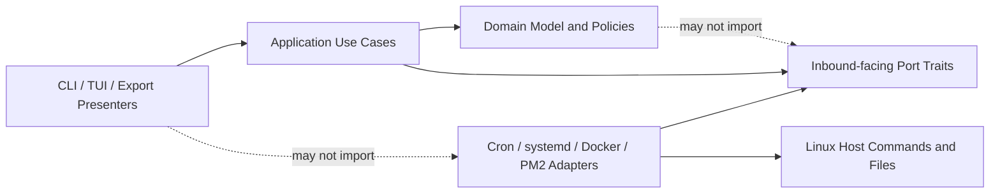
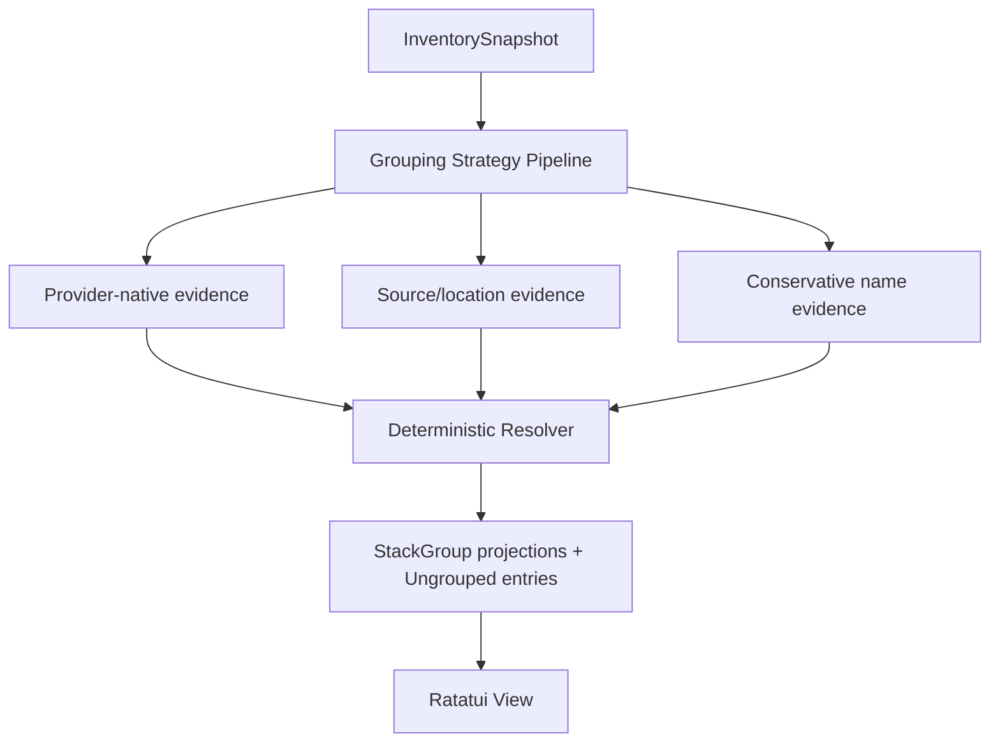

# Architecture Spine — srvls Rust Utility

## Design Paradigm

Hexagonal architecture keeps provider integrations and presentations outside a provider-neutral application core. The ratatui shell follows a unidirectional `Model -> Event -> Update -> View` loop. Strategy supplies grouping policies, Adapter supplies host integrations, and Command represents lifecycle mutations.



## Invariants & Rules

### AD-1 — Dependency direction

- **Binds:** all modules
- **Prevents:** presentation and provider code from becoming alternate owners of domain behavior
- **Rule:** `domain` imports only the standard library; `application` imports `domain` and inward-owned port traits; `adapters`, `presentation`, and `cli` depend inward. Cross-adapter or presentation-to-adapter imports are forbidden.

### AD-2 — Composed base Entry aggregate

- **Binds:** inventory, grouping, exports, inspection, lifecycle-actions
- **Prevents:** one incompatible resource model per provider and inheritance-shaped duplication
- **Rule:** every collector produces the same `Entry` aggregate composed from `EntryId`, name, provider/kind/scope, normalized status and health, optional schedule, provenance, capabilities, display attributes, and diagnostics. Provider differences are supplied as composed values; providers do not subtype `Entry`.

### AD-3 — Host integration ports

- **Binds:** inventory, inspection, lifecycle-actions
- **Prevents:** subprocess construction, timeouts, and privilege behavior from diverging by caller
- **Rule:** adapters implement `Collector`, `Inspector`, and `ActionExecutor`; all host execution goes through `CommandRunner`. Ports exchange domain values and typed errors only, never ratatui widgets, clap arguments, wire DTOs, or raw process objects.

### AD-4 — Evidence-based stack inference

- **Binds:** stack-grouping, tui
- **Prevents:** renderers inventing inconsistent groups or similarly named unrelated services being merged
- **Rule:** candidates use absolute tiers: native `300`, source `200`, semantic `100`; evidence does not sum or merge transitively. Native evidence is Docker Compose working directory then project, or non-default PM2 namespace; systemd/cron have none. Source evidence is Docker working directory or PM2 cwd, normalized lexically as absolute, case-preserving, repeated/dot-segment collapsed, parent-traversal rejected, trailing slash removed, and never filesystem-canonicalized. Names use Unicode lowercase, non-alphanumeric/letter-number splits, only known provider suffix and terminal replica removal, and retain environment words. Sort candidates by tier, unclaimed member count, specificity (path-component or token count), then canonical key; greedily claim members, recomputing residuals. Native/source need two residual members, semantic needs three sharing one non-generic project token; discard smaller residuals. `StackGroupId` is evidence kind plus percent-encoded full evidence key; basename/prefix is label and collisions are disambiguated.

### AD-5 — Snapshot owns collection truth

- **Binds:** inventory, tui, exports
- **Prevents:** a failed or unauthorized collector from appearing as a healthy empty subsystem
- **Rule:** each collector returns generation, `Availability { Required | Optional }`, entries, diagnostics, and required/advisory sub-operation reports. A shared reducer yields Success when all succeed; Partial when usable entries coexist with any fault; otherwise chooses `Failed > TimedOut > Denied > Unavailable`. Snapshot owns diagnostics and entries reference IDs. `--strict` fails Partial/Failed/TimedOut/Denied and Required Unavailable; Optional Unavailable alone does not. Failed refreshes never carry old entries as current; TUI may retain last-good only visibly stale, and stale rows cannot initiate mutations.

### AD-6 — Commands own mutations

- **Binds:** lifecycle-actions, tui, cli
- **Prevents:** unsafe duplicated action logic, capability bypasses, and shell injection
- **Rule:** groups are read-only in v1. Individual actions follow plan, capability/authorization preflight, confirmation, identity revalidation, execute, and OperationId-correlated verification. Public `disable` maps to systemd disable, Docker stop, or PM2 delete; TUI confirms stop and disable/delete. Verification: systemd start active, stop inactive, restart newer InvocationID/start timestamp, disable unit-file not enabled; Docker start running, stop/disable not running, restart same ID/new StartedAt; PM2 start online, stop stopped, restart same birth/new restart counter or uptime, delete full-identity absence. Timeout/unavailable is ExecutedUnverified, replacement is Stale, negative predicate is Failed. Verification can update global snapshot only when its refresh generation remains latest. Adapters use `--` or reject unsafe leading-dash identifiers.

### AD-7 — Interactive mode is terminal-aware

- **Binds:** cli, tui, exports
- **Prevents:** automation breakage when ratatui becomes the primary interface
- **Rule:** bare `srvls` opens ratatui only when stdin and stdout are terminals and `TERM != dumb`; otherwise it emits the legacy table. `--tui` requires TUI initialization or exits with a diagnostic. `--fzf` remains a deprecated alias for the ratatui UI without requiring fzf; undocumented `--fzf-lines` is removed. `--table`, `--json`, `--prom`, and `--md` are always non-interactive and emit neither ANSI styling nor diagnostics/logs on stdout.

### AD-8 — Visual meaning has fallbacks

- **Binds:** tui
- **Prevents:** inconsistent styling, unsupported glyphs, and status encoded by color alone
- **Rule:** widgets obtain colors and symbols only through `Theme` and `IconSet`. Status text is always present, `NO_COLOR` disables color, and `--ascii` overrides the default broadly supported Unicode icon set. Provider icon is secondary to status and selection emphasis. Untrusted text has C0/C1 controls replaced, and detail/log views enforce byte and line caps before rendering.

### AD-9 — External contracts are presenter-owned

- **Binds:** exports, inventory
- **Prevents:** richer internal models silently breaking scripts and metrics consumers
- **Rule:** presenters map through provider compatibility mappings to legacy `EntryV1`, metrics, Markdown, inspection, and table contracts. Completion never affects order: merge fixed cron, system-systemd, user-systemd, Docker, PM2 buckets and preserve each adapter's encounter ordinal; Markdown alone retains its legacy type/name sort. The sole authority is checked-in `tests/compat/{capture-baseline.sh,fixtures,golden,compatibility-ledger.md}` captured once with tool versions and declared volatile placeholders; tests never recapture live state. Preserve formatting/stdout/stderr/exit behavior unless the ledger names an intentional change. Default exports remain flat; grouped output is versioned and opt-in.

### AD-10 — Bounded synchronous concurrency

- **Binds:** inventory, tui
- **Prevents:** sequential collector latency, runaway child processes, and a second async runtime architecture
- **Rule:** a fixed worker set runs collectors. Global refresh uses monotonic generation IDs; only latest replaces displayed state. Action verification uses a separate OperationId lane and completes independently. `CommandRunner` returns `ProcessResult { termination: SpawnFailed(kind)|Exited(code)|Signaled(signal)|TimedOut, stdout, stderr, duration, redacted_argv }`; captured text is UTF-8-lossy with original bytes/truncation flags. Nonzero/signals remain values for adapters. Runner owns deadlines, output caps, child/process-group termination and reaping; dropping delivery is not cancellation. Tokio requires a new decision.

### AD-11 — Deterministic verification below host boundaries

- **Binds:** all modules
- **Prevents:** environment-sensitive CI and silent grouping, parser, export, or terminal regressions
- **Rule:** capture the Python baseline before replacement as the authoritative corpus: each provider's success/malformed/unavailable/denied/timeout fixtures plus golden CLI stdout, stderr, exit codes, ordering, JSON, Prometheus, Markdown, table, inspect, and action argv mappings. Adapters parse those fixtures, use cases test fake ports, grouping uses binding examples/property cases, and TUI views use ratatui `TestBackend` snapshots. Live-host tests remain opt-in and CI requires no host services.

### AD-12 — One locked Linux binary

- **Binds:** build, release, deployment
- **Prevents:** dependency drift, premature crate topology, and install-path breakage
- **Rule:** ship one crate for `x86_64-unknown-linux-gnu`, glibc 2.42, built in a pinned Ubuntu/glibc-2.42 image and checked with `readelf` plus host smoke. Use committed lock, MSRV 1.88, edition 2024, locked MSRV/current CI. Release tarball, installer, and SHA-256. Installer checksum-validates and smokes staged binary; accepts absent/managed/known repo symlink targets (foreign targets require `--force`), creates the version directory, atomically renames a same-directory temporary symlink over `~/.local/bin/srvls`, and records prior target. Pre-rename failure preserves old target; rollback atomically restores recorded target and reruns smoke. Split crates only after three consumers.

### AD-13 — Typed identity is shared by observation and action

- **Binds:** inventory, grouping, tui, inspection, lifecycle-actions
- **Prevents:** selection drift, identity collisions, and acting on a recreated resource with the same display name
- **Rule:** `EntryId` is `(provider, scope, native_locator, occurrence)` with percent-encoded display. Locator is full systemd unit name, immutable Docker ID, PM2_HOME plus numeric ID plus process-birth timestamp and executable/name fingerprint, or cron source plus physical line, exact-entry hash, and duplicate occurrence. Inspection/action carries locator and generation; executor re-resolves the full identity before mutation. PM2 may invoke numeric ID only after birth match. V1 IDs are not a durable external API.

### AD-14 — One terminal-session owner

- **Binds:** tui, cli
- **Prevents:** raw-mode corruption, stale effects, and multiple layers attempting terminal recovery
- **Rule:** one RAII `TerminalSession` initializes ratatui/Crossterm and restores on return/error/unwind under `panic=unwind`. Install panic handling first; signal-hook 0.4.4 converts SIGINT/SIGTERM and Ctrl-C into shutdown events processed by `Update` so the guard drops. SIGKILL/fatal synchronous signals are documented best-effort exceptions. `Update` alone owns model state; background effects return correlated events and never render.

### AD-15 — Privilege stays narrow and non-interactive

- **Binds:** cron, systemd, Docker, PM2 adapters; lifecycle-actions
- **Prevents:** raw-mode password hangs, whole-process elevation, environment confusion, and incompatible denial handling
- **Rule:** the binary never elevates itself. Root cron and TUI system mutations use `sudo -n`; explicit non-TUI CLI system mutations preserve legacy interactive `sudo` and are ledger/golden tested separately. User systemd, Docker, and PM2 retain invoking-user scope. Adapters probe capability and reduce the total AD-10 process result to shared diagnostics/outcomes.

## Consistency Conventions

| Concern | Convention |
| --- | --- |
| Domain types | Singular PascalCase types; provider-neutral nouns in `domain`; provider names confined to adapter modules and `Provider`/`EntryKind` values. |
| Identity | `EntryId` follows AD-13; display names and row indexes are never identity. |
| Time | UTC `SystemTime`/duration internally; presentation decides human formatting. |
| Status | Typed normalized state plus optional health; unknown values remain observable rather than coerced to healthy/inactive. |
| Errors | `thiserror` enums at module boundaries; typed diagnostics for recoverable partial collection; fatal setup/output errors return `Result`. |
| Logging | `tracing` only; TUI logs never target terminal stdout/stderr while raw mode is active. Secret values, process environment, and full cron commands are not logged. |
| Configuration | CLI and environment only in v1; `NO_COLOR` and explicit icon/theme flags override detection. |
| Group labels | Prefer provider project/namespace, then exact source basename, then shared semantic prefix. Duplicate labels append provider/source disambiguation; stable key follows AD-4. |
| TUI keys | `q`/`Esc` back or quit; `r` refresh; `/` filter; arrows or `j/k` navigate; `Enter` inspect/expand; `Space` expand/collapse; `s` stop; `R` restart; `x` disable/delete; `?` help. |

## Stack

| Name | Version |
| --- | --- |
| Rust MSRV | 1.88.0 |
| Rust edition | 2024 |
| ratatui | 0.30.2 |
| clap | 4.6.1 |
| serde | 1.0.228 |
| serde_json | 1.0.150 |
| thiserror | 2.0.18 |
| tracing | 0.1.44 |
| tracing-subscriber | 0.3.23 |
| insta (dev) | 1.48.0 |
| signal-hook | 0.4.4 |

## Structural Seed

```text
src/
  main.rs                 # composition root and terminal-aware mode selection
  cli.rs                  # clap contract and command dispatch
  domain/
    entry.rs              # Entry aggregate and composed facets
    snapshot.rs           # immutable inventory result and diagnostics
    grouping.rs           # group evidence, candidates, resolution policy
    action.rs             # capabilities and typed lifecycle commands
  application/
    collect.rs            # concurrent collection use case
    group.rs              # grouping strategy orchestration
    inspect.rs            # inspection use case
    execute.rs            # action validation and execution
  ports/
    collector.rs
    inspector.rs
    action_executor.rs
    command_runner.rs
  adapters/
    cron.rs
    systemd.rs
    docker.rs
    pm2.rs
    process.rs            # production CommandRunner
  presentation/
    tui/                  # TerminalSession, Model/Event/Update/View, widgets, theme, icons
    table.rs
    json.rs
    prometheus.rs
    markdown.rs
tests/
  fixtures/               # captured provider outputs, scrubbed of secrets
  golden/                 # export and TUI snapshots
```



## Capability → Architecture Map

| Capability / Area | Lives in | Governed by |
| --- | --- | --- |
| Unified inventory | `domain::entry`, `application::collect`, collectors | AD-2, AD-3, AD-5, AD-10 |
| Default stack grouping | `domain::grouping`, `application::group` | AD-4 |
| Ratatui interaction | `presentation::tui` | AD-1, AD-6, AD-7, AD-8 |
| JSON/Prometheus/Markdown/table | `presentation::{json,prometheus,markdown,table}` | AD-7, AD-9 |
| Inspect and lifecycle actions | `application::{inspect,execute}`, action adapters | AD-3, AD-6 |
| Packaging and CI | Cargo metadata and CI workflow | AD-11, AD-12 |

## Deferred

- Persistent user grouping overrides: add only after ambiguous real-host cases demonstrate that evidence strategies cannot remain automatic.
- User theme files: add only after a second theme beyond built-in color/ASCII modes is requested.
- Plugin or dynamic collector loading: revisit only when an out-of-tree provider must ship independently.
- Grouped machine-output schema: keep flat compatibility outputs until a consumer requires a versioned grouped contract.
- Broader Linux/glibc portability: revisit when a target host exists; v1 targets big-chungus glibc 2.42.
- Multi-resource/stack actions: groups remain read-only until capability intersection, ordering, partial failure, and rollback semantics are designed and tested.
- Interactive privilege escalation: v1 uses non-interactive `sudo -n`; revisit only with a terminal-safe authorization design.
