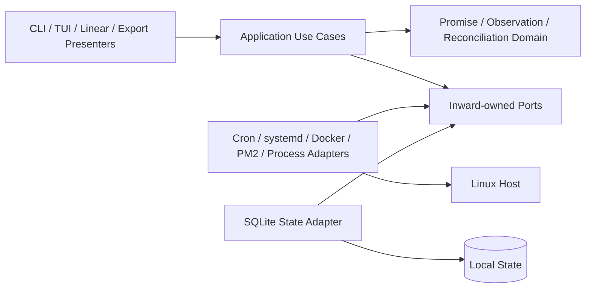
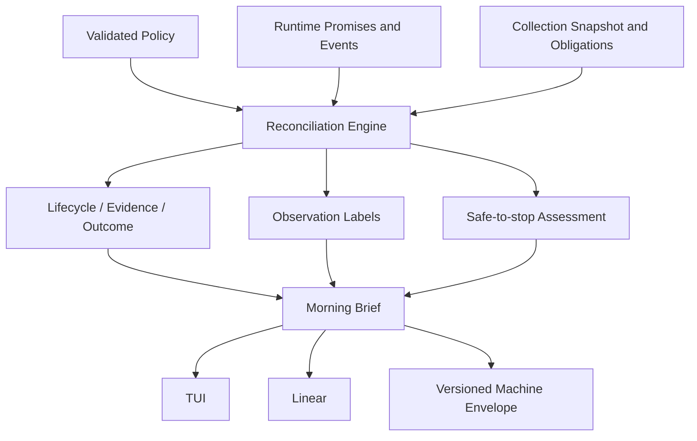

# Architecture Spine — srvls Runtime Promise Control Plane

## Design Paradigm

Hexagonal architecture keeps Host, storage, clock, and presentation details
outside a provider-neutral application core. The ratatui shell follows a
unidirectional `Model -> Event -> Update -> View` loop. Strategy owns grouping
and correlation policies, Adapter owns external integration, and Command owns
typed lifecycle mutation.

Canonical precedence is the final PRD, then its addendum, then the final UX
`DESIGN.md` and `EXPERIENCE.md`, then this spine. Live Python behavior and tests
govern only the explicitly inherited compatibility surfaces. A lower source may
constrain implementation but may not rename, blend, or defer a higher-source
contract.



## Invariants & Rules

### AD-1 — Dependency direction

- **Binds:** all modules
- **Prevents:** presentation, Provider, and persistence code becoming alternate
  owners of domain truth
- **Rule:** `domain` imports only the standard library. `application` imports
  `domain` and inward-owned port traits. `adapters`, `presentation`, and `cli`
  depend inward. Cross-adapter, presentation-to-adapter, domain-to-storage,
  domain-to-ratatui, and domain-to-wire-format imports are forbidden. Modules
  are private by default, each allowed edge is declared in one checked-in
  dependency manifest, and `cargo test --locked --test architecture_boundaries`
  rejects forbidden imports. That gate runs in bootstrap CI before any Provider
  implementation and in every later all-target test lane.

### AD-2 — Declared intent and observed truth stay separate

- **Binds:** runtime-promises, host-observations, reconciliation, exports,
  inspection, lifecycle-actions
- **Prevents:** a blended status, one incompatible model per Provider, and
  legacy output shape becoming the domain
- **Rule:** the core has distinct `RuntimePromise`, `Observation`,
  `ReconciliationFinding`, `Snapshot`, and `OperationRecord` aggregates.
  Provider-specific typed facets compose into `Observation`; providers never
  subtype it. Promise Lifecycle, Evidence Status, Promise Outcome, Observation
  labels, Safe-to-stop Assessment, Collection Obligation, Collector outcome,
  and Action Outcome remain orthogonal typed fields with exactly the canonical
  PRD values. Legacy six-field `EntryV1` exists only as an outward presenter
  projection.

### AD-3 — Ports own every side effect

- **Binds:** collection, durable-state, configuration, inspection,
  lifecycle-actions, time
- **Prevents:** subprocess, SQL, clock, boot identity, and privilege behavior
  diverging by caller
- **Rule:** adapters implement `Collector`, `Inspector`, `ActionExecutor`,
  `CommandRunner`, `PromiseRepository`, `SnapshotRepository`,
  `ActionPlanRepository`, `OperationRepository`, `PolicyRepository`,
  `StateMigrationCoordinator`, `Clock`, `BootIdentity`, and `HostIdentity`.
  Ports exchange versioned domain values and total typed results only. The
  application layer owns collection, Promise lifecycle, reconciliation,
  baseline, Brief, inspection, action, and release use cases; no caller
  constructs Host argv, SQL, backup operations, or time decisions.

### AD-4 — Evidence-based Stack inference

- **Binds:** stack-grouping, morning-brief, tui
- **Prevents:** renderers inventing groups or similarly named unrelated
  Runtimes being merged
- **Rule:** grouping runs after correlation and uses absolute tiers: exact
  matched Runtime Promise Project `400`, Provider-native `300`, source
  `200`, semantic `100`; evidence does not sum or merge transitively. Native
  evidence is Docker Compose working directory then project, or non-default PM2
  namespace; systemd, cron, and direct process have none. Project evidence uses
  the stable supplied Project ID only after independent identity correlation;
  ambiguous, conflicting, or name-only Promise matches contribute no grouping
  evidence. Source evidence is Docker working directory or PM2 cwd, normalized
  lexically as absolute, case-preserving, repeated and dot segments collapsed,
  parent traversal rejected, trailing slash removed, and never
  filesystem-canonicalized. Names use Unicode lowercase, non-alphanumeric and
  letter-number splits, only known Provider suffix and terminal replica
  removal, and retain environment words. Sort candidates by tier, unclaimed
  member count, specificity, then canonical key; greedily claim residual
  members. Native, Project, and source groups need two residual members;
  semantic groups need three sharing a non-generic project prefix.
  `StackGroupId` is evidence kind plus the AD-24 encoding of the full evidence
  key; label collisions receive Provider, Project, or source disambiguation.

### AD-5 — Snapshot owns scoped collection truth

- **Binds:** host-observations, collection, reconciliation, morning-brief,
  exports
- **Prevents:** unavailable or unauthorized collection looking like healthy
  empty Host truth
- **Rule:** each Collector returns generation, scope, effective
  `required | optional | not-applicable` obligation with reason, Observations,
  duration, diagnostics, and one `complete | partial | unavailable | denied |
  timed-out | invalid-output` outcome. The shared reducer and scope promotion
  implement PRD FR-14 exactly; only supported optional scopes can become
  required through configuration or an active Promise. Snapshot owns
  diagnostics; Observations reference diagnostic IDs. Strict mode fails every
  non-complete required scope and every partial, denied, timed-out, or
  invalid-output scope. Every AD-25 transport, authentication, framing, schema,
  identity, abnormal-exit, or pre-deadline size failure is represented by the
  coordinator-synthesized `invalid-output` CollectorReportV1 defined there; it
  never creates a seventh outcome or bypasses the one-report-per-scope rule.
  Completion order never affects content. Failed
  generations never carry old Observations forward as current; the TUI may show
  last-good truth only as visibly stale with all mutations disabled. Every
  fully reduced generation has one terminal report for every frozen AD-21
  scope, synthesizing `timed-out` at its half-open deadline. The reducer may
  retain an immutable candidate even when required evidence is incomplete, but
  only the persisted latest-requested generation may atomically become current
  with its Findings under AD-16 and AD-21. Incomplete current truth disables
  absence claims and mutation as its evidence requires. Setup, reduction, or
  persistence failure before that transaction records a failed
  CollectionAttempt, leaves the prior current pointer unchanged, and exposes
  it only as stale. Eligible TUI initial load
  and `r`, plus canonical `brief --linear | --json`, collect and commit the
  exact candidate Snapshot they render. Canonical action verification may
  commit a fresh targeted Snapshot only while its generation remains latest.
  Timestamped resource samples live in immutable Snapshot history; hot
  classification reads the configured AD-20 window from that history and never
  infers missing samples.
  Promise commands persist lifecycle state without creating Snapshots;
  canonical inspect, action status, and config commands are read-only. Action
  planning is Host-read-only and may persist only the immutable AD-22 plan.
  Legacy table, flat top-level JSON, Prometheus, Markdown, inspection, and
  explicit legacy actions remain stateless. Only explicit TUI `b` acceptance
  or the deterministic `baseline` command may move the Accepted Baseline
  pointer; refresh and scheduled collection never do. A
  Snapshot with an incomplete required scope is ineligible unless a typed
  override transaction retains missing scopes, principal, wall time, and
  reason. AD-24 Host identity, schema, AD-21 scope-manifest fingerprint, and
  AD-24 governing policy fingerprint define baseline compatibility. First-run
  and incompatible-baseline states
  never invent a change set.

### AD-6 — Commands own exact-target mutation

- **Binds:** lifecycle-actions, runtime-promises, tui, cli
- **Prevents:** unsafe duplicated action logic, row or name targeting, false
  success, and shell injection
- **Rule:** groups are read-only. Action Menu `a` is the complete discovery path
  and can plan `start` from a Promise with a supported Launch Mechanism even
  without an Observation. Cron has no canonical mutation capability in v1 and
  is refused before argv construction. An individual action follows AD-22
  durable plan, capability and authorization preflight, UX-governed
  confirmation, identity revalidation,
  execute, OperationId-correlated targeted verification, and one terminal
  `verified | executed-unverified | refused | timed-out | failed` outcome under
  PRD FR-40 precedence. Pre-launch identity drift is `refused` with
  `stale-identity`; post-launch replacement is `executed-unverified`. Stop and
  disable or delete require TUI confirmation; unknown safety requires the exact
  resolved verb. Safe-to-stop is recalculated before mutation and remains
  advisory: `unsafe` makes the action unavailable, while `unknown` requires the
  canonical typed acknowledgement. Planning is Host-read-only but may persist
  the immutable AD-22 ActionPlan required by a separate execute process. A plan
  is valid only for its exact source generation, identity, effective policy
  snapshot, BootIdentity, and AD-20 lifetime;
  expiration or intervening identity evidence requires a new plan and
  confirmation. A durable partial unique constraint admits at most one
  nonterminal operation per exact target, while caller actor plus idempotency
  key returns the original plan or operation result on retry. A conflicting
  submission is `refused` with `duplicate-operation`; actions use the bounded
  AD-20 pool separate from collection. Saturation refuses before Provider
  launch rather than entering an unbounded queue. Operations never auto-replay
  after crash. `OperationCoordinator` alone applies FR-40 precedence and owns
  the terminal compare-and-swap; adapters and verifiers return evidence, and
  presentation only requests cancellation or renders committed truth. Direct
  non-TUI verbs preserve their explicit compatibility lane. Adapters use argv only,
  safe end-of-options or identifier rejection, and these verification
  predicates:

  A `verified` predicate must be proved by fresh evidence sampled after the
  Provider launch boundary and correlated to the OperationId; matching state
  observed before launch or at any uncorrelated point never verifies an action.

  - systemd start is active; stop is inactive; restart retains exact unit and
    has a newer invocation or start timestamp; disable is not enabled;
  - Docker start is running; stop or disable is not running; restart retains
    exact container ID and has a newer `StartedAt`;
  - PM2 start is online with the same birth identity; stop is stopped with the
    same birth identity; restart has a newer restart counter or uptime; delete
    removes that full identity;
  - direct-process stop removes the exact PID and birth identity; start or
    restart delegates to a declared supported Launch Mechanism rather than
    reconstructing a command.

### AD-7 — Presentation routing is explicit and terminal-aware

- **Binds:** cli, tui, linear-output, exports, configuration
- **Prevents:** automation breakage, inaccessible interaction, and side effects
  before invalid configuration is reported
- **Rule:** raw argv selects one profile before clap, configuration, collection,
  or any other side effect. First match wins: the exact internal
  `__srvls-worker-v1` profile is reserved to AD-25 and authenticates FD 3 before
  parsing a request; the exact internal `__srvls-release-validator-v1` profile
  is reserved to AD-23 and authenticates FD 4 before admission or SQLite;
  argv[1] in `config | promise | brief | baseline | action |
  release`, then `inspect --id`, owns its complete tail as a canonical
  namespace; argv[1] in `inspect | start | stop | restart | disable` selects
  the frozen legacy action profile before that profile performs its
  exact-three-argument arity check. Explicit
  `--tui` or deprecated `--fzf` selects ratatui; a recognized top-level
  `--json | --prom | --md | --table` selects the stateless legacy inventory
  profile; and empty argv selects bare routing. Namespace-local `--json` can
  never select legacy inventory. Within the legacy inventory profile, frozen
  output precedence and supported modifiers remain compatibility contracts,
  but previously ignored extra or unknown options now fail nonzero through a
  named ledger deviation. `--help` renders help without collection, and retired
  `--fzf-lines` fails with its ledgered replacement. Configuration validates
  after profile selection but before collection, state writes, terminal setup,
  or mutation. Bare `srvls` opens ratatui only when stdin and stdout are
  terminals and `TERM != dumb`; otherwise it emits the legacy table. Explicit
  TUI failure never falls back. The canonical release namespace owns `install |
  upgrade | validate | status | rollback` under AD-23. `brief --linear` is the
  complete no-cursor human
  path; canonical JSON is machine-facing. Legacy machine stdout remains free of
  progress, diagnostics, and terminal decoration.

### AD-8 — Terminal meaning never depends on decoration

- **Binds:** tui, linear-output, inspection
- **Prevents:** inaccessible state, unsupported glyphs, animation dependence,
  and hostile terminal content
- **Rule:** widgets obtain optional style only through `Theme` and `IconSet`.
  Text carries every identity, state, focus, progress, and outcome. `NO_COLOR`
  controls color only; `--ascii` controls glyphs and wins over capability
  detection; `TERM=dumb` selects undecorated legacy output unless an explicit
  format wins. V1 has no spinner or animation mode. Untrusted C0, C1, DEL,
  escape, invalid byte, and bidirectional control content is visibly escaped or
  replaced before display. UX `DESIGN.md` and `EXPERIENCE.md` own layout,
  component, responsive, focus, and accessibility behavior.

### AD-9 — Compatibility and new contracts have separate owners

- **Binds:** exports, inspection, cli, Agent interfaces, release-recovery
- **Prevents:** richer internal truth silently breaking scripts, timers, and
  metrics consumers
- **Rule:** legacy presenters map through exact Provider compatibility mappings
  to table, flat `EntryV1` JSON, Prometheus, Markdown, inspection, and explicit
  action contracts. Fixed merge order is cron, system systemd, user systemd,
  Docker, PM2; each adapter preserves encounter ordinal, while Markdown alone
  retains legacy type and name sorting. The layered oracle is the checked-in
  Python behavior inventory, a frozen deterministic
  `tests/compat/{capture-baseline.sh,fixtures,golden,compatibility-ledger.md}`
  corpus captured once with declared volatile substitutions, the opt-in live
  Host smoke suite, and named deployed-consumer checks. Tests never recapture
  live truth as an assertion source. The frozen corpus includes flag-combination
  precedence, help and unknown argv, bad action arity, successful-empty unknown
  inspection, stdout refusal placement, child stderr merging, missing Docker,
  absent PM2 and fzf, malformed and wrong-shaped structured data, hostile
  identifiers, and every action argv. New Promise, Brief, config, linear,
  baseline, reconciliation, and operation commands use separately versioned
  deterministic envelopes and do not change top-level legacy output without a
  ledger entry naming rationale, version impact, replacement assertion, and
  consumer disposition. Direct-process Observations therefore appear only in
  new Brief, reconciliation, TUI, linear, and versioned machine surfaces until
  a ledgered decision explicitly changes a legacy presenter.

### AD-10 — Synchronous concurrency is bounded and correlated

- **Binds:** collection, tui, lifecycle-actions, subprocesses
- **Prevents:** sequential refresh latency, stale overwrite, runaway children,
  and a second runtime architecture
- **Rule:** a fixed collection pool executes exactly one frozen
  `DispatchScheduleV1` compiled over the AD-21 ScopeManifest and effective
  AD-20 policy. Configuration and runtime each derive the AD-24 canonical
  schedule bytes and require byte-for-byte equality; neither may reconstruct an
  event-driven schedule from observed completion, failure, or Ready times. The
  deterministic compiler is:

  1. number worker slots `0..collection.max_concurrency-1`; sort every frozen
     scope once by descending configured budget, then unsigned ScopeIdV1 bytes,
     and reject a duplicate or missing scope or arithmetic overflow;
  2. initialize every worker's full-budget availability offset to zero and the
     reserved process-gate end to zero. While scopes remain, choose
     `epoch_offset = max(process_gate_end, minimum worker availability)`, collect
     every worker whose availability is at or before that offset in ascending
     worker-ID order, and assign up to that many queued scopes in LPT order;
  3. for each assigned member freeze worker ID, ScopeIdV1, epoch offset,
     configured budget, and terminal offset `epoch offset + budget`, then move
     that worker's availability to the terminal offset. If the batch contains
     the single process scope, freeze its reserved process-gate interval as
     `[epoch offset, process terminal offset)` and move `process_gate_end` to
     that end; no later reservation epoch may fall inside the interval;
  4. persist epochs by ascending offset, members by ascending worker ID, the
     complete LPT ScopeId order, every per-scope budget and terminal offset, the
     process-gate interval, and `full_budget_makespan = max(member terminal
     offset)`. Freeze the effective scheduler margin as
     `max(configured scheduler margin, 1 ns)` and the generation-cutoff offset as
     exactly `full_budget_makespan + effective scheduler margin`.

  AD-21 admission samples one `ClockSampleV1` before any worker spawn; its boot
  nanoseconds are the sole generation schedule origin. Runtime re-derives and
  canonical-encodes `DispatchScheduleV1` from the persisted PolicySnapshotV1 and
  ScopeManifestV1, compares those bytes and the AD-24 schedule fingerprint with
  the persisted plan, and refuses the CollectionAttempt before spawn on any
  mismatch. Before capability allocation, socket creation, or spawn for any
  reservation, the coordinator samples `CLOCK_BOOTTIME` and compares that one
  value with both absolute cuts. Equality with or passage of either cut means
  the reservation is already expired: it creates no capability, socket,
  `OwnedSpawnV1`, child, or process-group state and synthesizes the AD-25
  no-child `worker-timeout` at the earlier exact absolute cut with
  `termination_origin=none`. Catch-up is deterministic after admission or
  scheduler latency: visit missed epochs by ascending epoch offset and members
  by ascending worker ID, terminalize every already-expired reservation in
  that complete order, and only then start the still-live members in the same
  epoch/worker order. A live member keeps its original absolute deadline and
  receives only the strict-before remaining budget; neither late admission nor
  catch-up moves an epoch or creates cleanup evidence for an expired member.
  It then executes only these reservations:

  1. a worker that terminalizes, fails, or becomes Ready before its next
     reservation remains held; no observation advances a reservation epoch. At
     each absolute epoch `schedule origin + epoch offset`, deadline-equality
     transitions for prior reservations occur first, then the coordinator
     initiates that epoch's reserved batch in ascending worker-ID order. A late
     coordinator may reduce the remaining member budget but may not move its
     absolute deadline;
  2. after the mandatory strict-before check, allocate that member's request ID
     and capability immediately before spawn. Set its absolute scope deadline
     to `schedule origin + epoch offset + budget` and
     the absolute generation cutoff to `schedule origin + generation-cutoff
     offset`; every addition is checked. Spawn, process-group setup, Hello/Ready
     authentication, request transfer, Provider work, result transfer, and the
     failure decision all consume that one reserved budget;
  3. drive every AD-25 lane concurrently. A non-process member authenticated
     Ready strictly before both deadlines receives its WorkerRequestV1
     immediately and never waits for any sibling's spawn, Ready, failure, or
     result. Simultaneous Ready events dispatch in ascending worker-ID order. A
     silent or failed member receives its one AD-25 report and cannot delay an
     authenticated Ready non-process member's request. It may affect the process
     request only through the same-epoch spawn-outcome rule and AD-13
     root/absence proof below;
  4. a still-live Ready process member may close the worker-spawn gate only after
     **every member reserved for that same epoch** has a parent-side spawn
     outcome of no child PID, complete SpawnedWorkerRootV1, or
     UnrootableSpawnV1. It never waits for any other member's Ready or result.
     After closing the gate, resolve every coordinator-owned AD-13
     UnrootableSpawnV1 from current or superseded generations: exact child reap
     and, for a known group, zero exact-group members are required. If an absence
     proof misses either deadline, synthesize `worker-timeout`, perform no
     process Host-read, and reopen the gate. Otherwise freeze every complete
     existing and same-epoch root whose group is not proven empty and dispatch
     the process request;
  5. the actual process Host-read gate remains closed through that member's
     half-open process cut. It may reopen when the process terminalizes or fails
     before Host-read, but early reopening still cannot advance a reservation.
     The schedule reserves no other spawn epoch inside the frozen process-gate
     interval; every early-free slot is held until its own next reservation.

  A failed member with a complete SpawnedWorkerRootV1 remains in
  SelfProcessSetV1 until its group is proven empty and never receives a request.
  A child that cannot construct that exact root enters the process Host-read
  absence barrier instead of an invented partial root. Provider children remain
  inside their owning ready worker process group and do not acquire independent
  worker slots.

  The reservation proof is mechanical: no member starts before its frozen epoch;
  every member's terminal cut is no later than `origin + epoch offset + budget`;
  every such terminal offset is at most `full_budget_makespan`; unresolved
  process barriers time out rather than add time; and early outcomes never move
  later epochs. Runtime scope-terminal time therefore cannot exceed the reserved
  full-budget trace. The exact generation cutoff is the origin plus that
  makespan plus the effective scheduler margin. Global refresh has monotonic
  generation IDs persisted with
  `latest_requested_generation`. New requests coalesce latest-wins: cancel
  undispatched superseded scopes, request typed cancellation of running old
  scopes, retain attempt diagnostics, and admit only the newest queued
  generation. Only its pointer CAS may replace repository or displayed current
  truth. Action execution and verification use a separate bounded pool and
  OperationId lane,
  complete a durable outcome regardless of newer global refreshes, and may
  replace global truth only when their generation remains latest. All
  potentially blocking collection-side Provider file, `/proc`, and command work
  runs through the authenticated same-binary AD-25 worker protocol, so the
  parent can cut a scope without stranding a worker thread or creating a second
  discovery path.

  A coordinator-owned atomic result registry accepts a report only before both
  its scope deadline and generation cutoff; equality is `timed-out`, and reducer
  mailbox order is irrelevant. A timer observed after equality uses the earlier
  absolute deadline as its canonical terminal and failure-evidence cut; observed
  scheduler lateness is separate bounded operational evidence and never extends
  a scope or changes its report bytes. `CommandRunner` reserves stdout and stderr
  independently against generation, scope, then child capture ledgers under one
  coordinator before spawn, drains
  both streams after their retained cap, and frees raw bytes and reservations
  immediately after typed normalization. It owns spawn, deadlines,
  typed cancellation, process-group termination, and eventual reaping under the
  AD-15 executable, environment, and working-directory policy. Its
  total result is `SpawnFailed(kind) | Exited(code) | Signaled(signal) |
  TimedOut` plus bounded stdout, stderr, original byte counts, truncation flags,
  duration, and redacted argv identity. Nonzero and signals are values
  interpreted by adapters. At a deadline the Snapshot reducer stops waiting;
  an exited child is reaped synchronously, while a Linux uninterruptible child
  is registered with the bounded reaper and remains a visible diagnostic until
  eventual reap. No application can promise a wall bound across kernel
  uninterruptible I/O. Dropped delivery suppresses stale results but is never
  cancellation. Tokio requires a new AD.

### AD-11 — Verification is deterministic below Host boundaries

- **Binds:** all modules
- **Prevents:** environment-sensitive CI and silent domain, storage, output, or
  terminal regressions
- **Rule:** the frozen Python compatibility corpus and golden outputs cover
  every Provider success, malformed, unavailable, denied, timeout, ordering,
  escaping, output, inspection, and action-argv case. Deterministic tests also
  cover Promise lifecycle and idempotency, boot and clock discontinuity,
  migrations and crash recovery, configuration precedence and invalid values,
  every reconciliation axis and classification, Safe-to-stop rules, retention,
  all AD-20 limits, human-linear journeys, all canonical UX states and budgets,
  terminal lifecycle, and action races and signals. Application tests use fake
  ports; grouping and reconciliation use table or property cases; TUI uses
  ratatui `TestBackend`. Cross-unit contract fixtures freeze the AD-21 read cut,
  atomic plan admission, concurrent baseline acceptance, nonterminal-operation
  admission, retention, three-sample hot-history races, immutable baseline
  comparison rows, zero post-admission baseline lookups, and byte-identical
  configuration/admission/runtime `DispatchScheduleV1` compilation. The default
  `[30,20,15,15,10,10,10,process=10]` four-worker schedule reserves epochs at
  `0,15,20,25` seconds and a process gate `[25,35)`; its 30-second member remains
  silent through its deadline while authenticated Ready non-process siblings
  dispatch immediately. Runtime and configuration must retain the exact
  35-second full-budget makespan and derive the 40-second cutoff from the
  five-second margin.

  A deterministic virtual-clock regression uses four workers and budgets
  `systemd-user=20`, `systemd-system=20`, `Docker=20`, `PM2=20`, `process=10`,
  and cron user/root/system `=9` seconds. It freezes epoch zero for the four
  20-second members and epoch 20 for process plus all three cron members, with
  process gate `[20,30)`, full-budget makespan 30 seconds, and cutoff 35 seconds.
  When the worker-zero 20-second lane terminalizes at `20 s - 1 ns`, its slot is
  held until the reserved 20-second epoch: process cannot spawn or close the gate
  one nanosecond early. At 20 seconds the batch spawns in worker-ID order;
  authenticated cron requests remain per-member immediate, process waits only
  for all four parent-side spawn outcomes, and every scope terminalizes by its
  frozen absolute deadline. Across the full-budget and one-nanosecond-early
  traces, the fixture asserts identical schedule bytes, worker assignments,
  epoch offsets, budgets, gate interval, request-not-before bounds, full-budget
  makespan, and cutoff. It separately asserts each trace's exact duration
  evidence, terminal reports, strict exit, Snapshot, and Brief; earlier causal
  evidence may change those bytes but may not change a reservation or create a
  generation-cutoff timeout.

  Admission-latency virtual clocks freeze epoch-zero members whose scope cut,
  generation cut, or both are already equal to or before the first runtime
  sample. Fixtures resume at one nanosecond before, exactly at, and one
  nanosecond after each cut and with multiple missed epochs. They require the
  AD-10 ascending epoch/worker catch-up order, all expired reports before any
  live spawn, zero capability/socket/child/root/reap state for each expired
  member, the earlier absolute cut as failure evidence, and byte-identical
  no-child `worker-timeout` diagnostics with `termination_origin=none`.

  The 60-second process/seven 1-second zero-margin case still proves the
  mandatory one-nanosecond half-open headroom, process scope placement is covered
  in every LPT position, and multi-batch virtual clocks inject nonzero
  spawn/Hello/Ready time to prove setup subtracts from Provider time without
  changing any reservation or absolute deadline. Runtime, configuration, and
  persisted CollectionPlan compare the same canonical schedule bytes rather than
  comparing event-dependent traces.
  Property suites own
  byte-complete AD-24 policy JSON, ScopeId/ScopeManifest grammars, non-UTF-8 path
  normalization, arbitrary valid diagnostic subjects and parameters,
  worker/coordinator candidate mixtures and duplicates, post-evidence reference
  resolution, and process exact-PID-versus-cgroup, multi-Provider tie,
  in-group Provider child/grandchild self-suppression, escaped-group emission,
  conflict, and retained-diagnostic tables.

  Canonical contract goldens are fixed assertion inputs and are never generated
  by the encoder under test. Under `tests/fixtures/contracts`,
  `policy-snapshot-v1/default.preimage.json` is the complete
  AD-20/ARCH-LIM-24 default
  PolicySnapshotV1 with decision token `srvls-decision-v1`; its companion
  `default.policy-fingerprint` is the lowercase SHA-256 defined by AD-24.
  `tests/fixtures/contracts/collection-plan-v1/minimal.preimage.json` freezes
  GenerationId 1, BootIdentity `00000000-0000-4000-8000-000000000001`,
  current and Promise repository revision 7, schedule origin 1,000,000,000 ns,
  UTC wall 2,000,000,000 ns, the default policy, accepted-baseline none,
  operation revision 3 with no rows, resource-history revision 4 with window
  start zero and no rows, prior-current none, current-pointer revision 5, and
  one optional cron-user UID 1000 scope with reason `default-supported`. Its
  four-worker schedule reserves worker 0
  at epoch zero for 10 seconds, has no process gate, 10-second makespan,
  five-second margin, and absolute cutoff 16,000,000,000 ns. Companion files
  freeze the obligation-bearing ScopeManifest, every nested baseline row
  preimage, each row fingerprint, DispatchScheduleFingerprint,
  PolicyFingerprint, and CollectionPlanFingerprint. Configuration, admission,
  runtime, repository, and two independent test encoders must emit the exact
  checked-in bytes and hashes without recapture or normalization.

  Observation identity goldens live at
  `tests/fixtures/contracts/observation-id-v1/{cron,systemd,docker,pm2,process}.bin`
  with matching uppercase-percent display and fingerprint files. Their fixed
  inputs are, respectively: cron-user UID 1000, source `/etc/cron.d/srvls`,
  physical line 0, entry-hash bytes `0x55`, and occurrence 0; systemd-system unit
  `srvls-metrics.service`; Docker endpoint `unix:///var/run/docker.sock`,
  context `default`, and 32 raw bytes `0x11`; PM2_HOME `/home/test/.pm2`, ID 7,
  `created_at` 1,000 UTC ms, and fingerprint bytes `0x22`; and process HostId
  bytes `0x33`, boot UUID `00000000-0000-4000-8000-000000000001`, PID 42,
  start tick 99, and fingerprint bytes `0x44`. Each repeated byte notation means
  exactly 32 bytes. Independent encoders must match all five complete binary
  envelopes, displays, and `srvls-observation-id-v1` fingerprints byte for
  byte.

  IPC fixtures cover
  every AD-25 peer check, Hello/Ready credentials and field echo, silent child,
  exit 77 before Ready, malformed and replayed Ready, a batch with one failed
  member, and an after-PID group/identity-setup failure with pending cleanup and
  a Ready process sibling in the same and a later generation. The latter proves
  no process Request or Host-read before exact absence, `worker-timeout` when
  absence misses either cut, no leaked internal Observation, no unrelated-group
  signal or suppression, and no later reap rewrite. IPC fixtures also cover capability
  replay, partial or oversized frame,
  exact-boundary and one-byte-over requests and results, maximum valid scope
  assignments, nested raw-byte vectors, wrong-plan/same-generation,
  wrong-plan/same-scope, request/result and scope mismatch, stdout/stderr
  isolation, timeout, signal, no-discovery path, and every row of the AD-25
  descriptor-ownership table. A `duplicate-parent-end` fixture injects an
  extra reference to the coordinator endpoint into the worker side, and a
  `duplicate-child-end` fixture injects an extra reference to the worker
  endpoint into each process in turn. Their negative controls prove that the
  applicable peer cannot observe EOF while the duplicate remains. Every
  injected-duplicate case is a fail-closed rejection: the pre-Hello audit
  freezes `fd-peer-auth`, accepts no Hello, Ready, Request, or Result, closes
  every owned original and duplicate, and proves failure-path EOF and the one
  synthesized report. A separate descriptor-clean fixture alone proves the
  successful Result, write-shutdown, clean-EOF, and two-sided close sequence.
  Combined fixtures cover
  malformed-frame plus exit 64, oversize plus parent cleanup signal, and trusted
  worker-error plus exit 70. Those combinations assert that later cleanup/reap
  status is excluded from immutable candidate bytes and retained only as
  WorkerReapEvidenceV1. A table-driven case for every AD-25 primary/causal
  variant asserts all seven parameter values, the failure-evidence cut, complete
  synthesized report, canonical candidate bytes and final DiagnosticId,
  primary/secondary precedence, current-pointer result, Brief completeness, and
  required/optional strict and non-strict exit.
  Storage fixtures cover fresh and existing database
  pragma readbacks, timeout equality, generation CAS, AD-22 plan and launch
  handoffs, every AD-23 pending effect and crash edge, torn or bad-checksum
  manifests, ordinary stateful entry after a crashed upgrade, every
  ReleaseValidationBypassV1 forged, replayed, stale-generation, old-version,
  attempted-write, and forwarding refusal; pending validation crashes both
  before a result and after a result but before complete; recovery under a new
  PID/birth, old-PID reuse, forged owner publication, and a second recovery-owner
  crash; the complete public release-event
  and UX-state mapping, sidecar restore, and the storage-unavailable shutdown
  exception. Admission-descriptor fixtures acquire shared and exclusive
  traditional POSIX record locks on the exact `[0,1)` range, verify
  `FD_CLOEXEC`, and exercise FD3, FD4, Provider, `systemctl`, and timer-control
  spawns. A separate audit process uses `F_GETLK` to prove the live owner's PID
  and lock type. Each case stops the child immediately after `fork` and before
  its first file action, terminates the lease owner, and proves a new exclusive
  contender acquires and publishes the next recovery owner while that child
  remains stopped. Post-exec controls additionally require
  `/proc/<child>/fd` to contain zero admission descriptors. Negative controls
  prove `flock` and `F_OFD_SETLK` retain the inherited-lock defect and therefore
  are rejected primitives; owner-side reopen, `dup`, stdio access, or close of
  the lock inode is a failing invariant.

  Release fixtures cover the AD-12 `StableToolchainEvidenceV1`
  match and a freshly fetched 1.97.1 manifest against a stale cached 1.97.0
  compiler that must fail before compile; exact-artifact ABI proof; every
  managed absolute `ExecStart` rewrite; and AD-23 forward and rollback
  validation. For both directions, table cases inject wrong fragment, target,
  monotonic or calendar schedule, accuracy or randomized delay, persistence,
  wake or reactivation value, and disabled-but-active enablement. Fresh
  invocation cases inject an already-active service, `RemainAfterExit=yes`,
  unchanged or zero InvocationID, non-advancing start time, and stale
  successful exit fields. Timer-causality cases advance LastTrigger and then
  inject a manual service start, a wrong or absent `trigger_unit`, a competing
  service job, lost JobRemoved, and reused invocation evidence; every case fails
  both forward and rollback. Subscription-handshake cases inject every cut
  before and after the acknowledged owner match, first owner lookup, exact job
  and property matches, successful Manager.Subscribe reply, unchanged owner
  recheck, queue-drain barrier, baseline capture, and trigger. A manager change
  away-and-back, reply from a stale owner, unexpected Unsubscribe, disconnect,
  receive overflow, dropped-message marker, or sequence gap always fails; no
  baseline or trigger exists before a clean barrier, and recovery repeats the
  complete handshake with fresh baselines. Virtual-clock cases place correct
  causal and FD4 evidence one nanosecond before, exactly at, and one nanosecond after the
  persisted ARCH-LIM-24 cut, crash each validation effect, and prove a new
  recovery owner retains the old attempt and persists a fresh attempt-bound cut.
  Every mismatch must fail the pair; matching cases prove the exact loaded
  contract, authoritative timer job/invocation causality, one shared validation
  deadline, and whole-pair rollback. First-install cases crash every automatic
  absent-restore effect and prove exact link/binary/state/sidecar/unit/
  enablement absence or restoration, including a nonempty service/timer prior-
  absence record, pending removal, post-unlink pre-reload, post-reload
  pre-readback, and completed absence cuts. Each cut rejects a foreign path or
  symlink replacement without deletion, proves every recorded unit file and
  enablement target absent, retains reserved ready generation zero, and returns
  `forward-failed-recovered`; an explicit rollback from the published sentinel
  proves byte-identical `rollback-unavailable` and zero transaction, event,
  KnownGood, admission, filesystem, database, unit, or Host mutation.
  Fixtures retain every crash edge from validation
  through durable commit decision, KnownGood publication, ready admission,
  and terminal commit, and explicit post-validation rollback from
  KnownGoodReleaseV1. The existing
  Python smoke suite and named timer checks
  remain live opt-in integration lanes and CI requires no Host service.

### AD-12 — One locked binary upgrades with its state

- **Binds:** build, release-recovery, durable-state, deployed consumers
- **Prevents:** dependency drift, late CI discovery, ABI breakage, binary-only
  rollback, and install-path ambiguity
- **Rule:** ship one Rust 2024 binary crate for
  `x86_64-unknown-linux-gnu` and glibc 2.42 with committed `Cargo.lock`, MSRV
  1.88 and explicit Cargo resolver 3. The bootstrap story and release CI each
  have a pinned MSRV lane plus a symbolic moving `stable` lane; the moving
  lane is never replaced by a permanently pinned point release. Before any
  Rust or Cargo compile, each of those CI entry points fetches fresh official
  `channel-rust-stable.toml` metadata, refreshes the installed `stable`
  channel, runs `rustc --version --verbose`, and persists one
  `StableToolchainEvidenceV1` artifact. Its required fields are the stable
  manifest date, `[pkg.rust]` release string and full `git_commit_hash`, the
  complete verbose output, and its parsed `release`, `commit-hash`,
  `commit-date`, and `host`. The parsed compiler release and full commit hash
  must exactly equal the freshly fetched manifest identity before compilation.
  The reviewed 2026-07-16 target is Rust 1.97.1, manifest release
  `1.97.1 (8bab26f4f 2026-07-14)`, and full commit
  `8bab26f4f68e0e26f0bb7960be334d5b520ea452`; a cached 1.97.0 compiler,
  stale manifest date, or release/commit mismatch fails before the first
  build command. Bootstrap retains the evidence as a CI artifact; release CI
  additionally binds its digest into the release proof record. Required gates are
  `cargo fmt --check`, locked clippy with warnings denied, locked all-target
  tests at MSRV and stable, compatibility goldens, migration tests, and release
  asset smoke. Build in a pinned glibc-2.42 image; release CI runs
  `readelf --version-info` on the exact final artifact, fails if any imported
  `GLIBC_*` version exceeds `GLIBC_2.42`, and then smokes that same artifact in
  the pinned oldest-supported glibc 2.42 runtime image.
  The release tarball and SHA-256 contain one versioned binary. `srvls release`
  is the sole install, upgrade, validation, status, and rollback process owner;
  AD-23 owns its crash and state contract. Installer smoke uses an isolated
  state directory. Preflight inventories the resolved shell command plus every
  managed and foreign absolute consumer path, including unit `ExecStart`
  values. A foreign bypass needs an explicit disposition; `--force` never
  silently rewrites it. Every managed absolute `ExecStart`, including
  `srvls-metrics.service` and `srvls-snapshot.service`, is staged to the
  canonical activated binary with its matching database backup and the
  manifest-owned AD-23 `ManagedConsumerUnitContractV1` for its service/timer
  pair. After `systemctl --user daemon-reload` and before any trigger proof,
  validation must read back and exactly match that normalized loaded-unit
  contract and each unit's declared enablement result. It then produces the
  AD-23 `TimerInvocationAcceptanceV1` from a fresh candidate invocation
  originating through the exact paired timer. Any property, enablement,
  trigger, invocation, start, or exit mismatch restores binary and link,
  matching state, service and timer definitions and enablement, and daemon
  state as one pair, reloads, and runs the same exact validator against the
  prior manifest; AD-23 FirstInstallAbsentV1 uses its exact absence validator
  because no prior executable exists. AD-23 owns the schemas, durable ordering,
  forward and rollback postconditions, and retained rollback bundle. Split
  crates only after three independent consumers.

### AD-13 — Identity is typed, exact, and generation-bound

- **Binds:** runtime-promises, host-observations, grouping, tui, inspection,
  lifecycle-actions, durable-state
- **Prevents:** selection drift, identity reuse, and mutation of a recreated
  Runtime with the same display name
- **Rule:** `PromiseId`, `SnapshotId`, `PlanId`, `OperationId`, and lifecycle
  `EventId` are UUIDv7. `GenerationId` is a gap-free Host-local unsigned
  sequence allocated in state. `ScopeIdV1` is a tagged Provider locator with
  Provider-specific exact fields; its normalized canonical ordering forms
  ScopeManifestV1.

  `DiagnosticId` is `(GenerationId, ScopeIdV1, canonical_ordinal)`, where the
  ordinal is a gap-free `u32` sequence from zero **per `(GenerationId,
  ScopeIdV1)`**. A diagnostic created by the coordinator must name one actual
  frozen ScopeId whose evidence caused it; a condition with no such scope is a
  typed CollectionAttempt result, not a diagnostic with an invented scope.
  Producers create candidates only after evidence exists. Each
  `DiagnosticCandidateV1` contains fixed producer tag `coordinator=0x00 |
  worker=0x01`, its ScopeId, stable ASCII code, parameter-schema version,
  `DiagnosticSubjectV1` bytes, source encounter `u64`,
  `DiagnosticParameterV1` bytes, and duplicate occurrence `u32`.
  `DiagnosticSubjectV1` bytes are `0x01 || tag:u8 || length:u32be || payload`:
  `0x00` none with zero length; `0x01` ScopeIdV1 bytes; `0x02` canonical
  ObservationId bytes; `0x03` UUID public ID as 16 bytes; `0x04` normalized
  absolute raw path; `0x05` NFC UTF-8 text; `0x06` fixed 32-byte command or
  content fingerprint; and `0x07` uninterpreted evidence bytes. Wrong lengths,
  noncanonical payloads, unknown tags, or trailing bytes are invalid.
  `DiagnosticParameterV1` is one AD-24 canonical JSON object whose keys are the
  code-and-schema-declared stable ASCII fields in declaration order, with no
  unknown or omitted key. Every value is exactly one tagged object:
  `{"type":"absent"}`; `{"type":"bool","value":<boolean>}`;
  `{"type":"i64","value":<integer>}`; `{"type":"u64","value":<integer>}`;
  `{"type":"text","value":<NFC string>}`; `{"type":"bytes","value":<uppercase-percent complete raw bytes>}`;
  `{"type":"path","value":<uppercase-percent AD-24 normalized absolute raw path>}`;
  `{"type":"id","value":<canonical lowercase hyphenated UUID>}`;
  `{"type":"list","value":[<tagged values in semantic order>]}`; or
  `{"type":"object","schema":<stable ASCII token>,"value":<declared-order object of tagged values>}`.
  Integers use the AD-24 minimal JSON grammar and their named signed or unsigned
  64-bit range; `null`, untagged values, alternate byte encodings, and
  serde-defaulted absence are invalid.

  Within each producer and scope, source encounter is assigned from the
  Provider compatibility fixture's deterministic evidence order. Duplicate
  occurrence is the zero-based encounter count among byte-identical code,
  subject, source-encounter, schema, and parameter fields. After evidence, the
  producer sorts unsigned canonical candidate tuples ascending by producer tag,
  code bytes, subject bytes, source encounter encoded `u64be`, parameter-schema
  bytes, parameter bytes, and duplicate occurrence encoded `u32be`; its
  zero-based position creates
  `DiagnosticCandidateRefV1 = (ScopeIdV1, producer_tag, local_ordinal:u32)`.
  CollectorReportV1 observations reference only keys from that same report.
  After the half-open evidence cut, the coordinator merges accepted worker and
  coordinator candidates, sorts that same complete tuple unsigned ascending,
  assigns final per-scope ordinals exactly once, and atomically rewrites every
  candidate reference to its DiagnosticId before Snapshot persistence. A
  dangling, duplicate, cross-scope, or rejected-report reference rejects the
  report; after assignment the reducer may reject the generation but never
  remaps an ID. No pre-dispatch diagnostic range exists.

  `ObservationIdV1` is byte-total per Provider. Its envelope is `0x01 ||
  provider_tag:u8 || field_count:u16be`, followed by the following exact fields
  in ascending tag order as `field_tag:u16be || length:u32be || value`:

  | Provider / tag | Count | `0x0001` | Remaining field tags and exact values |
  | --- | ---: | --- | --- |
  | cron / `0x01` | 5 | complete ScopeIdV1 bytes | `0x0002 source`: AD-24 normalized absolute raw path; `0x0003 physical_line`: zero-based `u64be`; `0x0004 entry_hash`: 32 raw SHA-256 bytes over domain `srvls-cron-entry-v1`, zero byte, then length-framed exact schedule, user, and command bytes; `0x0005 duplicate_occurrence`: zero-based `u32be` |
  | systemd / `0x02` | 2 | complete ScopeIdV1 bytes | `0x0002 unit`: nonempty NFC UTF-8 full unit name, case preserved and with no alias or suffix removal |
  | Docker / `0x03` | 2 | complete ScopeIdV1 bytes | `0x0002 container_id`: exactly 32 raw bytes decoded from the canonical 64-lowercase-hex immutable full container ID |
  | PM2 / `0x04` | 4 | complete ScopeIdV1 bytes, including PM2_HOME | `0x0002 pm_id`: `u32be`; `0x0003 birth_origin`: nine bytes, tag `0x01` for `created_at` or `0x02` for `pm_uptime`, then its nonnegative UTC-millisecond `u64be`; `0x0004 executable_name_fingerprint`: 32 raw SHA-256 bytes over domain `srvls-pm2-birth-v1`, zero byte, then length-framed normalized executable raw path and NFC name bytes |
  | process / `0x05` | 5 | complete process ScopeIdV1 bytes | `0x0002 boot_id`: kernel UUID as 16 bytes; `0x0003 pid`: `u32be`; `0x0004 start_ticks`: Linux `/proc/<pid>/stat` start time as `u64be`; `0x0005 executable_command_fingerprint`: 32 raw SHA-256 bytes over domain `srvls-process-birth-v1`, zero byte, then a one-byte `0x01` executable or `0x02` command discriminator and one length-framed complete raw value |

  A variant has no undeclared occurrence or birth field: cron's duplicate field
  disambiguates byte-identical physical entries, while the other native locator
  and declared birth fields are already unique in their scope. Scope/provider
  mismatch, a wrong count, tag, length, integer width, hash preimage, path or
  text normalization, unknown, missing, repeated, or out-of-order field, and
  trailing bytes are invalid. Public display is the AD-24 uppercase-percent
  encoding of the complete envelope. `ObservationIdFingerprint` is SHA-256 over
  domain `srvls-observation-id-v1`, a zero byte, and those same complete bytes;
  no Provider may hash its logical fields through a different preimage.

  `SelfProcessSetV1` is generation-bound. Its frozen roots contain the exact
  coordinator PID/birth/executable device-inode identity and each parent-created
  AD-25 worker PID/birth/executable device-inode plus dedicated process-group ID
  whose worker or supervised group is not proven empty before the direct-process
  evidence cut. Every successful child-PID return first creates an internal
  `OwnedSpawnV1` before any subsequent setup read: request ID, exact PID, and the
  parent's unreaped owned-child handle. It refines to `SpawnedWorkerRootV1` only
  after the parent records boot-start ticks, executable device/inode, and the
  successful dedicated process-group ID. That complete root remains frozen even
  when Hello/Ready authentication fails or times out, until the group is proven
  empty; a spawn with no child PID creates neither record.

  If birth, executable, or dedicated-group construction fails after a child PID
  exists, the owned record becomes `UnrootableSpawnV1`: request ID, PID, owned
  child handle, tagged `not-attempted | failed | succeeded(pgid)` group-setup
  result, and WorkerReapEvidenceV1. It remains in a coordinator-wide barrier
  across supersession, is never encoded as a partial self root, and never
  suppresses a Host process. Cleanup targets the known dedicated group only for
  `succeeded(pgid)`; otherwise it targets the exact unreaped owned child PID and
  never the inherited coordinator group. Before any process-scope request in
  the current or a later generation, the coordinator closes the worker-spawn gate and requires the
  owned handle to report that exact child exited and was reaped. When group
  setup succeeded, the same freeze cut must also find zero `/proc` members with
  that exact process-group ID. Before Ready and Request the worker is forbidden
  to fork, clone, or launch a Provider, so reaping the exact child is sufficient
  when no dedicated group was established. If all absence proofs are not
  complete strictly before the process scope and generation deadlines, AD-10
  synthesizes the process scope's `worker-timeout` unless that worker already
  terminalized under an earlier AD-25 cause; either way it performs no Host-read
  and reopens the gate. Later reap evidence cannot revise that report or
  Snapshot.

  Before a process request, the coordinator has resolved every member reserved
  for that same AD-10 epoch to one parent-side spawn outcome and every
  unrootable-child absence barrier, then snapshots every complete existing and
  same-epoch spawned group not proven empty. Non-process requests do not wait
  for unrelated Ready/failure outcomes.
  The gate remains closed through the half-open process Host-read cut. A later
  worker root cannot appear, and every earlier possibly-live internal process is
  either carried in the process assignment or proven absent.
  Each worker is process-group leader before FD3 readiness authentication, and its
  collection CommandRunner keeps Provider children and descendants in that
  group. During the scan, an exact PID/birth is a materialized self member only
  if it is a frozen root or its captured process-group ID equals a frozen worker
  group; a descendant that escapes that group is emitted unless independent
  Provider ownership evidence suppresses it. The process report echoes the
  frozen roots and sorted materialized members. An unrelated concurrent srvls
  process is never a member merely because it shares the same executable inode,
  PID number, parent name, or command. A `ProcessOwnershipHintV1` names an exact
  process identity, claimant ScopeIdV1, and one rule: `self-executable`,
  `collection-worker-pgrp`, `systemd-main-pid`, `systemd-cgroup`,
  `docker-init-pid`, `docker-cgroup`, or
  `pm2-pid-birth`. Every rule requires exact PID plus birth evidence;
  self-executable also requires the running srvls executable device/inode;
  collection-worker-pgrp requires membership in the frozen generation-owned
  worker group; direct Provider rules require the Provider's exact native PID/birth field,
  and cgroup rules require exact membership in the claimant's captured cgroup.
  Weak parent, name, command, cwd, or partial-cgroup evidence never suppresses.
  The AD-21 reducer evaluates only cutoff-eligible hints and suppresses self only
  when the exact root or worker-group membership is materialized in
  SelfProcessSetV1.
  Otherwise it suppresses one direct-process duplicate when at least one valid
  Provider hint exists. The selected owner is the **first** item after sorting
  ascending by strength `self=0 < exact Provider PID=1 < cgroup=2`, then
  Provider tag `cron=0x01 < systemd=0x02 < docker=0x03 < pm2=0x04 <
  process=0x05`, then unsigned ScopeIdV1 canonical bytes. Thus an exact Provider
  PID beats a cgroup claim and lower Provider and Scope bytes break equal-rule
  ties.
  Multiple valid claimants keep suppression because they identify the same
  PID/birth, but mark ownership conflicted. `ProcessSuppressionV1` retains the
  direct candidate, every hint and contributing scope completeness, rejected
  hints, conflict set, selected owner, applied rule, and a typed diagnostic;
  absent or incomplete ownership evidence emits the direct Observation rather
  than suppressing it. Inspection and action carry the typed identity and source
  generation; executors re-resolve every component before mutation. Display
  names, row indexes, groups, and weak correlations are never identity.

### AD-14 — One terminal and shutdown owner

- **Binds:** tui, cli, lifecycle-actions
- **Prevents:** raw-mode corruption, detached operations, duplicate outcomes,
  and layers competing to restore the terminal
- **Rule:** one RAII `TerminalSession` at the TUI boundary owns raw mode,
  alternate screen, cursor, input, panic, and signal restoration under
  `panic=unwind`. `Update` alone owns the model and implements UX-IP-10 for
  pre-submit, executing, verifying, persisted-outcome, and exit phases.
  Submitted operations never detach; `q` is unavailable while active and Esc
  only navigates after submit. Ctrl-C, SIGINT, and SIGTERM request phase-specific
  typed cancellation. `OperationCoordinator`, not `Update` or an adapter, owns
  FR-40 and the one terminal revision CAS; `Update` renders only durable state.
  Terminal restoration and termination attempts obey AD-20 bounds. If SQLite or
  kernel I/O cannot complete, restoration still occurs, the last durable
  `launch-authorized | executing | verifying` phase remains for AD-16 recovery,
  and no false terminal outcome is invented. A repeated signal forces the
  bounded termination-attempt path without rewriting durable truth. SIGKILL,
  fatal synchronous signals, and Linux uninterruptible I/O are documented
  platform exceptions to process-exit and reap bounds.

### AD-15 — Privilege is narrow and never hidden in raw mode

- **Binds:** cron, systemd, Docker, PM2, direct-process, lifecycle-actions
- **Prevents:** password hangs, whole-process elevation, wrong user scope, and
  incompatible denial handling
- **Rule:** the binary never elevates itself. Root collection and TUI system
  mutation use `sudo -n`; explicit non-TUI system mutation preserves legacy
  interactive sudo and is golden-tested as a separate lane. User systemd,
  Docker, PM2, and direct-process access retain the invoking principal and
  narrow Provider capability. Canonical adapters resolve executables only from
  compiled or configured absolute allowlisted paths, start in `/`, and pass a
  minimal per-Provider allowlist of locale, identity, socket, and runtime
  variables; caller PATH, arbitrary working directory, hooks, and credentials
  are not inherited. The frozen legacy profile alone retains its ledgered PATH,
  cwd, environment, and interactive-sudo behavior. Missing executable,
  unsupported capability, daemon unavailable, permission denied, timeout,
  invalid output, and nonzero
  status map to distinct diagnostics and collection or action outcomes. Secrets,
  environments, unrestricted logs, and full cron command bodies are never
  logged.

### AD-16 — SQLite is the sole durable truth owner

- **Binds:** runtime-promises, lifecycle-events, snapshots, baselines,
  operations, retention, recovery
- **Prevents:** partial records, concurrent file rewrites, divergent schemas,
  and silent state reset
- **Rule:** one bundled SQLite database at
  `${XDG_STATE_HOME:-~/.local/state}/srvls/state.sqlite3` implements repository
  ports; directory mode is `0700` and database and sidecars are `0600`. The
  adapter performs one fail-closed initialization sequence on both fresh and
  existing databases. Outside a transaction it sets `PRAGMA journal_mode=WAL`
  and requires the returned value `wal`. Every opened connection then, in this
  order, reads `journal_mode` and requires `wal`, sets
  `PRAGMA synchronous=FULL` and reads back numeric `2`, sets
  `PRAGMA foreign_keys=ON` and reads back `1`, and sets the AD-20 busy timeout.
  No read or write transaction may begin after a missing, differently typed, or
  mismatched readback; the adapter returns typed unavailable/recovery-required
  truth instead of proceeding. Only then do writers use `BEGIN IMMEDIATE`,
  revision compare-and-swap, and deterministic ID order; schema migration takes
  an exclusive lock. Promise event sequence plus
  current projection, ActionPlan creation or consumption, every operation phase
  plus its evidence, baseline acceptance plus audit event, and complete
  PolicySnapshot insertion are single transactions. A Snapshot transaction
  contains its CollectionPlan reference, scope reports, diagnostics,
  Observations, retained resource samples, materialized Findings, Promise and
  policy revisions, decision-contract version, and current-pointer CAS; only
  `latest_requested_generation` can move that pointer.
  Before an external Provider may launch, an operation is durably moved from
  `planned` to `launch-authorized`; after launch it moves through `executing`
  and `verifying` to exactly one terminal outcome. Restart never auto-replays a
  nonterminal operation: an unconsumed plan remains bounded by TTL; a submitted
  but pre-launch operation can become `refused` as interrupted before
  launch, while `launch-authorized`, `executing`, or `verifying` receives fresh
  targeted evidence and resolves conservatively to `verified`, `failed`, or
  `executed-unverified`. Embedded forward migrations are versioned and tested;
  integrity, cross-record invariant, or migration failure opens read-only
  recovery and refuses mutation and baseline acceptance rather than creating
  fresh state.
  Retention runs transactionally after successful writes, excludes active truth
  and pinned current or Accepted Baseline records, and leaves a bounded audit
  summary for pruned closed intent. UTC `completed_at` or `terminal_at` is the
  age clock; records at or before the cutoff are eligible, and `(timestamp,
  typed ID)` is the oldest-first tie-break. Age and count limits are both
  enforced on unpinned records, including AD-20 global Promise, operation, and
  lifecycle-event ceilings. Pins may exceed those counts but are disclosed; a
  closed or expired Promise remains pinned while a current Observation or
  finding depends on its closure, Lease, or ownership evidence. Crossing the
  AD-20 state-byte ceiling is the no-symlink sum of POSIX `st_blocks * 512` for
  the database, WAL, SHM, retained state backups, and AD-23 upgrade manifests;
  a missing file contributes zero. It then prunes all eligible data. If pinned
  truth still exceeds it, state enters capacity-exhausted mode:
  in-place recovery and writes
  required to terminalize already-admitted lifecycle or action work continue,
  while new Promise declarations, candidate Snapshots, baseline changes, and
  Host mutations are refused. Stateless read-only compatibility output remains
  available. Replaced baselines become unpinned. One bounded watermark
  per record class lets a pruned `action status` return `gone` with cutoff
  evidence instead of false `not-found`. The schema has versioned families for
  `schema_migrations`, Promise projections and lifecycle events,
  PolicySnapshots, CollectionPlans and CollectionAttempts, immutable Snapshots
  and Collector
  reports, Observations and typed Provider details, materialized reconciliation
  findings and Briefs, baseline acceptances, ActionPlans, operations and
  operation events, compatibility runs, and retention tombstones. Rows retain
  typed IDs,
  boot and wall-time provenance, governing policy snapshot, and schema version;
  bounded Provider detail is versioned JSON, while raw process streams,
  unrestricted logs, secrets, and full environments are never persisted.
  AD-23's fsynced UpgradeTransaction manifest is the sole permission-restricted
  recovery artifact outside SQLite and never owns product-domain truth.

### AD-17 — Promise lifecycle uses explicit events and defensible time

- **Binds:** runtime-promises, Heartbeats, Leases, Agent interfaces,
  durable-state
- **Prevents:** retries duplicating intent, wall-clock rollback extending
  ownership, and restart silently preserving ephemeral ownership
- **Rule:** declare, revise, renew, release, complete, and revoke append typed
  events and update one current Promise projection transactionally. Required
  fields validate before write. Caller operation identity plus actor and kind is
  unique, so safe retry returns the original deterministic result. Every
  accepted event receives a gap-free per-Promise `event_sequence` and
  `prior_projection_revision`; the projection through sequence N is
  authoritative, and readers never refold events in another order. Same-boot
  Lease and cadence calculations use suspend-inclusive Linux `CLOCK_BOOTTIME`
  semantics while wall time remains display provenance. Host suspend therefore
  consumes Lease and Heartbeat time. Boot-ID change expires ephemeral ownership
  until valid renewal; wall-clock discontinuity never extends it. Omitted intent
  uses the finite AD-20 Lease; persistent intent requires Durable Ownership and
  an inspectable Launch Mechanism. `closed` retains exactly one `released |
  completed | revoked` reason and never stops a Runtime.

### AD-18 — Reconciliation is one pure deterministic decision engine

- **Binds:** runtime-promises, host-observations, findings, morning-brief,
  Safe-to-stop Assessment
- **Prevents:** UI-specific classification, false certainty, and weak evidence
  becoming action identity
- **Rule:** one pure use case consumes only an AD-21 frozen CollectionPlan and
  its eligible reports, then evaluates in canonical order: Promise Lifecycle,
  Evidence Status, identity correlation, Promise Outcome, every compatible
  Observation label, attention rank, and Safe-to-stop Assessment. For each
  Promise/Observation edge it records a lexicographic evidence vector in this
  order: exact Provider identity `2` or exact declared immutable locator `1`;
  exact Project; exact Launch Mechanism target; exact normalized source; exact
  bounded process ownership; bounded name similarity. Secondary fields are
  `match=1 | absent=0 | conflict=-1`; they never sum. Provider or anchor conflict
  rejects the edge. Unequal present Project IDs conflict; unequal exact targets
  in one Provider conflict; incompatible present sources or process ownership
  conflict. Name uses strsim 0.11.1 Jaro-Winkler over the AD-4 normalized name,
  at most 256 Unicode scalars, with `>= 0.94` as match and every lower or
  over-limit value as absent, never conflict. Without an anchor the edge is retained only as `candidate`
  and cannot establish healthy truth or mutation identity. An anchored edge is
  `conflicted` when any secondary conflicts, otherwise `corroborated` when any
  secondary matches, otherwise `confirmed`; conflicted evidence prohibits
  health and safety. Each Observation selects a Promise only when one eligible edge
  has a strict lexicographic maximum. Equal maxima remain `ambiguous`; a Promise
  may receive multiple Observations so intended count can classify exact excess
  instances without silently choosing a destructive target. Stable typed IDs
  break output order only, never an evidence tie. Ambiguity or incomplete
  required evidence yields `unresolved` or `unknown`, never absence, safety, or
  empty success. Output retains each vector plus contributing, contradictory,
  and missing evidence and applies PRD FR-18 through FR-27 without collapsing
  axes. Materialized Findings carry `decision_contract_version`; historical
  reads render them unchanged, while re-evaluation creates a new derived
  generation. The Brief answers all eight FR-28 questions, names completeness,
  baseline, current Snapshot, Evidence Window, and timezone, and keeps
  drill-down IDs back to every contributing aggregate.

### AD-19 — Typed configuration retains provenance

- **Binds:** configuration, policy, collection, reconciliation, retention,
  lifecycle-actions, presentation
- **Prevents:** hidden defaults, silent typos, inconsistent policy, and
  configuration side effects
- **Rule:** typed TOML values merge in fixed precedence: built-ins,
  `/etc/srvls/config.toml`, XDG user config, explicit config file,
  `SRVLS_` environment, then CLI value flags. Each effective field retains its
  winning source and overridden chain. Unknown keys, duplicate semantic keys,
  invalid types, and values outside AD-20 or UX ranges fail visibly rather than
  clamp. Every discovered source is parsed and schema-validated before merge;
  a malformed lower-precedence value still fails instead of being hidden by a
  later override. Dotted TOML names are canonical; environment spelling uppercases path
  components and joins them with `__`, for example
  `SRVLS_COLLECTION__MAX_CONCURRENCY`; repeatable CLI `--set key=value` uses the
  same dotted name, and duplicate assignments within one source are errors.
  `config validate --linear | --json` and `config explain --linear` expose
  schema-declaration field order, value or redaction, source, default, valid
  range, correction, and restart requirement. The versioned JSON validation
  envelope carries `schema_version`, `ok`, and ordered errors with stable code,
  path, redacted value, source, message, and valid range. Snapshots, findings,
  Accepted Baselines, plans, and operations reference one complete AD-24
  PolicySnapshotV1 rather than artifact-specific subsets. The provenance chain
  and separate ProvenanceDigest remain inspectable without changing behavioral
  compatibility. An unsupported policy schema is a typed read-only result;
  readers never fill absent historical fields from current defaults, so history
  is never reinterpreted under later configuration.
  Validation precedes all side effects and v1 does not hot-reload.

### AD-20 — Operational limits are stable, visible contracts

- **Binds:** collection, subprocesses, inspection, retention, Leases,
  Heartbeats, findings, lifecycle-actions, durable-state
- **Prevents:** downstream stories choosing incompatible time, memory, privacy,
  and safety boundaries
- **Rule:** the following built-in defaults and inclusive valid ranges are
  stable identifiers. Invalid values fail configuration. Effective values and
  provenance appear in config explanation and any finding, truncation, timeout,
  or outcome they affect.

| ID | Configuration | Built-in default | Valid range and invariant |
| --- | --- | --- | --- |
| ARCH-LIM-1 | `collection.max_concurrency` | 4 workers | 1–8 |
| ARCH-LIM-2 | `collection.deadline.*` | cron user/root/system 10 s each; system/user systemd 15 s each; Docker 30 s; PM2 20 s; process 10 s | 1–60 s each; one reserved-epoch budget covers worker setup/authentication, request, Host work, result, and failure decision for its scope |
| ARCH-LIM-3 | `collection.scheduler_margin`; derived `collection.generation_cutoff` | 5 s; derived 40 s | margin 0–30 s; effective margin is `max(configured margin, 1 ns)`; cutoff is not independently configurable and equals the frozen DispatchScheduleV1 full-budget makespan plus effective margin |
| ARCH-LIM-4 | `process.child_stdout_bytes`, `process.child_stderr_bytes` | 4 MiB and 256 KiB | stdout 64 KiB–16 MiB; stderr 16 KiB–1 MiB; separate counts, truncation, and draining |
| ARCH-LIM-5 | `inspection.max_bytes`, `inspection.max_lines` | 256 KiB and 200 lines | 4 KiB–2 MiB and 10–2,000 lines; earlier bound wins and is disclosed |
| ARCH-LIM-6 | `retention.snapshot_days`, `retention.snapshot_count` | 14 days and 256 historical | 2–90 days and 16–4,096; both apply; current and Accepted Baseline are pinned |
| ARCH-LIM-7 | `retention.event_days`, `retention.events_per_promise` | 90 days and 50,000 | 30–365 days and 1,000–1,000,000; active truth and latest closure summary remain |
| ARCH-LIM-8 | `lease.default_duration`, `heartbeat.default_cadence`, `heartbeat.grace` | 12 h, 5 min, 5 min | 5 min–30 d, 10 s–1 h, 30 s–30 min; grace never extends the Lease |
| ARCH-LIM-9 | `stale.no_use_window` | 24 h | 5 min–30 d; no supported positive no-use evidence means no stale label |
| ARCH-LIM-10 | `hot.cpu_percent`, `hot.memory_percent`, `hot.sample_count`, `hot.window` | 80%, 25%, 3 samples, 2 min | thresholds 1–100%; samples 1–12; window 1 min–1 h; query timestamped samples from current and retained prior Snapshots; insufficient samples mean no hot label |
| ARCH-LIM-11 | `action.execution.*` | systemd 100 s; Docker 45 s; PM2 30 s; process 10 s; Launch Mechanism 120 s | systemd and Launch Mechanism 5–600 s; Docker and PM2 5–300 s; process 1–60 s |
| ARCH-LIM-12 | `action.verification_window`, `action.poll_interval` | 30 s and 500 ms | 5–120 s and 100–2,000 ms |
| ARCH-LIM-13 | `action.graceful_termination`, `action.forced_observation` | 2 s and 1 s | 100 ms–10 s and 100 ms–5 s; no timed reap guarantee for Linux D-state work |
| ARCH-LIM-14 | `state.busy_timeout` | 5 s | 100 ms–30 s; timeout is an explicit unavailable or refused result, never a lost write |
| ARCH-LIM-15 | `action.plan_ttl` | 5 min | 10 s–30 min; a newer source generation, identity, policy, or expiry requires replan and reconfirmation |
| ARCH-LIM-16 | `process.scope_stdout_bytes`, `process.scope_stderr_bytes` | 8 MiB and 512 KiB | stdout 64 KiB–64 MiB; stderr 16 KiB–4 MiB; each is at least its child cap |
| ARCH-LIM-17 | `process.generation_stdout_bytes`, `process.generation_stderr_bytes` | 32 MiB and 2 MiB | stdout 256 KiB–256 MiB; stderr 64 KiB–16 MiB; each is at least concurrency times its child cap |
| ARCH-LIM-18 | `retention.promise_count`, `retention.operation_count`, `retention.lifecycle_event_count` | 10,000; 10,000; 1,000,000 | Promises 100–100,000; operations 100–1,000,000; events 10,000–10,000,000; deterministic pins and watermarks apply |
| ARCH-LIM-19 | `state.byte_ceiling` | 512 MiB | 64 MiB–8 GiB; AD-16 `st_blocks * 512` accounting; prune eligible truth, then enter disclosed capacity-exhausted mode rather than delete pins |
| ARCH-LIM-20 | `action.max_concurrency` | 4 operations | 1–16; independent of collection; saturation refuses before launch |
| ARCH-LIM-21 | `action.revalidation_deadline` | 5 s | 1–15 s; expiry before launch is refused |
| ARCH-LIM-22 | `action.finalization_deadline` | 5 s | 1–30 s; bounded durable-write attempts before restoration; unavailable or uninterruptible storage leaves the last truthful nonterminal phase for recovery |
| ARCH-LIM-23 | derived `action.total_decision_bound` | systemd 143 s; Docker 88 s; PM2 73 s; process 53 s; Launch Mechanism 163 s | revalidation + selected execution + verification + graceful + forced observation + finalization attempt; read-only decision budget, never a universal process-exit, durable-write, or reap bound |
| ARCH-LIM-24 | `release.validation_timeout` | 120 s | 10–600 s; one persisted `CLOCK_BOOTTIME` cut covers loaded-unit readback, timer causal proof, terminal service evidence, and the matching FD4 candidate validation for one recovery-attempt/effect attempt |

For ARCH-LIM-3, default jobs are
`[30, 20, 15, 15, 10, 10, 10, 10]`. AD-10 freezes four-worker reservation
epochs `0,15,20,25` seconds and process gate `[25,35)`, for an exact 35-second
full-budget makespan even when the 30-second sibling remains silent. The
five-second effective margin yields the exact 40-second cutoff. For the
four-worker near-tie regression `[20,20,20,20,process=10,9,9,9]`, epoch 20
reserves process plus all three 9-second members, making the frozen makespan 30
seconds and cutoff 35 seconds even if one initial lane completes at
`20 s - 1 ns`. A 60-second process scope plus seven 1-second scopes reserves the
second batch after its `[0,60)` process gate and therefore has makespan 61
seconds; with configured zero margin its derived cutoff is 61 seconds plus one
nanosecond. No independent cutoff override can admit a value below the compiled
schedule.
For ARCH-LIM-23, configuration validation computes the same formula exposed by
config explanation, action planning, confirmation, status, linear, and machine
surfaces. Both derived calculations are generated from the typed configuration
schema and tested as contracts, not duplicated constants.
For ARCH-LIM-24, checked addition of the sampled attempt start and effective
duration produces the only release-validation deadline. Equality is expired;
no wall clock, systemd timeout, or FD4-local default may select another cut.

### AD-21 — Collection and reconciliation share one frozen truth cut

- **Binds:** collection, runtime-promises, reconciliation, snapshots,
  baselines, resource evidence
- **Prevents:** mixed-time findings, obligation drift, worker/reducer shape
  mismatch, cutoff races, and two meanings of current
- **Rule:** the repository exposes one `admit_collection` operation. Under one
  `BEGIN IMMEDIATE` transaction it either performs every following step or
  commits none: allocate the next gap-free GenerationId; capture one
  `ClockSampleV1` pairing suspend-inclusive boot nanoseconds with UTC wall
  nanoseconds plus BootIdentity, whose boot value is the sole generation
  schedule origin sampled before worker spawn; read one
  `current_repository_revision`; freeze Promise
  projection revisions and current event sequences; insert the complete
  PolicySnapshotV1; build the ordered ScopeManifestV1 with effective
  obligations; invoke the AD-10 configuration compiler over that exact policy
  and manifest; and require its AD-24 canonical DispatchScheduleV1 bytes and
  fingerprint to equal an independent admission derivation. The transaction
  derives the absolute generation cutoff by checked addition of the schedule
  origin and the frozen schedule's generation-cutoff offset. A schedule byte,
  fingerprint, scope, budget, assignment, offset, gate, makespan, margin, or
  cutoff mismatch aborts the transaction before any GenerationId becomes
  visible. The same read also creates:

  - `AcceptedBaselineCutV1`: explicit `none | accepted`; `none` contains no
    comparison projection, while `accepted` contains the acceptance ID and
    revision, exact baseline Snapshot ID and revision, compatibility result, and
    a complete immutable `BaselineComparisonProjectionV1`. That versioned
    projection materializes the baseline Evidence Window start and completeness,
    every Promise row as PromiseId, projection revision, and all materialized
    lifecycle, lease, ownership, purpose, and comparison fields plus fingerprint;
    every Observation row as canonical ObservationId and all materialized
    Provider, evidence, birth, project, resource, and comparison fields plus
    fingerprint; and every Finding row as stable correlation key and all
    materialized Promise/Observation references, lifecycle/evidence/outcome axes,
    labels, completeness, Safe-to-stop value, and comparison fields plus
    fingerprint. Rows sort by their canonical identity bytes and
    carry the baseline policy, ScopeManifest, and decision-contract versions;
    they are the entire FR-27 new, resolved, changed, and persisting comparison
    input, not repository handles;
  - `OperationCutV1`: operation-repository revision and the sorted OperationId,
    exact target, and durable phase of every nonterminal operation;
  - `ResourceHistoryCutV1`: history-repository revision and the sorted immutable
    sample IDs and rows eligible for the frozen hot-policy window; and
  - the prior-current Snapshot ID plus current-pointer revision at that same
    current repository revision.

  The admission transaction inserts that complete `CollectionPlanV1`, the
  canonical DispatchScheduleV1 bytes and fingerprint embedded within it, its
  AD-24 canonical plan bytes, and `CollectionPlanFingerprint = SHA-256(domain
  "srvls-collection-plan-v1", zero byte, canonical plan bytes)`, pins its
  accepted baseline and resource-history references, and updates
  `latest_requested_generation`. A crash cannot expose a GenerationId, schedule,
  pin, plan, or latest-requested pointer without all of them. Baseline
  acceptance, operation changes, new resource samples, current-pointer changes,
  and retention committed after admission affect only the next generation;
  retention cannot prune a plan pin before its terminal Snapshot or
  CollectionAttempt transaction. The pure reducer consumes the embedded
  BaselineComparisonProjectionV1 and performs zero post-admission baseline
  lookup.

  V1 ScopeId variants are cron user/root/system, systemd user/system, Docker
  endpoint plus context, PM2 `PM2_HOME`, and process HostIdentity. AD-24 bytes
  define equality, ordering, fingerprints, persistence, and worker validation.
  AD-25 workers receive a bounded WorkerRequestV1, not the complete
  plan: it carries the CollectionPlanFingerprint and DispatchScheduleFingerprint,
  current repository revision, and only that scope's frozen identity,
  obligation, worker ID, schedule origin, reservation epoch offset, budget,
  full-budget makespan, generation-cutoff offset, absolute deadlines, capture
  reservations, SelfProcessSetV1, and typed Provider inputs. Workers echo the
  exact plan, schedule, and assignment fingerprints and return
  DiagnosticCandidateV1 values; reduction rejects any mismatch. Before the
  first spawn, runtime independently recompiles and canonical-encodes the
  schedule from the persisted PolicySnapshotV1 and ScopeManifestV1 and requires
  byte equality with the embedded schedule; mismatch creates a failed
  CollectionAttempt with no worker and no current-pointer change. Baseline,
  operation, resource-history, Promise, and current-pointer cuts remain solely
  in the persisted parent/reducer plan. Reports register atomically before both
  half-open deadlines. The reducer alone performs cross-Provider attribution
  and AD-13 suppression after all eligible reports, assigns final diagnostic
  ordinals, and reconciles using only the frozen plan plus those reports—never a
  later baseline, operation, history, policy, Promise, current-pointer, or wall
  clock read. The plan's paired UTC wall sample stamps the Snapshot, Evidence
  Window end, resource sample provenance, and Brief; later wall samples are
  diagnostic-only. It materializes Findings under the frozen decision version
  and requests the AD-16 transaction. A superseded generation may retain a
  CollectionAttempt and candidate evidence but cannot move repository or
  displayed current truth.

### AD-22 — Action plans and operation effects have one durable handoff

- **Binds:** lifecycle-actions, cli, tui, durable-state, verification,
  recovery
- **Prevents:** incompatible Plan references, ambiguous launch boundaries,
  duplicate mutation, and competing terminal outcomes
- **Rule:** immutable `ActionPlanV1` is stored under PlanId with SnapshotId,
  GenerationId, exact target identity, verb, capability and safety evidence, confirmation
  contract, PolicyFingerprint, decision-contract version, actor, idempotency
  key, BootIdentity, created boot and wall samples, and expiry. Actor,
  idempotency key, and
  plan kind are unique and return the original plan. Submit revalidates every
  captured field, then one transaction consumes the plan by revision CAS,
  allocates OperationId, and creates the `planned` operation; expiry or drift
  refuses before launch. After durable
  `launch-authorized`, `LaunchReceiptV1` records OperationId, exact argv
  identity, spawn result or `may-have-launched`, and coordinator monotonic launch
  sequence. `VerificationRequestV1` registers its sample start strictly after
  that sequence and tags every result with OperationId and verification
  generation. `OperationCoordinator` is the sole FR-40 outcome authority and
  terminal CAS owner. Adapters emit execution or cancellation evidence,
  verifier emits fresh evidence, TUI emits navigation or CancellationRequest,
  and status renders repository truth. Storage failure follows AD-14 recovery;
  no layer invents a terminal result.

### AD-23 — Release is a quiesced, crash-recoverable transaction

- **Binds:** install, upgrade, validation, rollback, durable-state, deployed
  consumers
- **Prevents:** live writes lost by restore, split binary/schema pairs,
  unowned absolute consumers, and incompatible backup methods
- **Rule:** `application::release` owns `srvls release install | upgrade |
  validate | status | rollback`; `StateMigrationCoordinator` owns typed
  `create_backup | migrate | restore | verify` effects. Release preflight
  refuses before quiescence when staged files and the required backup cannot fit
  under ARCH-LIM-19.

  `ReleaseAdmissionV1` lives under
  `${XDG_STATE_HOME:-~/.local/state}/srvls/upgrade`. The directory is owned by
  the invoking user and mode `0700`; `admission.lock` is a regular mode-`0600`
  no-symlink path on the same local filesystem as that directory. V1 accepts
  the canonical Host's local ext-family `statfs` type `0xEF53` and fails closed
  on remote, distributed, FUSE, unknown, or changed mount identity; another
  local filesystem requires a new architecture decision. The lease owner opens
  exactly one descriptor with `O_RDWR | O_CLOEXEC | O_NOFOLLOW`, verifies owner,
  mode, regular-file type, device and inode, and immediately requires
  `F_GETFD & FD_CLOEXEC != 0`.

  Admission uses only traditional process-associated POSIX record locks:
  `F_SETLK | F_SETLKW` with `l_whence=SEEK_SET`, `l_start=0`, `l_len=1`, and
  `l_type=F_RDLCK` for an ordinary shared lease or `F_WRLCK` for the release
  exclusive lease. `flock`, `lockf`, and every `F_OFD_*` command are forbidden.
  A nonblocking conflict accepts either `EACCES` or `EAGAIN`; blocking
  acquisition retries only `EINTR` while its typed cancellation remains live.
  An independent-process `F_GETLK` audit over the same `[0,1)` range must report
  the owner PID and expected conflicting lock type; `F_UNLCK`, another PID, an
  OFD owner marker, or a different range fails before admission is trusted.
  The release adapter is the sole code allowed to open this inode. While the
  lease is held, the owner process may not reopen, `dup`, close, pass to stdio,
  or permit any library access to any descriptor for that inode, because
  closing any such descriptor releases all of that process's record locks on
  the file. Threads share the one lease and never use it for thread exclusion.
  The lock is advisory and every srvls stateful entry participates.

  Traditional record locks are not inherited across `fork` and are released
  automatically when the owning process terminates. A stopped child therefore
  cannot retain either lease even if it still holds an inherited descriptor;
  close-on-exec and the child whitelist below remain defense-in-depth for
  descriptor exposure, not the lease-liveness proof. The binding adversarial
  fixture acquires shared and exclusive variants, forks a child, stops it before
  its first file action, kills the owner, and requires a separate contender to
  acquire `F_WRLCK` on `[0,1)` while the child remains stopped. It also proves
  `F_GETLK` names the live parent before death and returns `F_UNLCK` after death.
  `admission-v1.json` atomically persists schema version, install generation,
  `ready | recovering`, and optional UpgradeTransactionId. Before opening
  SQLite, every Promise, collection, Brief, baseline, plan, action, TUI, and
  other stateful entry acquires and retains a shared lease, reads admission plus
  the transaction manifest, and proceeds only for `ready` with no nonterminal
  transaction. `recovering`, a nonterminal or unreadable transaction, generation
  mismatch, bad ownership/mode, or torn state returns the stable typed result
  `upgrade-recovery-required` before SQLite or any state write. Only the release
  namespace may take the exclusive lease, persist `recovering`, and own recovery;
  a crashed release therefore leaves a durable gate after its live lock is
  dropped.

  `ChildDescriptorWhitelistV1` governs every process spawn while any admission
  lease is held. Only descriptors 0, 1, and 2 plus exactly the explicitly mapped
  transient FD3 worker endpoint or FD4 validator endpoint for its corresponding
  same-binary exec may cross exec. The admission descriptor is never on the
  whitelist. Worker, validator, Provider, `systemctl`, timer-control, smoke,
  checksum, and every other child path closes that descriptor and every other
  non-whitelisted descriptor as its first child spawn file action; `O_CLOEXEC`
  remains a second atomic backstop. Parent spawn plans record the admission
  descriptor identity and whitelist, verify the close action was installed, and
  require the post-exec FD3/FD4 peer audit or a dedicated child descriptor proof
  to report zero admission descriptors. A pre-exec setup failure closes the
  child copy when it runs. This hygiene prevents disclosure, but lease release
  depends only on the process-associated lock owner's termination or explicit
  unlock and is therefore already true while a pre-action child is stopped.

  `UpgradeTransactionV1` retains its immutable original owner and an ordered,
  gap-free list of `ReleaseRecoveryAttemptV1` records. Attempt zero names the
  initial owner. A replacement release process may act only after acquiring the
  exclusive admission lock and calling the manifest repository's lock-capability
  checked `publish_recovery_owner` operation. It reads the last attempt and
  refuses takeover if `/proc/<old-pid>` still has that exact BootIdentity,
  process-start birth, and executable device/inode despite the free lock; an
  absent PID or different birth is a dead owner, while PID reuse is retained as
  evidence and never mistaken for the old process. One checksummed atomic
  manifest replacement then appends the next attempt with version, attempt UUID
  and sequence, current PID/birth/executable identity, admission-lock
  device/inode, predecessor manifest checksum, and acquisition boot time. The
  repository refuses a missing exclusive-lock capability, stale predecessor,
  repeated sequence, or owner mismatch. Readback of that replacement makes it
  the sole active attempt; only then may recovery persist `resumed`, rerun an
  effect, or launch a validator. Owner publication is a manifest control
  transition, not an external effect or a new public phase; the following
  `resumed` event retains the pending step's mapped phase. A crash before
  replacement leaves the prior attempt authoritative; a crash after it lets the
  next owner append another attempt by the same rule.

  Every forward, pre-decision restored-pair, and explicit-rollback validation
  effect first persists one `ReleaseValidationAttemptV1` inside the pending
  manifest step. Its exact key order is `schema_version`,
  `recovery_attempt_id`, `recovery_attempt_sequence`, `effect_attempt`,
  `start_boot_ns`, `timeout_ns`, `absolute_deadline_boot_ns`; schema is
  `srvls-release-validation-attempt-v1`, the recovery identity is the active
  ReleaseRecoveryAttemptV1, and all remaining values are unsigned. One
  `CLOCK_BOOTTIME` sample supplies `start_boot_ns`; `timeout_ns` is the frozen
  ARCH-LIM-24 value; checked addition supplies the absolute deadline. The
  pending replacement and readback happen before loaded-unit sampling, timer
  trigger or wait, child creation, or FD4 creation. Timer, systemd job,
  terminal-service, and FD4 evidence must all occur strictly before that one
  cut; equality is expired and no subsystem-local timeout may replace it.
  Recovery never extends a prior attempt's cut. After publishing a new recovery
  owner, it retains the expired or interrupted attempt as evidence and persists
  the next gap-free effect-attempt number with a fresh owner-bound start and
  cut before replay. A retry under the same owner likewise requires a new
  durable effect attempt rather than silently refreshing the old deadline.

  Candidate validation uses only `ReleaseValidationBypassV1`. The release owner
  launches the exact staged binary with raw profile
  `__srvls-release-validator-v1`, creates an `AF_UNIX SOCK_STREAM` socketpair,
  maps only the candidate endpoint to inherited FD 4, and closes every other
  copy with close-on-exec. Its first spawn file action applies AD-23
  ChildDescriptorWhitelistV1, including explicit closure of the exclusive
  admission lease before any other setup; validator entry proves FD4 is the
  only nonstandard inherited descriptor. Before admission or SQLite the
  candidate requires FD
  4 to be a Unix stream, `SO_PEERCRED` UID to equal the invoking UID and peer PID
  to equal `getppid()`, and the peer PID/birth/executable device-inode to match
  the manifest's active ReleaseRecoveryAttemptV1. The one request is AD-25
  length framing plus CanonicalJsonV1 with a 1 MiB request and result cap and EOF
  after the single result. Its payload is the exact
  `ReleaseValidationRequestV1` schema below: protocol
  `srvls-release-validation-v1`, request UUID, random
  one-time 256-bit capability, UpgradeTransactionId, active recovery-attempt
  UUID and sequence, exact current manifest revision and checksum, old and
  candidate install generations, candidate binary SHA-256, uppercase-percent
  canonical database path, allowed database schema, backup manifest hash, the
  exact ReleaseValidationAttemptV1 absolute `CLOCK_BOOTTIME` deadline, and mode
  `read-only-release-validation`. The candidate returns the exact
  `ReleaseValidationResultV1` schema below and echoes, in the same encoding,
  protocol, request, capability, transaction, recovery
  attempt, manifest revision and checksum, candidate generation and hash, then
  exactly one
  `validated` result with schema/integrity/read-only evidence or `rejected`
  result with a stable code; capability plus request is fresh for and consumed
  once by that exact recovery attempt. A prior attempt's socket, request, or
  capability is invalid after owner publication.
  Only a matching request permits the candidate to open the named database
  read-only and perform the manifest-declared validation. It cannot begin a
  write transaction, invoke another stateful entry, export the capability in
  argv or environment, forward FD 4, or pass it to consumer/timer processes.
  Forged, replayed, stale-generation, recovery-attempt, manifest-revision,
  candidate-hash, schema, version, peer, or transaction mismatch, attempted
  write, trailing data, or inherited-handle
  forwarding returns `upgrade-recovery-required` before SQLite or Host effects;
  old candidates that do not implement the exact protocol fail closed.

  `UpgradeTransactionV1` is byte-total. It is one CanonicalJsonV1 object with
  exact key order `schema_version`, `payload`, `checksum`; schema is
  `srvls-upgrade-transaction-v1`. `payload` is one
  `UpgradeTransactionPayloadV1` object with exact key order `transaction_id`,
  `manifest_revision`, `predecessor_checksum`, `intent`, `original_owner`,
  `recovery_attempts`, `active_recovery_attempt_id`,
  `old_install_generation`, `target_install_generation`, `prior_release`,
  `paths`, `artifacts`, `state_backup`, `consumers`, `known_good_candidate`, `commit_decision`,
  `current_step`, `step_records`, `release_events`, `terminal_result`.
  Transaction and attempt IDs are UUIDs; revision and generations are unsigned;
  intent is exactly `install | upgrade | rollback`; predecessor checksum is
  `{"kind":"absent"}` only at revision zero or key order `kind`, `value` with
  kind `present` and a SHA-256. `state_backup` is exactly
  `{"kind":"absent"}` before a verified backup or key order `kind`, `value`
  with kind `present` and a complete StateBackupManifestV1.
  `prior_release` is the preflight-frozen recovery authority with key order
  `kind`, `value`, kind `installed | first-install-absent`, and the matching
  complete InstalledPriorReleaseV1 or FirstInstallAbsentV1. It is immutable for
  the transaction and is available before any forward effect.
  `known_good_candidate` is exactly
  `{"kind":"absent"}` or key order `kind`, `value` with kind `present` and a
  complete KnownGoodCandidateV1. Recovery attempts sort by gap-free sequence
  from zero, active ID names their final row, consumers sort by unsigned pair
  ID, step records by gap-free sequence, and events by gap-free sequence.

  `checksum` is lowercase SHA-256 over literal ASCII domain
  `srvls-upgrade-transaction-v1`, one zero byte, and the complete canonical
  bytes of the `payload` object alone. The outer schema and checksum key are not
  in that preimage. `predecessor_checksum` is the checksum value from the exact
  prior rename-complete envelope, never its file digest or a reconstructed
  payload. The checked-in crash-cut goldens freeze complete payload bytes, this
  preimage, checksum, and full-file SHA-256 independently of any product encoder.

  The release schema registry is exhaustive; every object below uses the named
  key order, no unknown or omitted key, and AD-24 scalars and tagged unions:

  | Type | Exact key order and closed values |
  | --- | --- |
  | `ReleaseOwnerIdentityV1` | `boot_identity`, `pid`, `process_start_ticks`, `executable_device`, `executable_inode`; boot identity is UUID, all others unsigned. |
  | `ReleaseRecoveryAttemptV1` | `schema_version`, `attempt_id`, `sequence`, `owner`, `admission_lock_device`, `admission_lock_inode`, `predecessor_manifest_checksum`, `acquisition_boot_ns`; schema `srvls-release-recovery-attempt-v1`, owner is the complete owner identity, predecessor is tagged absent/present SHA-256. Sequence zero is the immutable original owner; replacements increment by one. |
  | `ReleasePathsV1` | `canonical_link_path`, `prior_versioned_binary_path`, `candidate_versioned_binary_path`, `database_path`, `transaction_manifest_path`, `known_good_path`; prior binary is tagged absent/path and every other path is an uppercase-percent AD-24 normalized absolute raw path. |
  | `ReleaseBinaryArtifactV1` | `kind`, `path`, `sha256`, `size_bytes`; kind is `absent` only with path/hash/size tagged absent, or `present` with path, hash, and unsigned size tagged values. |
  | `ReleaseArtifactsV1` | `prior_binary`, `candidate_binary`, `prior_database_schema`, `target_database_schema`, `release_tarball_sha256`, `stable_toolchain_evidence_sha256`; candidate is present, prior may be absent, schemas are unsigned, and both trailing values are SHA-256. |
  | `StateFileV1` | `role`, `path`, `disposition`, `size_bytes`, `sha256`; role is one of `database`, `wal`, or `shm`; disposition is one of `absent`, `copied`, or `checkpointed`; size/hash are tagged absent exactly when disposition is absent. Rows occur once each in database/WAL/SHM order. |
  | `StateBackupManifestV1` | `schema_version`, `method`, `source_database_path`, `backup_database_path`, `source_schema`, `target_schema`, `source_files`, `backup_files`, `integrity_result`, `no_live_restore_connections`, `file_fsync`, `directory_fsync`, `manifest_hash`; schema `srvls-state-backup-manifest-v1`, method is `sqlite-backup-api` or `checkpointed-equivalent`, integrity is `ok`, and booleans are explicit. `manifest_hash` uses domain `srvls-state-backup-manifest-v1`, zero byte, and this object through `directory_fsync`, excluding only `manifest_hash`. |
  | `DropInIdentityV1` | `path`, `sha256`; rows sort by unsigned path bytes without duplicates. |
  | `UnitFragmentIdentityV1` | `fragment_path`, `fragment_sha256`, `source_path`, `drop_ins`; source is tagged absent/path and drop-ins are complete sorted identities. |
  | `ExecStartCommandV1` | `binary_path`, `argv`, `ignore_failure`; path and each argv are complete raw bytes, argv retains semantic order and may be empty, boolean explicit. |
  | `ServiceUnitContractV1` | `unit_name`, `fragment`, `exec_start`, `remain_after_exit`; unit is NFC text, fragment complete, command list semantic-order and nonempty, remain false. |
  | `TimerMonotonicEntryV1` | `base`, `offset_usec`; base NFC text, offset unsigned; rows sort by complete canonical bytes with duplicates retained. |
  | `TimerCalendarEntryV1` | `base`, `expression`; both NFC text; rows sort by complete canonical bytes with duplicates retained. |
  | `TimerUnitContractV1` | `unit_name`, `fragment`, `target_unit`, `timers_monotonic`, `timers_calendar`, `on_clock_change`, `on_timezone_change`, `accuracy_usec`, `randomized_delay_usec`, `fixed_random_delay`, `persistent`, `wake_system`, `remain_after_elapse`, `defer_reactivation`; durations unsigned and every boolean explicit. |
  | `UnitEnablementExpectationV1` | `unit_name`, `mechanism`, `expected_state`, `expected_stdout`, `expected_exit_status`; mechanism `dbus-unit-file-state` requires state and tags stdout/status absent; `systemctl-one-unit` requires all three. Exactly service then timer rows appear. |
  | `ManagedConsumerUnitContractV1` | `schema_version`, `pair_id`, `service`, `timer`, `enablement`, `contract_hash`; schema `srvls-managed-consumer-unit-contract-v1`; pair ID is stable ASCII; complete service/timer values and exactly two enablement rows. Hash domain is `srvls-managed-consumer-unit-contract-v1`, zero byte, and the object through `enablement`, excluding only `contract_hash`. |
  | `ReleaseValidationAttemptV1` | `schema_version`, `recovery_attempt_id`, `recovery_attempt_sequence`, `effect_attempt`, `start_boot_ns`, `timeout_ns`, `absolute_deadline_boot_ns`; schema `srvls-release-validation-attempt-v1`, remaining numeric values unsigned and checked start plus timeout equals deadline. |
  | `DbusMatchRuleV1` | `sequence`, `sender`, `path`, `interface`, `member`, `arg0`, `ack_boot_ns`; sequence unsigned, sender/path/interface/member NFC text, arg0 tagged absent/text, acknowledgement unsigned. Rules are exactly NameOwnerChanged, JobNew, JobRemoved, timer PropertiesChanged, service PropertiesChanged in sequence `0..4`. |
  | `ManagerSubscriptionHandshakeV1` | `schema_version`, `bus_scope`, `client_unique_name`, `manager_well_known_name`, `manager_unique_owner`, `match_rules`, `subscribe_reply_owner`, `owner_recheck`, `drain_barrier_boot_ns`, `status`; schema `srvls-manager-subscription-handshake-v1`, scope `user`, well-known name `org.freedesktop.systemd1`, both reply owner and recheck equal the bound unique owner, and status `ready`. |
  | `TimerBaselineV1` | `last_trigger_usec_monotonic`, `invocation_id`, `start_usec_monotonic`, `captured_boot_ns`; values unsigned except InvocationID, exactly 16 raw bytes represented as uppercase-percent. |
  | `TimerTerminalSampleV1` | `invocation_id`, `start_usec_monotonic`, `result`, `exec_main_code`, `exec_main_status`, `observed_boot_ns`; result `success`, code `CLD_EXITED`, remaining numeric values unsigned. |
  | `TimerInvocationAcceptanceV1` | `schema_version`, `validation_attempt`, `handshake`, `timer_unit`, `service_unit`, `baseline`, `trigger_mode`, `causality_proof`, `terminal_sample`; schema `srvls-timer-invocation-acceptance-v1`, trigger mode is `force` or `await`, with complete nested values. `TimerCausalityProofV1` is the exact existing schema below and must name the same units, owner boot, baseline, invocation, and strict-before attempt. |
  | `InstalledPriorReleaseV1` | `kind`, `binary`, `state_backup_manifest_hash`, `consumer_contracts`, `install_generation`, `integrity_hashes`; kind `installed`, binary present, consumer array sorted, generation unsigned, integrity hashes unsigned-name sorted objects `name`, `sha256`, nonempty. |
  | `KnownGoodCandidateV1` | `schema_version`, `prior_release`, `candidate_checksum`; schema `srvls-known-good-candidate-v1`; prior release is byte-identical to payload `prior_release`; checksum domain `srvls-known-good-candidate-v1`, zero byte, and the object through `prior_release`. |
  | `CommitDecisionV1` | exactly `{"kind":"undecided"}` or key order `kind`, `candidate_checksum`, `target_install_generation`, `expected_known_good_checksum` with kind `decided`. |
  | `KnownGoodReleaseV1` | `schema_version`, `payload`, `checksum`; schema `srvls-known-good-release-v1`; payload key order `source_transaction_id`, `published_install_generation`, `candidate`; checksum domain `srvls-known-good-release-v1`, zero byte, and complete payload bytes. |
  | `ReleaseTerminalResultV1` | tagged union described below; it is never omitted from a manifest and is `pending` before terminal truth. |

  The adjacent persisted and FD4 authorities are closed as well.
  `ReleaseAdmissionV1` is CanonicalJsonV1 with exact key order
  `schema_version`, `install_generation`, `status`, `transaction_id`,
  `checksum`; schema is `srvls-release-admission-v1`, generation unsigned,
  status `ready | recovering`, and transaction tagged absent/UUID. `ready`
  requires absent transaction; `recovering` requires present transaction. Its
  checksum domain is `srvls-release-admission-v1`, zero byte, and the complete
  object through `transaction_id`, excluding only `checksum`.

  `ReleaseValidationRequestV1` exact key order is `protocol`, `request_id`,
  `capability`, `transaction_id`, `recovery_attempt_id`,
  `recovery_attempt_sequence`, `manifest_revision`, `manifest_checksum`,
  `old_install_generation`, `candidate_install_generation`,
  `candidate_binary_sha256`, `database_path`, `allowed_database_schema`,
  `backup_manifest_hash`, `absolute_deadline_boot_ns`, `mode`; protocol is
  `srvls-release-validation-v1`, capability is 256-bit lowercase hex, mode is
  `read-only-release-validation`, IDs/hashes/unsigned/path follow AD-24.
  `ReleaseValidationResultV1` key order is `protocol`, `request_id`,
  `capability`, `transaction_id`, `recovery_attempt_id`,
  `recovery_attempt_sequence`, `manifest_revision`, `manifest_checksum`,
  `candidate_install_generation`, `candidate_binary_sha256`, `result`.
  `result` is exactly key order `kind`, `database_schema`, `integrity_result`,
  `read_only_proof_sha256` with kind `validated`, or key order `kind`, `code`
  with kind `rejected` and one ReleaseReasonV1. No request/result field or
  inactive union member is optional.

  `ManagerSubscriptionHandshakeV1.match_rules` is literal, not an
  implementation-generated set. Rule zero has sender
  `org.freedesktop.DBus`, path `/org/freedesktop/DBus`, interface
  `org.freedesktop.DBus`, member `NameOwnerChanged`, and arg0
  `org.freedesktop.systemd1`. Rules one and two use the bound manager unique
  owner, path `/org/freedesktop/systemd1`, interface
  `org.freedesktop.systemd1.Manager`, members `JobNew` and `JobRemoved`, and
  absent arg0. Rules three and four use that owner, the exact escaped D-Bus
  object path for the timer then service, interface
  `org.freedesktop.DBus.Properties`, member `PropertiesChanged`, and absent
  arg0. A broader match, different sequence, unacknowledged rule, or any owner
  mismatch is noncanonical.

  `ReleaseStepRecordV1` has exact key order `schema_version`, `sequence`,
  `step`, `direction`, `state`, `effect_attempt`, `idempotency_key`,
  `recovery_attempt_id`, `validation_attempt`, `pre_effect_evidence`,
  `post_effect_evidence`, `reason_code`. Schema is
  `srvls-release-step-record-v1`; direction is `forward | recovery |
  explicit-rollback`; state is `pending | complete | failed | skipped`;
  sequence and effect attempt are unsigned; idempotency key and recovery owner
  are UUIDs. Validation attempt is tagged absent/present with a complete
  `ReleaseValidationAttemptV1`. Evidence arrays contain only the closed atoms
  below, sorted by atom tag order then unsigned primary identity bytes, with no
  duplicate atom. Pending has no post atoms and reason `none`; complete has the
  step's required post atoms and reason `none`; failed has the observed atoms
  and one non-`none` failure reason; skipped has no external-effect post atom
  and sole reason `no-prior-release`. A new replay appends the next sequence and
  increments effect attempt for that step; it never overwrites the prior
  failed/interrupted attempt history.

  `ReleaseEvidenceAtomV1` is exactly one of these CanonicalJsonV1 objects; the
  listed order includes the leading `kind` key:

  | Kind | Remaining exact keys and values |
  | --- | --- |
  | `path` | `path`, `state`, `sha256`, `symlink_target`; state is `absent`, `regular`, or `symlink`, and hash/target are exact tagged absent/hash/path values. |
  | `state` | `database_path`, `schema`, `integrity_result`, `database_sha256`, `wal`, `shm`; schema unsigned, integrity is `ok`, `unavailable`, or `failed`, hash tagged absent/present, WAL/SHM complete `StateFileV1`. |
  | `backup` | `manifest_hash`; exact StateBackupManifestV1 hash. |
  | `admission` | `status`, `install_generation`, `transaction_id`; status is `ready` or `recovering`, generation unsigned, transaction tagged absent/UUID. |
  | `consumer` | `pair_id`, `contract_hash`, `readback`; readback is `intended`, `loaded-match`, or `absent`, and hashes are exact. |
  | `timer` | `pair_id`, `acceptance`; acceptance is complete TimerInvocationAcceptanceV1. |
  | `fd4` | `request_id`, `result`, `evidence_sha256`; result is `validated` or `rejected`, and values are exact. |
  | `smoke` | `artifact_sha256`, `result`, `stdout_sha256`, `stderr_sha256`; result is `passed` or `failed`, and all hashes are exact. |
  | `known-good` | `path`, `checksum`, `source_transaction_id`; values exact. |
  | `decision` | `candidate_checksum`, `target_install_generation`, `expected_known_good_checksum`; values exact. |
  | `absence` | `canonical_link_absent`, `versioned_binary_absent`, `state_disposition`, `consumer_units`; booleans explicit, state disposition the complete FirstInstallAbsentV1 member, and consumer rows exact key order `unit_name`, `paths_absent`, `unit_file_state` with state `no-such-unit-file`. |
  | `transaction` | `manifest_revision`, `result`; revision unsigned and result the complete ReleaseTerminalResultV1. |

  The exact `ReleaseStepV1` vocabulary and required post-evidence kinds are:

  | Ordered path | Stable step tokens and required post evidence |
  | --- | --- |
  | Forward | `stage-binary:path`; `verify-checksum:path`; `isolated-smoke:smoke`; `persist-recovering-admission:admission`; `create-backup:backup`; `migrate-and-verify-state:state`; `activate-binary:path`; `rewrite-consumers:consumer`; `daemon-reload:consumer`; `readback-consumers:consumer`; `prove-timer-invocation:timer`; `validate-candidate:fd4`; `stage-known-good-candidate:decision`; `commit-decided:decision`; `publish-known-good:known-good`; `persist-ready-admission:admission`; `commit-transaction:transaction`. |
  | Recovery or explicit rollback | `restore-binary:path`; `restore-state:state`; `restore-consumers:consumer`; `rollback-daemon-reload:consumer`; `validate-restored-pair:timer,fd4`; `remove-first-install-consumers:path`; `first-install-daemon-reload:consumer`; `validate-first-install-absence:absence`; `rollback-ready-admission:admission`; `complete-rolled-back:transaction`. |

  A step may carry additional atoms only when named by its row's prerequisites:
  path before checksum/activation/restore, backup before state migration/restore,
  consumer before daemon reload/readback/timer, timer before FD4 validation,
  decision before KnownGood publication, and KnownGood plus admission before a
  terminal transaction. This fixed relation, not public phase, selects
  idempotent readback. Step, evidence kind, direction, state, or reason outside
  this registry requires V2 and is rejected by V1.

  `ReleaseReasonV1` is the closed stable vocabulary `none`,
  `no-prior-release`, `resumed-after-owner-loss`, `forward-effect-failed`,
  `rollback-effect-failed`, `checksum-mismatch`, `smoke-failed`,
  `backup-invalid`, `migration-failed`, `activation-mismatch`,
  `consumer-contract-mismatch`, `timer-causality-mismatch`,
  `dbus-match-failed`, `dbus-subscribe-failed`, `dbus-owner-changed`,
  `dbus-disconnected`, `dbus-stream-discontinuity`, `candidate-rejected`,
  `deadline-expired`, `foreign-path`, `unknown-version`, and
  `recovery-readback-mismatch`. It is exhaustive for step failures, events, and
  terminal recovery-required results.

  `ReleaseEventV1` has exact key order `schema_version`, `transaction_id`,
  `sequence`, `recovery_attempt_id`, `recovery_attempt_sequence`,
  `manifest_revision`, `manifest_step`, `public_phase`, `status`, `reason_code`.
  Schema is `srvls-release-event-v1`; sequences/revision are unsigned; phase is
  `stage | checksum | smoke | activate | consumer-validation | recovery |
  commit`; status is `started | succeeded | failed | resumed | skipped`; reason
  is one ReleaseReasonV1. Events sort by sequence from zero, name an existing
  recovery attempt and step record, and may not describe a manifest revision
  later than their containing payload.

  `ReleaseTerminalResultV1` is exactly one tagged object: `{"kind":"pending"}`;
  `{"kind":"committed","target_install_generation":<u64>}`;
  `{"kind":"forward-failed-recovered","failing_step":<ReleaseStepV1>,
  "restored_install_generation":<u64>}`; `{"kind":"rolled-back",
  "source_install_generation":<u64>,"target_install_generation":<u64>}`;
  `{"kind":"rollback-unavailable","reason":"no-prior-release"}`; or
  `{"kind":"upgrade-recovery-required","last_step":<ReleaseStepV1>,
  "reason":<non-none ReleaseReasonV1>}` in the displayed key order. The public
  no-transaction rollback-unavailable response uses these identical bytes.

  Unknown outer or nested schema/version, key, union kind, step, evidence atom,
  reason, phase, status, ordering, or scalar representation fails before any
  effect truth is read. V1 does not migrate or default a release authority in
  place. The prior rename-complete manifest and KnownGood file remain the only
  authorities, and `upgrade-recovery-required/unknown-version` is returned.
  Every admission or transaction replacement creates a unique
  same-directory mode-`0600` file with `O_CREAT|O_EXCL` and no-follow semantics,
  writes all bytes, fsyncs the file, atomically renames it over the destination,
  and fsyncs the directory. Readers reject a truncated, unknown-version, or
  checksum-mismatched envelope; the prior rename-complete version remains the
  recovery authority and orphan temporary files are never promoted by name.

  Every forward effect is one ordered step: stage binary, verify checksum,
  isolated smoke, persist recovering admission, create backup, migrate and
  verify state, activate binary, rewrite consumers, daemon-reload, read back
  loaded consumer contracts, force or await and prove a fresh timer-originated
  candidate invocation, validate
  candidate, stage KnownGood candidate, persist `commit-decided`, publish
  KnownGood, persist ready admission, and commit transaction. Every rollback
  effect is likewise explicit: restore binary, restore state, restore consumer
  contracts, rollback-daemon-reload, validate restored pair,
  persist ready admission, and complete the transaction as rolled back. Before
  an effect, atomic manifest replacement records
  `pending`, attempt number, idempotency key, and pre-effect evidence and is
  fsynced; only after the effect's required readback succeeds does another
  replacement record `complete` and post-effect evidence. A persisted failure
  records the same step and bounded reason without claiming completion.
  Recovery treats `pending` as may-have-executed: checksum, smoke, and readback
  rerun read-only; candidate validation reruns only after the current
  ReleaseRecoveryAttemptV1 is durably published and uses a fresh attempt-bound
  FD4 exchange; file, link, unit, admission, and known-good writes
  compare exact hash/target and complete or atomically replace; daemon-reload
  and timer validation rerun from new property and invocation baselines;
  backup, migrate, and restore call the typed
  coordinator to verify schema, hash, sidecars, and integrity before completing
  or selecting rollback. No recovery step infers completion from phase name.

  `StateBackupManifestV1` requires the SQLite backup API or an explicitly
  equivalent checkpointed method, no live restore connections, database/WAL/SHM
  disposition, content hashes, schema and integrity verification, and file plus
  parent-directory fsync.

  `ManagedConsumerUnitContractV1` is prepared from the transaction's intended
  staged bytes and enablement policy before the first consumer effect; expected
  values are never learned from post-reload state. Each ordered service/timer
  pair stores the exact service and timer names and the complete intended
  fragment and drop-in bytes needed to restore either generation. For each
  unit, `UnitFragmentIdentityV1` stores the normalized absolute `FragmentPath`,
  its SHA-256, tagged `SourcePath`, and the ordered normalized `DropInPaths`
  with their SHA-256 values. The service contract stores the exact configured
  portion of loaded `ExecStart` as an ordered list of binary path, complete
  argv, and ignore-failure flag, discarding only the D-Bus tuple's runtime
  timestamps, PID, code, and status; it also requires
  `RemainAfterExit=false`. The timer contract stores exact target `Unit`;
  `TimersMonotonic` normalized as sorted `(base, offset_usec)` tuples with
  duplicates retained and dynamic next-elapse values removed;
  `TimersCalendar` normalized as sorted `(base, manager-normalized expression)`
  tuples with duplicates retained and dynamic next-elapse values removed;
  `OnClockChange`, `OnTimezoneChange`, `AccuracyUSec`,
  `RandomizedDelayUSec`, `FixedRandomDelay`, `Persistent`, `WakeSystem`,
  `RemainAfterElapse`, and `DeferReactivation`. Every duration is an exact
  unsigned microsecond value and every boolean is explicit.

  Each unit contract also declares exactly one enablement readback mechanism
  and expected result: either exact D-Bus `UnitFileState`, or a separate
  one-unit `systemctl --user is-enabled` invocation with exact stdout token and
  exit status. An implementation may not query multiple units and accept the
  command's any-enabled success, nor switch mechanisms after a mismatch.
  After `systemctl --user daemon-reload`, one post-effect readback requires
  `NeedDaemonReload=false`, byte-equal fragment identity and hashes, and exact
  normalized service, timer, and enablement values before trigger validation.
  ActiveState never substitutes for enablement. A wrong fragment, ExecStart,
  timer target, schedule, accuracy, randomized delay, persistence, wake or
  reactivation value, or a disabled-but-active unit fails this postcondition.

  Every paired-timer acceptance then creates a new
  `TimerInvocationAcceptanceV1` under the active
  ReleaseValidationAttemptV1. `ManagerSubscriptionHandshakeV1` freezes this
  exact user-bus order before a baseline or trigger is legal:

  1. connect to the user bus and successfully install an
     `org.freedesktop.DBus.NameOwnerChanged` match restricted to well-known name
     `org.freedesktop.systemd1`; acknowledgement of `AddMatch` is part of the
     evidence;
  2. call `GetNameOwner("org.freedesktop.systemd1")` and bind the returned
     nonempty unique name as the only manager sender for this attempt;
  3. install and receive successful `AddMatch` replies for exact sender, object
     path, interface, and member matches for Manager `JobNew`, Manager
     `JobRemoved`, and `PropertiesChanged` on the exact timer and service object
     paths. The Manager path is `/org/freedesktop/systemd1`; the Manager
     interface is `org.freedesktop.systemd1.Manager`; property matches use
     `org.freedesktop.DBus.Properties` and no broader sender or path rule;
  4. call `org.freedesktop.systemd1.Manager.Subscribe()` on the Manager path and
     require a successful method reply from the bound unique owner. A sent call,
     local match installation, or a reply from another owner is not success;
  5. call `GetNameOwner` again, require the same unique owner, and drain all
     queued owner-change, disconnect, receive-overflow, dropped-message, and
     discontinuity markers through that reply barrier. Any marker fails the
     attempt even when the owner changed away and back;
  6. only after the clean barrier, require the target service inactive, confirm
     `RemainAfterExit=false`, and capture timer
     `LastTriggerUSecMonotonic`, service `InvocationID`, and service
     `ExecMainStartTimestampMonotonic` baselines; only then may the exact timer
     be forced or awaited.

  `AddMatch` or `Subscribe` failure, unexpected `Unsubscribe`, manager-owner
  transition, bus disconnect, receive queue overflow/drop/gap, or any required
  signal-stream discontinuity from connect through the terminal sample is a
  validation failure and cannot be repaired by property polling. Recovery
  closes the old bus connection, repeats the complete handshake under its fresh
  ReleaseValidationAttemptV1, and takes fresh baselines before replay. systemd
  v257 emits most Manager signals only while at least one client has
  successfully invoked `Subscribe`; no implementation may infer subscription
  from receiving an unrelated signal.

  Ordering evidence alone is insufficient. The authoritative causal record is
  `TimerCausalityProofV1`, whose exact key order is `schema_version`,
  `manager_boot_id`, `timer_unit`, `service_unit`, `job_id`, `job_path`,
  `job_type`, `activation_details`, `baseline_last_trigger_usec_monotonic`,
  `accepted_last_trigger_usec_monotonic`, `baseline_invocation_id`,
  `accepted_invocation_id`, `baseline_start_usec_monotonic`,
  `accepted_start_usec_monotonic`, `job_removed_result`, and
  `observation_boot_ns`. The schema token is
  `srvls-timer-causality-proof-v1`; manager identity is BootIdentity; job ID is
  unsigned; path and unit names are exact NFC text; InvocationIDs are exactly
  16 raw bytes. `activation_details` is the complete Job object's
  `org.freedesktop.systemd1.Job.ActivationDetails` list captured before
  JobRemoved, canonicalized as `{"key":<NFC>,"value":<NFC>}` pairs sorted by
  unsigned pair bytes with duplicates retained. It must contain the exact pair
  `trigger_unit=<timer_unit>`, Job.Unit must equal `service_unit`, JobType must
  be `start`, and JobRemoved result must be `done`. systemd documents a present
  `trigger_unit` ActivationDetails pair as a valid trigger that caused that
  activation job; because its presence is best effort, absence is a validation
  failure rather than permission to infer causality.

  Acceptance additionally requires the timer's later trigger value, then the
  first nonzero service InvocationID and advancing start timestamp observed for
  that causally tagged job, with start at or after the advanced trigger. No
  other JobNew for the service, InvocationID transition, manual start, or
  unrelated activation may occur from baseline through the accepted job's
  terminal sample; any such race rejects the pair. The terminal sample retains
  that exact invocation and start and reports `Result=success`,
  `ExecMainCode=CLD_EXITED`, and `ExecMainStatus=0`. The acceptance record embeds
  the complete causal proof plus the terminal fields and every observation boot
  time. All evidence is strict-before the one ReleaseValidationAttemptV1
  deadline. One job or invocation cannot satisfy two acceptances. An
  already-active target, stale success, missing causal detail, lost D-Bus event,
  competing manual start, or deadline equality therefore cannot pass.

  Forward validation applies those two schemas against the staged candidate
  contract; rollback revalidation applies the same schemas against the prior
  installed contract from the transaction or KnownGood bundle and takes fresh
  baselines. FirstInstallAbsentV1 instead uses its declared absence validator
  and never fabricates timer or FD4 evidence for a nonexistent executable.
  Both directions fail on wrong target, schedule, delay, persistence,
  enablement, or invocation correlation. A forward failure enters the existing
  whole-pair restore path; a rollback mismatch leaves admission recovering and
  returns `upgrade-recovery-required` rather than claiming recovery.
  Activation and rollback continue to treat binary/link, database, service and
  timer contracts, enablement, and daemon state as one pair. Foreign absolute
  consumers require an explicit `unchanged | migrated | blocked` disposition.

  Successful candidate and consumer validation first stages one
  `KnownGoodCandidateV1` inside UpgradeTransactionV1; it is not the published
  rollback record. The candidate contains the exact prior binary and hash or an
  explicit first-install-absent sentinel, matching state backup and schema,
  prior `ManagedConsumerUnitContractV1` records, prior install generation, and
  every integrity hash. `FirstInstallAbsentV1` is permitted only when preflight
  proved both canonical managed link and prior managed version binary absent
  and no foreign file or consumer was displaced. Its exact key order is `kind`,
  `canonical_link_path`, `versioned_binary_path`, `state_disposition`,
  `consumer_disposition`, `prior_install_generation`; kind is
  `first-install-absent`, paths are AD-24 normalized absolute raw paths,
  `state_disposition` is exactly `{"kind":"absent"}` or key order `kind`,
  `backup_manifest_hash`, `schema` with kind `restore-recorded`,
  and prior install generation is the reserved unsigned value zero.

  `consumer_disposition` is one exact tagged union. The recorded branch has key
  order `kind`, `contracts`, with kind `restore-recorded` and a nonempty array of
  complete prior `ManagedConsumerUnitContractV1` values in pair-ID order. The
  absent branch has key order `kind`, `units`, with kind `absent` and a nonempty
  array of `AbsentManagedConsumerUnitV1` in unsigned unit-name order. Each
  absence object has exact key order `schema_version`, `unit_kind`, `unit_name`,
  `fragment_path`, `drop_in_paths`, `enablement_target_paths`; schema is
  `srvls-absent-managed-consumer-unit-v1`; kind is `service | timer`; every path
  is an AD-24 normalized absolute raw path. Drop-in and enablement-target arrays
  are unsigned-path sorted, duplicate-free, and may be empty; every managed
  pair must contain exactly one service and its exact timer, and all possible
  managed fragment, drop-in, wants/requires symlink targets selected by the
  target contract must be present. Preflight proves `lstat=ENOENT` for every
  recorded path, empty loaded FragmentPath/DropInPaths, and `GetUnitFileState`
  `NoSuchUnitFile` before the first consumer effect. An empty contracts or units
  array is never an implicit absence representation.

  A subsequent fsynced manifest replacement marks
  `commit-decided` complete and binds that candidate, target install generation,
  and expected published checksum. This is the irreversible commit decision.
  Only then may the `publish-known-good` pending/complete effect atomically
  replace `known-good-v1.json` under the same checked, no-follow, file-fsync,
  rename, and directory-fsync protocol. Its readback must match the transaction,
  target generation, and checksum before ready admission. Thus every successful
  commit retains exactly one pinned `KnownGoodReleaseV1`; the previous file
  remains authoritative before publication, and commit never deletes the new
  one.

  Every resumed branch first publishes and reads back its active
  ReleaseRecoveryAttemptV1; no effect-specific truth may run under a dead or
  superseded owner. Recovery then has one truth table: before validation completes, or after validation
  but before `commit-decided`, it restores and validates the whole prior pair;
  after `commit-decided`, it may not roll back and must finish KnownGood
  publication, ready admission at the target generation, and terminal commit in
  that order. If publication is pending or absent, recovery republishes the
  staged candidate and verifies it; if publication is complete but admission is
  still recovering, it persists and verifies ready; if ready names the target
  generation but the transaction is nonterminal, it completes the transaction.
  A checksum, generation, or staged-candidate mismatch remains
  `upgrade-recovery-required` and never selects an older file by accident.
  Pre-decision recovery to FirstInstallAbsentV1 is byte-total and never invokes
  an absent binary: it removes only the transaction-owned link and versioned
  binary after exact target/hash readback, applies the declared absent or
  restore-recorded database/WAL/SHM disposition, then executes exactly the
  tagged consumer branch. `restore-recorded` restores its complete prior
  fragments and enablement. `absent` persists a pending removal record before
  unlinking each transaction-owned fragment, drop-in, and enablement target in
  the recorded unit/path order; an exact expected hash or symlink target is
  required before removal, while a missing path is idempotent and any foreign
  replacement fails recovery without deletion. It prunes an empty
  transaction-created drop-in directory only after every recorded child is
  absent, then persists complete. It persists and completes a separate
  daemon-reload step, then an absence-readback step requiring every recorded
  path `lstat=ENOENT`, empty loaded FragmentPath/DropInPaths, and
  `GetUnitFileState` `NoSuchUnitFile` for each service and timer. A crash at any
  pending cut repeats exact readback and the same idempotent effect; no empty
  list, current target contract, or manager cache is allowed to stand in for
  the frozen prior-absence records. Recovery finally verifies link and managed
  binary absence plus exact state, sidecar, unit, timer, and enablement
  postconditions.
  Stage, checksum, smoke, and FD4 candidate-validation steps complete as
  `skipped` with sole reason `no-prior-release`; the absence validator itself is
  a required recovery effect. Each removal, restore, reload, and absence
  readback retains ordinary pending/complete crash recovery. Only after all
  readbacks may admission become `ready` at reserved generation zero and the
  transaction return `forward-failed-recovered`.

  `srvls release rollback` never repoints directly. For an installed retained
  pair it creates a new UpgradeTransactionV1 and runs the same admission,
  validation, decision, publication, event, and commit protocol. If the current
  KnownGoodReleaseV1 instead contains FirstInstallAbsentV1, rollback acquires
  only the ordinary shared ready-admission read, returns the stable machine
  result `rollback-unavailable` with reason `no-prior-release`, and performs no
  exclusive-lock transition, UpgradeTransaction creation, event, file, state,
  unit, enablement, KnownGood, admission-generation, or Host mutation. Retries
  return the identical result. A recovering or inconsistent admission still
  returns `upgrade-recovery-required` before this sentinel check.
  Only a later durably commit-decided transaction may replace the single
  known-good record with its own prior pair.

  Manifest-owned `ReleaseEventV1` stores version, transaction ID, gap-free
  sequence, active recovery-attempt UUID and sequence, manifest step, public
  phase, `started | succeeded | failed | resumed | skipped`, and a stable reason
  code. The complete mapping is:

  | Durable internal step | Public phase | Canonical UX label |
  | --- | --- | --- |
  | stage binary | `stage` | stage |
  | verify checksum | `checksum` | checksum |
  | isolated smoke | `smoke` | compatibility smoke |
  | persist recovering admission; create backup; migrate and verify state; activate binary | `activate` | activate |
  | rewrite consumers; daemon-reload; loaded-consumer readback; timer activation and verification; candidate validation | `consumer-validation` | validate consumers |
  | restore binary/state/consumer and timer definitions and enablement; rollback-daemon-reload; validate restored pair; rollback ready admission; rolled-back terminal record | `recovery` | rollback |
  | stage KnownGood candidate; commit decision; publish KnownGood; commit ready admission; committed terminal record | `commit` | retain known-good |

  A future ordered phase with no pending step projects `pending`; `started` and
  `resumed` project `running`; `succeeded` projects `passed`; `failed` projects
  `failed`; and `skipped` requires a complete manifest step with a stable reason
  and projects `skipped-with-reason`. A phase with any executed step cannot be
  skipped; it passes only after every applicable step completes. `started` is
  emitted only after pending is durable, `succeeded` or `skipped` only after the
  corresponding complete record, `failed` only after failure evidence, and
  `resumed` only after exclusive recovery ownership and its
  ReleaseRecoveryAttemptV1 are persisted and read back. Crash recovery emits
  resumed plus the eventual result against the
  original transaction.

  Final machine result is exactly `committed`, `forward-failed-recovered`,
  `rolled-back`, `rollback-unavailable`, or `upgrade-recovery-required`.
  `forward-failed-recovered`
  names the forward failing step and verified whole-pair recovery result;
  `rolled-back` names the source and retained target generations of the explicit
  new rollback transaction; `rollback-unavailable` is the no-mutation
  FirstInstallAbsentV1 result above; and `upgrade-recovery-required` names the last
  durable step and mismatch or failed recovery reason. Resumed recovery uses the
  same terminal result, never a sixth alias. Admission returns to `ready` only
  with the committed target generation after forward commit, or the restored
  prior generation after verified pre-decision rollback.

### AD-24 — Shared encodings and historical contracts are canonical

- **Binds:** identity, grouping, configuration, snapshots, baselines,
  findings, actions, persistence
- **Prevents:** equivalent IDs or policies hashing differently, reboot-invalid
  baselines, and historical truth changing after upgrade
- **Rule:** `HostIdentityV1` is SHA-256 over domain `srvls-host-v1`, a zero byte,
  and the validated lowercase Linux machine-id bytes; BootIdentity remains the
  kernel boot UUID and is never baseline identity. Public UTF-8 composite
  strings other than ScopeId use NFC, leave only RFC 3986 unreserved bytes
  literal, use uppercase percent-hex, and reject malformed or noncanonical
  input.

  `CanonicalJsonV1` is UTF-8 with no BOM, whitespace, or trailing newline. Each
  artifact's schema fixes its top-level type and field declaration order; every
  required object key appears exactly once in that order and no unknown key
  appears. Nested objects retain their declared order; ordered arrays retain
  semantic order, while set-valued arrays sort unsigned by each element's
  canonical bytes. Keys and values are Unicode scalar strings normalized to NFC:
  quote and reverse solidus encode as `\"` and `\\`; every U+0000 through
  U+001F control encodes as six bytes `\u00XX` with uppercase hex; solidus and
  every other scalar emit literally as UTF-8. Short control escapes, escaped
  solidus, surrogate escapes, non-scalar or invalid UTF-8 input, duplicate keys,
  and alternate normalization are rejected. Integers use minimal base-10 with
  no leading zero, plus sign, exponent, fraction, or negative zero; booleans are
  lowercase `true | false`; floats are forbidden. Resolved effective policy has
  no missing value: schema-declared absence uses its stable ASCII enum token,
  never omission or `null`. Colon and comma are the only separators. Across
  every CanonicalJsonV1 schema, UUIDs are lowercase hyphenated strings,
  SHA-256 values and 256-bit capabilities are exactly 64 lowercase hex
  characters, complete binary values and Linux paths are uppercase-percent
  encodings, enum and version tokens are stable ASCII strings, unsigned values
  use nonnegative JSON integers, and optional or union values use a declared
  tagged object rather than omission, `null`, or an untyped map.

  `PolicySchemaV1` is the following exhaustive v1 behavioral-policy grammar;
  its listed object and key order is literal, not dotted lexical order or
  implementation declaration order. `PolicySnapshotV1` is one
  CanonicalJsonV1 object with exact top-level key order `schema`,
  `decision_contract_version`, `collection`, `process`, `inspection`,
  `retention`, `lease`, `heartbeat`, `stale`, `hot`, `action`, `state`, and
  `release`. `schema` is `srvls-policy-snapshot-v1`; the decision version is a
  stable ASCII token. The remaining objects have these exact keys and order:

  | Object | Exact key order |
  | --- | --- |
  | `collection` | `max_concurrency`, `deadlines`, `scheduler_margin_ns` |
  | `collection.deadlines` | `cron_user_ns`, `cron_root_ns`, `cron_system_ns`, `systemd_system_ns`, `systemd_user_ns`, `docker_ns`, `pm2_ns`, `process_ns` |
  | `process` | `child_stdout_bytes`, `child_stderr_bytes`, `scope_stdout_bytes`, `scope_stderr_bytes`, `generation_stdout_bytes`, `generation_stderr_bytes` |
  | `inspection` | `max_bytes`, `max_lines` |
  | `retention` | `snapshot_age_ns`, `snapshot_count`, `lifecycle_event_age_ns`, `events_per_promise`, `promise_count`, `operation_count`, `lifecycle_event_count` |
  | `lease` | `default_duration_ns` |
  | `heartbeat` | `default_cadence_ns`, `grace_ns` |
  | `stale` | `no_use_window_ns` |
  | `hot` | `cpu_basis_points`, `memory_basis_points`, `sample_count`, `window_ns` |
  | `action` | `max_concurrency`, `execution_deadlines`, `verification_window_ns`, `poll_interval_ns`, `graceful_termination_ns`, `forced_observation_ns`, `plan_ttl_ns`, `revalidation_deadline_ns`, `finalization_deadline_ns` |
  | `action.execution_deadlines` | `systemd_ns`, `docker_ns`, `pm2_ns`, `process_ns`, `launch_mechanism_ns` |
  | `state` | `busy_timeout_ns`, `byte_ceiling` |
  | `release` | `validation_timeout_ns` |

  Every listed leaf is a nonnegative JSON integer in the exact AD-20 base unit:
  nanoseconds, bytes, counts, or basis points. There are no wildcard keys,
  aliases, omitted leaves, defaults, tagged alternates, or unknown keys in v1.
  The derived generation cutoff and action total-decision bounds are excluded
  because their byte-total inputs are present and AD-10/AD-20 recompute them;
  scope obligation and resolved executable/argv/environment/read-root inputs
  are excluded because the obligation-bearing ScopeManifestV1 and AD-25
  ProviderScopeInputV1 admit them separately. Provenance is excluded. Any new
  behavior-affecting policy leaf requires `PolicySnapshotV2`; a v1 reader may
  never silently append, sort, or default it.

  `PolicyFingerprint` is SHA-256 over domain `srvls-policy-v1`, a zero byte, and
  those bytes; provenance is excluded. `ProvenanceDigest` is SHA-256 over domain
  `srvls-provenance-v1`, a zero byte, and the schema-ordered canonical source and
  override chain under the same JSON grammar.

  `DispatchScheduleV1` has no boot-time origin and therefore has identical bytes
  in configuration, admission, and runtime. Its CanonicalJsonV1 fields are, in
  this exact key order: `schema` with token `srvls-dispatch-schedule-v1`;
  `worker_count`; `lpt_scope_order`; `epochs`; `full_budget_makespan_ns`;
  `effective_scheduler_margin_ns`; and `generation_cutoff_offset_ns`. Every
  value after `schema` is an unsigned integer except the two arrays. LPT ScopeIds
  are uppercase-percent canonical bytes in AD-10 order and contain every
  ScopeManifest entry's ScopeId exactly once.

  Each epoch object has exact key order `epoch_offset_ns`, `members`,
  `process_gate`. Epochs sort by offset and have no duplicate offset. Members
  sort by worker ID and have exact key order `worker_id`, `scope_id`,
  `budget_ns`, `terminal_offset_ns`; the two times and worker ID are unsigned.
  `process_gate` is exactly `{"kind":"absent"}` or, for the one
  process member in that epoch, `{"kind":"reserved","scope_id":<ScopeIdV1>,
  "start_offset_ns":<unsigned>,"end_offset_ns":<unsigned>}` in that field order.
  The reserved start equals the epoch offset and the end equals that process
  member's terminal offset; no later epoch lies strictly inside the interval.
  Every terminal offset equals epoch offset plus budget, the makespan equals the
  maximum terminal offset, the effective margin equals `max(configured margin,
  1 ns)`, and the cutoff offset equals makespan plus effective margin, all under
  checked `u64` arithmetic. Any mismatch is noncanonical.
  `DispatchScheduleFingerprint` is SHA-256 over domain
  `srvls-dispatch-schedule-v1`, a zero byte, and those complete schedule bytes.

  `CollectionPlanV1` canonical bytes are CanonicalJsonV1 with fields in this
  exact top-level key order: `schema_version`; `generation_id`; `clock_sample`;
  `current_repository_revision`; `promise_cut`; `policy_snapshot`;
  `policy_fingerprint`; `scope_manifest`; `scope_manifest_fingerprint`;
  `dispatch_schedule`; `dispatch_schedule_fingerprint`;
  `absolute_generation_cutoff_boot_ns`; `accepted_baseline_cut`;
  `operation_cut`; `resource_history_cut`; `prior_current_snapshot`; and
  `current_pointer_revision`. `schema_version` is the stable token
  `srvls-collection-plan-v1`. `policy_snapshot` and `dispatch_schedule` are the
  complete objects defined above; `scope_manifest` is the uppercase-percent
  encoding of the complete obligation-bearing binary manifest below. IDs,
  fingerprints, revisions, sequences, clocks, offsets, budgets, counts, and
  reservations use the AD-24 scalar encodings and no admitted field is omitted.

  Every nested plan schema is likewise exact:

  - `ClockSampleV1` key order is `boot_identity`,
    `schedule_origin_boot_ns`, `utc_wall_ns`.
  - `PromiseCutV1` key order is `repository_revision`, `rows`. Rows sort by
    unsigned PromiseId bytes and each `PromiseCutRowV1` has exact key order
    `promise_id`, `projection_revision`, `event_sequence`, `fields`.
    `fields` contains one `{"name":<stable token>,"value":<tagged value>}`
    object for every name, in this exact order: `lifecycle`, `closure_reason`,
    `agent_id`, `agent_label`, `project_id`, `project_label`,
    `runtime_provider`, `runtime_scope_id`, `runtime_locator`, `purpose`,
    `launch_provider`, `launch_scope_id`, `launch_target`,
    `expected_lifetime`, `owner_id`, `owner_label`,
    `intended_instance_count`, `persistence`, `opaque_references`,
    `declaration_source`, `created_boot_ns`, `created_utc_ns`,
    `lease_boot_identity`, `lease_expires_boot_ns`,
    `heartbeat_last_boot_ns`, `heartbeat_cadence_ns`, `heartbeat_grace_ns`,
    and `durable_ownership`. Values use exactly the AD-13
    DiagnosticParameterV1 tagged-value grammar; a semantically absent field is
    tagged absent, never omitted. ID, locator, reference, lifetime, and
    ownership composites use its schema-declared object/list variants, so an
    untyped map is invalid.

    The field-to-tag declaration is fixed. `lifecycle`, Agent/Project/Owner IDs
    and labels, `runtime_provider`, `purpose`, `persistence`, and
    `declaration_source` are tagged text; `closure_reason` and
    `launch_provider` are absent or text; `runtime_scope_id` and
    `runtime_locator` are bytes; `launch_scope_id` and `launch_target` are
    absent or bytes; instance count, creation clocks, cadence, and grace are
    u64; Lease BootIdentity is absent or UUID; Lease expiry and last Heartbeat
    are absent or u64; durable ownership is bool. `expected_lifetime` is the
    object schema `promise-lifetime-v1` with declared value-key order `kind`,
    `duration_ns`, `termination`: kind is text `lease | termination`, and
    exactly the matching u64 duration or text termination is present while the
    other is tagged absent. `opaque_references` is a semantic-order list of
    `promise-reference-v1` objects with value-key order `kind`, `value`, both
    tagged text, sorted unsigned by complete object bytes. No other tag or
    object schema is valid for a Promise field.
  - `AcceptedBaselineCutV1` is exactly `{"kind":"none"}` or an object with key
    order `kind`, `acceptance_id`, `acceptance_revision`,
    `baseline_snapshot_id`, `baseline_snapshot_revision`, `compatibility`,
    `projection`, where kind is `accepted`. `compatibility` is exactly
    `{"kind":"compatible"}` or
    `{"kind":"incompatible","reasons":[<stable tokens>]}`, with reasons
    unsigned-byte sorted and unique.
  - `BaselineComparisonProjectionV1` has exact key order `schema_version`,
    `evidence_window_start_utc_ns`, `completeness`, `policy_fingerprint`,
    `scope_manifest_fingerprint`, `decision_contract_version`, `promise_rows`,
    `observation_rows`, `finding_rows`; its schema token is
    `srvls-baseline-comparison-v1`. `completeness` has exact key order
    `required_complete`, `incomplete_scope_ids`, `out_of_scope_scope_ids`; the
    first value is boolean and both ScopeId arrays sort unsigned canonical
    bytes without duplicates. Promise rows reuse the PromiseCutRowV1 fields
    and add final key `fingerprint`. Observation rows sort by ObservationId bytes
    and have key order `observation_id`, `fields`, `fingerprint`; their fixed
    field-name order is `provider`, `scope_id`, `native_locator`,
    `birth_evidence`, `lifecycle`, `schedule`, `health`, `project`, `source`,
    `ownership`, `cpu_basis_points`, `rss_bytes`, `host_memory_bytes`,
    `provider_detail`, and `comparison`. Finding rows sort by unsigned
    `correlation_key` bytes and have key order `correlation_key`, `fields`,
    `fingerprint`; their fixed field-name order is `promise_ids`,
    `observation_ids`, `promise_lifecycle`, `evidence_status`,
    `promise_outcome`, `labels`, `completeness`, `safe_to_stop`,
    `evidence_vector`, `contradictory_evidence`, `missing_evidence`, and
    `comparison`. Every `fields` entry uses the same exact tagged-value rule,
    including tagged absence; set-valued ID and label lists sort by canonical
    element bytes and semantic-order lists retain order.

    Observation field tags are fixed: Provider and lifecycle are text; ScopeId,
    native locator, birth evidence, and Provider detail are bytes; schedule,
    health, Project, source, ownership, and comparison are absent or bytes; CPU,
    RSS, and Host memory are absent or u64. Finding Promise IDs are UUID lists,
    Observation IDs are byte lists, labels are text lists, lifecycle/evidence/
    outcome/Safe-to-stop are text, and completeness, evidence vector,
    contradictory evidence, missing evidence, and comparison are bytes. Every
    byte-valued baseline field is copied from its immutable persisted Snapshot
    aggregate field without semantic reconstruction; its domain schema and
    complete bytes are retained by baseline acceptance. The fixed type and
    order make the plan encoder a byte copy, not a second Provider serializer.
  - A baseline row fingerprint excludes only its final `fingerprint` key and is
    SHA-256 over, respectively, domain `srvls-baseline-promise-row-v1`,
    `srvls-baseline-observation-row-v1`, or
    `srvls-baseline-finding-row-v1`, a zero byte, and the complete canonical row
    preimage. No fingerprint may cover a logical reconstruction or a different
    field subset.
  - `OperationCutV1` has key order `repository_revision`, `rows`; rows sort by
    OperationId bytes and have exact key order `operation_id`,
    `target_identity`, `phase`. `target_identity` is exactly key order `kind`,
    `observation_id`, `promise_id`, `launch_provider`, `scope_id`,
    `native_target`: kind `observation` requires the ObservationId and tags the
    other four values absent; kind `promise-launch` requires PromiseId, stable
    Provider token, ScopeIdV1, and complete raw native target and tags the
    ObservationId absent. Every value uses the AD-13 tagged-value grammar;
    phase is exactly `planned | launch-authorized | executing | verifying`.
  - `ResourceHistoryCutV1` has key order `repository_revision`,
    `window_start_utc_ns`, `rows`; rows sort by sample UUID bytes and have exact
    key order `sample_id`, `snapshot_id`, `observation_id`, `sample_utc_ns`,
    `cpu_basis_points`, `rss_bytes`, `host_memory_bytes`. Every value after the
    three UUIDs is unsigned.
  - `prior_current_snapshot` is exactly `{"kind":"none"}` or has key order
    `kind`, `snapshot_id`, `snapshot_revision` with kind `present`.

  A wrong key, row field, field-name order, tagged type, row order, union
  member, duplicate, omission, or unknown value makes the plan noncanonical.
  This complete stream, including every baseline row and its declared
  fingerprint, is the sole input to `CollectionPlanFingerprint`; the
  fingerprint is SHA-256 over domain `srvls-collection-plan-v1`, a zero byte,
  and these exact canonical bytes.

  `ScopeIdV1` canonical bytes are `0x01 || provider_tag || fields`, with these
  fixed tags and fields: `0x01` cron-user plus `uid:u32be`; `0x02` cron-root;
  `0x03` cron-system; `0x04` systemd-user plus `uid:u32be`; `0x05`
  systemd-system; `0x06` Docker plus endpoint and context; `0x07` PM2 plus
  `PM2_HOME`; and `0x08` process plus the fixed 32 HostIdentity bytes. Each
  variable field is `length:u32be || bytes`; integer fields are unsigned
  big-endian and fixed-width. Docker endpoint and context are exact NFC UTF-8
  strings: no URI, socket, case, default-context, or empty-context aliasing is
  performed. PM2_HOME and every Linux path field are absolute raw bytes with no
  NUL: collapse repeated slash and `.` components, reject `..`, preserve case
  and non-UTF-8 bytes, retain `/` for root, and remove every other trailing
  slash. Unknown tags, wrong field count or length, noncanonical paths or
  strings, and trailing bytes are invalid. Scope display percent-encodes the
  complete canonical binary sequence, leaving only RFC 3986 unreserved bytes
  literal and using uppercase hex. `ScopeManifestV1` is obligation-bearing and
  byte-total: it encodes `version:0x01 || count:u32be`, then each entry sorted by
  unsigned ScopeIdV1 bytes as `scope_length:u32be || ScopeIdV1 ||
  obligation_tag:u8 || reason_length:u16be || reason`. Obligation tags are
  `required=0x01`, `optional=0x02`, and `not-applicable=0x03`; reason is a
  nonempty stable ASCII token. Duplicate ScopeIds, an unknown tag, empty or
  noncanonical reason, wrong length, unsorted entry, or trailing byte is
  invalid. LPT consumes only the ScopeId portion of every entry, while
  admission, report validation, and WorkerRequest obligation require the exact
  kind and reason from that same entry. Its fingerprint is SHA-256 over domain
  `srvls-scopes-v1`, a zero byte, and the complete obligation-bearing manifest
  bytes. Those bytes alone govern equality, LPT input, report validation,
  persistence, baseline compatibility, and fixtures; no IDs-only manifest is a
  valid v1 alternate.

  Findings and Briefs persist their materialized
  result plus `decision_contract_version`; historical reads never recompute it,
  and explicit re-evaluation creates a new derived generation. Unsupported
  encoding, policy, or decision versions return a typed read-only result.

### AD-25 — Same-binary workers use one authenticated FD3 protocol

- **Binds:** cli, collection, subprocesses, Collector adapters, diagnostics
- **Prevents:** CLI/worker routing drift, unauthenticated internal invocation,
  incompatible framing, suppressed EOF, stdio corruption, and child-side
  rediscovery
- **Rule:** the parent launches the exact current executable with sole raw argv
  profile `__srvls-worker-v1`, makes the child leader of a dedicated
  generation-owned process group, and creates the connected pair as
  `socketpair(AF_UNIX, SOCK_STREAM | SOCK_CLOEXEC, 0)`. Call its coordinator
  endpoint `P0` and worker endpoint `C0`. It enables `SO_PASSCRED` on `P0`
  before spawn and maps only `C0` to inherited FD 3. The coordinator allocates
  the request ID and
  cryptographically random 256-bit one-time channel capability before spawn.
  The child refuses before Ready or Host work unless FD 3 is a Unix stream;
  child-side `SO_PEERCRED` has the invoking UID and a PID equal to `getppid()`;
  and `/proc/self/exe` and `/proc/<parent>/exe` have the same device and inode.
  It sets FD 3 close-on-exec before Hello and keeps it set before launching any
  Provider child. Before one
  accepted Request it may only authenticate, exchange Hello/Ready, and wait: it
  must not fork, clone, or launch any Provider or helper process.

  Pair-descriptor ownership is exact and is part of FD3 authentication. The
  table counts pair endpoints only; AD-23 ChildDescriptorWhitelistV1 separately
  requires the worker's first pre-exec action to close the admission lease and
  the worker-entry audit to prove zero admission-lock descriptors before Hello:

  | Lifecycle cut | Coordinator descriptors | Worker descriptors | Required closure and proof |
  | --- | --- | --- | --- |
  | Pair created, before spawn | exactly `P0` and `C0`, both close-on-exec | no worker exists | No duplicate is permitted except the tracked FD3 mapping needed by the spawn file actions. |
  | Spawn returns a child PID / worker pre-exec | exactly `P0`; the coordinator closes `C0` and every temporary or duplicate worker-end descriptor before its first Hello byte | pre-exec maps `C0` to descriptor 3, clears close-on-exec on exactly FD3 only for the exec of `__srvls-worker-v1`, then closes `P0`, original `C0` when distinct from 3, and every temporary or duplicate descriptor | The one close-on-exec exception spans only that same-binary exec; every opposite endpoint and duplicate closes in its owning process rather than relying on exit. |
  | Worker entry, before Hello | exactly one descriptor referring to `P0`, still close-on-exec; zero descriptors referring to `C0` | exactly FD3 referring to `C0`; zero descriptors referring to `P0`; FD3 close-on-exec restored | Both sides audit the tracked file actions and endpoint identity. Any extra original, duplicated, or opposite endpoint is `fd-peer-auth`; its owner closes it and no Hello is accepted. No FD3 duplicate may be created after this cut. |
  | One complete Result | retain `P0` only until the clean-EOF trust cut | after writing the complete Result, call `shutdown(FD3, SHUT_WR)` and close FD3 | The coordinator requires clean EOF with no trailing byte, then closes `P0`. The worker has no FD3 endpoint and the coordinator has no pair endpoint after this row. |
  | Any setup, authentication, framing, timeout, cancellation, signal, or cleanup failure | close every coordinator-owned `P0`, `C0`, or temporary copy after freezing required failure evidence | close every worker-owned FD3, original, opposite, or temporary copy before returning or exiting; after a Result attempt, write-shutdown first when possible | Cleanup is idempotent, closes only descriptors owned in that process, and never depends on close-on-exec, child exit, group reap, or the peer to release the last reference. |

  Immediately after spawn, the only live open file descriptions for the pair
  are therefore one `P0` in the coordinator and exactly FD3 in the worker.
  The `duplicate-parent-end` and `duplicate-child-end` AD-11 fixtures inject
  forbidden extra references on both sides. Discovery freezes `fd-peer-auth`,
  accepts no Hello, closes all owned copies, and proves failure-path EOF; closing
  the duplicate sanitizes cleanup only and never converts that lane into an
  accepted exchange. Only the separate descriptor-clean fixture reaches Result
  and the normal clean-EOF trust cut.

  FD3 protocol v1 framing is exactly `length:u32be || canonical_json_bytes` in
  this four-frame direction sequence and no other: parent `WorkerHelloV1`, child
  `WorkerReadyV1`, parent `WorkerRequestV1`, child `WorkerResultV1`, then EOF.
  Hello and Ready payloads are each at most 4 KiB; Request is at most 32 MiB;
  Result is at most `16 MiB + effective scope stdout cap + effective scope
  stderr cap` (84 MiB at the AD-20 maxima). AD-24 CanonicalJsonV1 rules apply.
  Zero length, early EOF, wrong direction or kind, out-of-order, repeated,
  trailing, or over-limit framing is invalid. The sender computes the complete
  payload length before sending and never truncates.

  `WorkerHelloV1` is one CanonicalJsonV1 object in this exact order and with no
  optional fields: protocol string `srvls-worker-v1`; kind string `hello`;
  request ID; 64-lowercase-hex capability; 64-lowercase-hex
  DispatchScheduleFingerprint; unsigned worker ID; schedule-origin boot
  nanoseconds; reservation-epoch offset nanoseconds; reservation-budget
  nanoseconds; full-budget makespan nanoseconds; generation-cutoff offset
  nanoseconds; absolute scope-deadline and generation-cutoff `CLOCK_BOOTTIME`
  nanoseconds; and expected-worker object containing unsigned PID, boot-start
  ticks, executable device, executable inode, and process-group ID. The child
  rejects before Ready unless checked arithmetic proves the reservation epoch is
  `origin + offset`, the scope deadline is `origin + offset + budget`, and the
  cutoff is `origin + cutoff offset`; its observed boot time may not precede the
  reservation epoch, `offset + budget <= full-budget makespan`, and
  `full-budget makespan < cutoff offset`. After validating the parent and Hello,
  the child sends
  exactly one `WorkerReadyV1` via `sendmsg`. Its object order is protocol string
  `srvls-worker-v1`; kind string `ready`; the exact request ID and capability;
  and its observed worker object with those same five fields. The first Ready
  byte must carry exactly one kernel-supplied `SCM_CREDENTIALS` record received
  by the parent's `recvmsg`; its PID, UID, and GID must equal the spawned child
  and expected principal. Before accepting Ready, the parent also requires the
  echoed fields, its unreaped owned child PID/birth, `/proc/<pid>/exe`
  device/inode, and process group to equal the expected worker object. Thus
  `SO_PEERCRED` authenticates parent to child while Ready credentials plus the
  owned spawn identity authenticate child execution to parent. Missing,
  malformed, oversized, credential-less, mismatched, or replayed Ready is
  `fd-peer-auth`; exit 77 before Ready is the same reason. Ready admission and
  every failure are strict-before the Hello's scope and generation deadlines;
  equality or a silent child is `worker-timeout`. Local canonical encoding of
  Hello or Request maps to `request-encode`; an FD3 read/write syscall failure
  before accepted Ready maps to `fd-peer-auth`, while one after Ready maps to
  `frame-invalid`, subject to the deadline-first and bare-exit rules below.

  A still-before-deadline ready non-process worker receives WorkerRequestV1
  without waiting for another batch member's spawn, Ready, failure, or result;
  simultaneous Ready events use ascending worker-ID order. A ready process
  worker may close the spawn gate only after every member in its exact frozen
  reservation epoch has a parent-side spawn outcome, never after waiting for an
  unrelated Ready. It receives its request only after AD-10 freezes all
  representable roots and resolves every unrootable-child absence barrier.
  Request ID plus
  capability is consumed by the one Hello/Ready/Request/Result exchange;
  the worker rejects unless request ID, capability, schedule fingerprint, worker
  ID, schedule origin, reservation offset and budget, makespan, cutoff offset,
  scope deadline, and generation cutoff equal Hello byte-for-byte and repeat the
  same checked arithmetic. Cross-worker or later replay is a protocol mismatch.
  A request one byte over
  its limit is not sent; its Ready but still-idle worker is terminated and the
  repository records `worker-request-too-large`. A result declared one byte
  over its limit is not allocated or parsed; the worker is terminated with
  `worker-result-too-large`.

  A child-PID return is recorded as AD-13 OwnedSpawnV1 before process-group,
  birth, or executable setup. Failure to refine it into a complete
  SpawnedWorkerRootV1 creates UnrootableSpawnV1 and starts exact-child cleanup;
  its own synthesized failure report need not await reap, but no current or
  later process-scope Host-read may begin until AD-13's absence proof succeeds.
  Pending or uninterruptible cleanup therefore times out the process scope
  without a Request instead of inventing a partial root or exposing an internal
  child as Host truth.

  Every worker
  spawn/process-group-setup, Hello/Ready authentication, or pre-request
  encoding/size failure and every post-request framing, schema, version,
  identity, capability, assignment, result-size, valid `protocol-error | worker-error`,
  exit `64 | 70 | 77`, or abnormal exit/signal failure produces exactly one
  coordinator-synthesized AD-5 CollectorReportV1. It carries the frozen
  generation, scope, and obligation; zero Observations and zero trusted capture
  bytes; exact boot-nanosecond elapsed duration from the absolute reserved epoch
  `schedule_origin_boot_ns + reservation_epoch_offset_ns` to the
  failure-evidence cut; and no untrusted partial WorkerResult field.

  `WorkerTransportFailureV1` primary-reason selection is first-match and total.
  The coordinator records one `failure_evidence_cut_boot_ns` at the event that
  first makes a non-timeout failure decidable. At equality with or after either
  absolute deadline, `worker-timeout` wins over every other fact, produces
  outcome `timed-out`, and freezes the cut to the earlier exact absolute
  deadline even when the timer is observed later. Strictly before both
  deadlines, outcome is `invalid-output` and
  the first present reason in this order wins: `worker-spawn`, `request-encode`,
  `worker-request-too-large`, `fd-peer-auth`, `worker-result-too-large`,
  `frame-invalid`, `schema-invalid`, `version-mismatch`, `identity-mismatch`,
  `capability-mismatch`, `assignment-mismatch`, `worker-protocol-error`,
  `worker-internal-error`, `worker-signal`, then `worker-exit`. With no earlier
  FD3 reader, setup, or trusted-result reason, bare exit `77` normalizes to
  `fd-peer-auth`, bare exit `0 | 64` to `frame-invalid`, bare `70` to
  `worker-internal-error`, another nonzero exit to `worker-exit`, and a signal
  to `worker-signal`.

  The event loop services the expected FD3 frame through complete
  framing/schema classification before consulting wait status for that worker.
  EOF after zero bytes of the expected frame is not itself a cause: the parent
  joins the owned child status until the earlier absolute deadline, then uses
  the bare-exit/signal mapping or timeout. EOF after any partial frame is
  immediately `frame-invalid`. Any other non-wait cause freezes its cut and
  candidate parameters immediately before result admission is closed and
  parent cleanup begins. If a complete valid report result has no transport
  cause, exit `0` is required before admission; a direct nonzero or signal wait
  event becomes the cut. A trusted
  `protocol-error | worker-error` result is itself the earlier cause and does
  not wait for exit evidence. These rules make poll order, cleanup duration, and
  eventual reap unable to change the immutable candidate.

  The report owns exactly one byte-complete `WorkerTransportDiagnosticV1`
  candidate: producer `coordinator=0x00`; the report ScopeId; code equal to that
  primary reason; parameter-schema token `worker-transport-diagnostic-v1`;
  DiagnosticSubjectV1 scope variant bytes `0x01 || 0x01 || length:u32be ||
  ScopeIdV1`; source encounter `0`; and duplicate occurrence `0`. Its
  DiagnosticParameterV1 object has exactly these declared-order keys and no
  others: `request_id` as tagged `id`; `worker_subcode` as tagged `absent |
  text`; `exit_code` as tagged `absent | u64`; `signal` as tagged `absent |
  u64`; `termination_origin` as tagged text token `none | parent-cleanup |
  worker`; `measured_bytes` as tagged `absent | u64`; and `allowed_bytes` as
  tagged `absent | u64`. Inactive fields are always tagged absent; the following
  matrix is exhaustive and every unspecified field in a row is absent:

  | Causal evidence at the cut | Primary code | `worker_subcode` | `exit_code` | `signal` | `termination_origin` | `measured_bytes` / `allowed_bytes` |
  | --- | --- | --- | --- | --- | --- | --- |
  | spawn fails before a child exists | `worker-spawn` | absent | absent | absent | `none` | absent / absent |
  | process-group/setup fails after spawn | `worker-spawn` | absent | absent | absent | `parent-cleanup` | absent / absent |
  | parent cannot canonically encode Hello or a Ready child's Request | `request-encode` | absent | absent | absent | `parent-cleanup` | absent / absent |
  | Request payload exceeds cap | `worker-request-too-large` | absent | absent | absent | `parent-cleanup` | exact canonical JSON payload length / `33554432` |
  | pre-Ready FD3 I/O or Ready proof, credentials, fields, kind, or replay fails | `fd-peer-auth` | absent | absent | absent | `parent-cleanup` | absent / absent |
  | direct bare exit 77 before any earlier cause | `fd-peer-auth` | absent | `77` | absent | `worker` | absent / absent |
  | Result declared length exceeds cap | `worker-result-too-large` | absent | absent | absent | `parent-cleanup` | exact declared `u32be` payload length / exact effective Result payload cap |
  | post-Ready FD3 I/O or zero, partial, trailing, repeated, wrong-direction, or malformed frame | `frame-invalid` | absent | absent | absent | `parent-cleanup` | absent / absent |
  | direct bare exit 0 or 64 before any earlier cause | `frame-invalid` | absent | exact `0` or `64` | absent | `worker` | absent / absent |
  | valid frame with schema, version, identity, capability, or assignment defect | exact applicable named mismatch code | absent | absent | absent | `parent-cleanup` | absent / absent |
  | trusted protocol-error result | `worker-protocol-error` | exact trusted stable text code | absent | absent | `parent-cleanup` | absent / absent |
  | trusted worker-error result | `worker-internal-error` | exact trusted stable text code | absent | absent | `parent-cleanup` | absent / absent |
  | direct bare exit 70 before any earlier cause | `worker-internal-error` | absent | `70` | absent | `worker` | absent / absent |
  | direct signal before any earlier cause | `worker-signal` | absent | absent | exact signal number | `worker` | absent / absent |
  | other direct nonzero exit before any earlier cause | `worker-exit` | absent | exact exit code | absent | `worker` | absent / absent |
  | deadline with no child | `worker-timeout` | absent | absent | absent | `none` | absent / absent |
  | deadline with a spawned child | `worker-timeout` | absent | absent | absent | `parent-cleanup` | absent / absent |

  Request and Result size measurements exclude the four-byte frame header. Only
  the two size-primary rows carry size fields: a known zero length, declared
  in-cap length followed by early EOF, trailing bytes after an in-cap frame,
  Ready oversize, and ordinary schema failure still encode both fields absent.
  `termination_origin` means `none` when no process exists, `parent-cleanup`
  when the selected non-wait cause mandates coordinator group termination, and
  `worker` only when direct wait status selected the cause; it never claims a
  Linux signal sender. Exit and signal are mutually exclusive and appear only
  in the direct-wait rows. Any later cleanup exit or signal is excluded from
  this candidate and retained only in bounded `WorkerReapEvidenceV1`, keyed by
  request ID with cleanup-invoked flag, exact `pending | exited(code) |
  signaled(signal)` state, observation boot nanoseconds, and group-empty proof;
  that operational reaper record cannot rewrite a CollectorReport,
  DiagnosticCandidateV1, DiagnosticId, Snapshot, or Brief. AD-13 local sorting,
  reference rewrite, and per-scope final ordinal then produce the sole
  DiagnosticId; no alternative timeout candidate or extra parameter is
  permitted.

  Transport failure alone never creates a generation-level failed
  CollectionAttempt, a seventh outcome, or a missing scope report; AD-5
  completeness, current-pointer, Brief, baseline eligibility, and strictness
  rules apply normally to the synthesized report.

  `WorkerRequestV1` is a CanonicalJsonV1 object in this exact order and with no
  optional fields: protocol string `srvls-worker-v1`; lowercase-hyphenated UUID
  request ID; 64-lowercase-hex capability; mode string `collect-scope`;
  64-lowercase-hex CollectionPlanFingerprint; 64-lowercase-hex
  DispatchScheduleFingerprint; unsigned current repository revision; unsigned
  GenerationId; complete ScopeIdV1 uppercase-percent string; 64-lowercase-hex
  ScopeAssignmentFingerprint;
  obligation object with stable `required | optional | not-applicable` kind and
  stable reason token; unsigned worker ID; `schedule_origin_boot_ns`;
  `reservation_epoch_offset_ns`; `reservation_budget_ns`;
  `full_budget_makespan_ns`; `generation_cutoff_offset_ns`; absolute scope
  deadline; and absolute generation cutoff, with every time encoded as unsigned
  `CLOCK_BOOTTIME`-domain or relative nanoseconds as applicable;
  capture-reservation object with unsigned stdout and stderr byte
  caps; SelfProcessSetV1 frozen-root array sorted by kind, PID, then birth, whose
  objects contain stable `coordinator | worker` kind, unsigned PID, boot-start
  ticks, executable device, executable inode, and a tagged absent-or-present
  unsigned worker process-group ID; and
  one `ProviderScopeInputV1`.

  `ProviderScopeInputV1` is `{"schema":<stable provider-v1 token>,"bytes":<uppercase-percent binary>}`;
  the only schema tokens are `cron-v1 | systemd-v1 | docker-v1 | pm2-v1 |
  process-v1` and they must match the ScopeId Provider.
  Its binary envelope is `0x01 || provider_tag:u8 || field_count:u16be`, then
  schema-declared fields in ascending tag order as `field_tag:u16be ||
  value_kind:u8 || length:u32be || value`. Value kinds are `0x01` complete raw
  bytes, `0x02` NFC UTF-8, `0x03` `u64be`, `0x04` one byte `0x00 | 0x01`,
  `0x05` ScopeIdV1 bytes, `0x06` ordered list encoded as `count:u32be` plus
  length-framed values, and `0x07` set encoded the same way after unsigned
  canonical-byte sort. Every variant has exactly five fields: `0x0001` invocation
  kind `command | host-read` as NFC UTF-8; `0x0002` ordered CommandSpecV1 list,
  each item encoded `executable_length:u32be || normalized_absolute_raw_path ||
  argc:u32be || (argument_length:u32be || complete_raw_argument)*`; `0x0003`
  environment set whose entries are ASCII-name and raw-value length pairs sorted
  by name bytes; `0x0004` ordered normalized absolute read-root raw-path list;
  and `0x0005` privilege token `invoking-principal | sudo-n`. Empty lists are
  count zero, never absent. Wrong field count, tag,
  kind, order, missing, repeated, unknown, noncanonical path, or trailing data
  is invalid. It contains only the one scope's already-resolved absolute
  executables, argv, environment, read roots, and privilege—never policy,
  baseline, operation, resource-history, Promise, current-pointer, or discovery
  handles.

  `ScopeAssignmentFingerprint` is SHA-256 over domain
  `srvls-scope-assignment-v1`, a zero byte, and one CanonicalJsonV1 object with
  this exact key order: `schema` with token `srvls-scope-assignment-v1`;
  `collection_plan_fingerprint`; `dispatch_schedule_fingerprint`;
  `current_repository_revision`; `generation_id`; `scope_id`; `obligation`;
  `worker_id`; `schedule_origin_boot_ns`; `reservation_epoch_offset_ns`;
  `reservation_budget_ns`; `full_budget_makespan_ns`;
  `generation_cutoff_offset_ns`; `absolute_scope_deadline_boot_ns`;
  `absolute_generation_cutoff_boot_ns`; `capture_reservation`;
  `self_process_set`; and `provider_scope_input`. It has no unknown or omitted
  key, and every value uses the identical WorkerRequestV1 encoding.
  The worker recomputes it before Host work and echoes it in its result.

  `WorkerResultV1` is a CanonicalJsonV1 object in this exact order: protocol,
  request ID, capability, CollectionPlanFingerprint,
  DispatchScheduleFingerprint, current repository revision, GenerationId,
  ScopeIdV1, ScopeAssignmentFingerprint, reservation echo, and one result tagged
  object, followed by DiagnosticCandidateV1 array and capture accounting. The
  reservation echo has exact Request values and key order `worker_id`,
  `schedule_origin_boot_ns`, `reservation_epoch_offset_ns`,
  `reservation_budget_ns`, `full_budget_makespan_ns`,
  `generation_cutoff_offset_ns`, `absolute_scope_deadline_boot_ns`, and
  `absolute_generation_cutoff_boot_ns`. The result object is
  exactly one of `{"kind":"report","value":<CollectorReportV1>}`,
  `{"kind":"protocol-error","code":<stable token>}`, or
  `{"kind":"worker-error","code":<stable token>}`; no inactive member is
  present. CollectorReportV1 and candidates use their declared-order shared
  schemas: UUIDs, fingerprints, ScopeIds, raw native locators, paths, captures,
  integers, enums, options, and unions use the exact AD-13/AD-24 encodings, and
  no untyped JSON map or serde-defaulted field exists. The process-scope report
  also echoes the frozen self roots and its sorted exact PID/birth/materialized
  worker-group members. Capture accounting
  contains unsigned observed, retained, and truncated byte counts separately
  for stdout and stderr. Parent and reducer require byte equality for protocol,
  request, capability, plan and schedule fingerprints, repository revision,
  generation, scope, assignment fingerprint, every reservation field,
  arithmetic, and deadline-bound admission;
  no mismatched or unrequested result becomes evidence. After writing its one
  complete Result frame, the worker must successfully write-shutdown and close
  FD3 as required by the ownership table. A Result frame becomes syntactically
  trusted only after its exact declared payload is followed by clean EOF with
  no trailing byte; the parent then closes `P0`. A `report` result additionally requires
  direct exit `0`; all three facts must occur strictly before both deadlines.
  A clean `protocol-error | worker-error` result selects its cause at that EOF
  cut and excludes later wait status as specified above.

  Worker stdin is `/dev/null`; worker stdout and stderr are `/dev/null` and are
  never transport. Provider stdout/stderr are independently captured under the
  frozen reservations and returned only as typed bounded fields on FD 3. FD3
  remains close-on-exec, and the ownership audit leaves no other pair
  descriptor for a Provider process to inherit. Exit
  `0` means one syntactically valid result frame was written, regardless of the
  Collector outcome; `64` is framing, schema, version, or identity mismatch;
  `70` is internal failure before a valid result; and `77` is FD3 or peer
  authentication failure. Provider exit is data inside the report, not the
  worker exit code. At deadline equality, timeout, supersession cancellation,
  SIGINT, or SIGTERM, the parent closes result admission and its coordinator
  endpoint, terminates the worker process
  group under AD-10/AD-20, and accepts no later frame; a direct-wait failure cut
  retains its exact signal while later cleanup status is only
  WorkerReapEvidenceV1. Provider commands remain in the worker's dedicated process
  group; an escaped descendant is not treated as self merely by ancestry. The
  worker performs no clap routing beyond its reserved token,
  configuration/XDG/SQLite/current-state discovery, PATH lookup, wall-clock
  stamping, or scope recomputation. It uses only the authenticated request,
  monotonic deadline, AD-15 Provider environment, and scoped Host reads. Any
  future worker mode or transport version requires a new AD.

### Canonical UX acceptance Host

`ARCH-HOST-1` is a deterministic release-build test profile with four dedicated
x86_64 logical CPUs, 8 GiB memory, Linux, and glibc 2.42. The canonical UX
fixture from `EXPERIENCE.md` runs against ratatui `TestBackend` for 30 measured
iterations after warm-up with no live Collector or network dependency. The
benchmark records binary hash, CPU model, kernel, glibc, fixture hash, and
effective UX-BUD policy. The current reference machine is an AMD Ryzen 9 9950X
Host with 16 cores, 32 threads, 128 GiB memory, Linux 6.17, and glibc 2.42; its
runner is constrained to the `ARCH-HOST-1` profile. UX-BUD-1 through UX-BUD-7
retain the defaults and valid ranges in `EXPERIENCE.md` unchanged.

## Consistency Conventions

| Concern | Convention |
| --- | --- |
| Domain nouns | Canonical PRD capitalization in human text; singular PascalCase Rust types; Provider names remain adapter values. |
| Identity | UUIDv7 for durable generated IDs; exact typed Observation identity from AD-13; display and row position are never identity. |
| Time | Suspend-inclusive `CLOCK_BOOTTIME` for same-boot duration decisions; UTC wall time plus timezone provenance for persistence and display; boot ID retained. |
| Status | Canonical orthogonal enums only; diagnostics and reason codes never create status aliases. |
| Errors | `thiserror` enums at boundaries; total process results; typed diagnostics for partial truth; fatal setup and output errors return `Result`. |
| Persistence | Repositories and SQLite adapter own transactions and migrations; callers never coordinate files or issue SQL. |
| Configuration | Typed layered TOML under AD-19; built-ins are explicit sources; invalid values never clamp. |
| Logging | `tracing` only; no terminal stdout/stderr logging in raw mode; no secret, environment, or unrestricted command content. |
| Output | Machine stdout contains no ANSI, cursor control, progress, icons, logs, or human diagnostics; deterministic order and one trailing newline. |
| Group labels | Provider project or namespace, then exact source basename, then semantic prefix; stable key follows AD-4. |
| TUI behavior | `EXPERIENCE.md` owns keys, focus, states, action phases, responsive thresholds, and assistive lanes; `Update` is the sole model owner. |

## Stack

The versions below are the reviewed 2026-07-16 lock targets and dated
toolchain evidence. Compatible requirements may be broader, but `Cargo.lock`
and locked CI own dependency resolution; the Rust `stable` lane remains a
symbolic moving channel governed by AD-12 rather than a permanent point pin.

| Name | Version |
| --- | --- |
| Rust MSRV / edition | 1.88.0 / 2024 |
| Rust current-stable evidence / CI channel | 1.97.1 at review (manifest 2026-07-16, commit `8bab26f4f68e0e26f0bb7960be334d5b520ea452`) / symbolic `stable` |
| ratatui / default Crossterm line | 0.30.2 / 0.29 |
| clap | 4.6.2 |
| serde | 1.0.228 |
| serde_json | 1.0.150 |
| rusqlite with `bundled` / libsqlite3-sys / SQLite | 0.39.0 (`=0.39.0` manifest) / 0.37.0 / 3.51.3 |
| toml crate / TOML specification | 1.1.3 (`=1.1.3` manifest) / 1.1.0 |
| uuid with `v7` and `serde` | 1.24.0 |
| time | 0.3.53 |
| thiserror | 2.0.18 |
| tracing / tracing-subscriber | 0.1.44 / 0.3.23 |
| signal-hook | 0.4.4 |
| libc | 0.2.186 |
| strsim | 0.11.1 |
| insta (dev) | 1.48.0 |

## Structural Seed

```text
src/
  main.rs                    # composition root and pre-side-effect routing
  cli.rs                     # clap compatibility and new command contracts
  domain/
    promise.rs               # Promise, Lease, Heartbeat, lifecycle events
    observation.rs           # Observation aggregate and exact identity
    snapshot.rs              # collection truth, obligations, diagnostics
    reconciliation.rs        # axes, correlation, findings, safety
    grouping.rs              # Stack evidence and deterministic resolver
    action.rs                # plans, capabilities, commands, outcomes
    contracts.rs             # canonical IDs, encodings, policy snapshots
    policy.rs                # validated policy and ARCH-LIM values
    worker.rs                # WorkerRequest/Result and protocol invariants
  application/
    promises.rs              # declare, query, renew, close
    collect.rs               # bounded collection generations
    reconcile.rs             # pure reconciliation orchestration
    brief.rs                 # Evidence Window and Brief composition
    baseline.rs              # eligibility, acceptance, retention
    inspect.rs               # bounded typed inspection
    execute.rs               # exact-target lifecycle operation
    release.rs               # install transaction and recovery orchestration
  ports/
    collector.rs
    inspector.rs
    action_executor.rs
    command_runner.rs
    repositories.rs
    clock.rs
    state_migration.rs
    worker_transport.rs      # authenticated internal worker boundary
  adapters/
    host/{cron,systemd,docker,pm2,process}.rs
    process.rs               # production CommandRunner
    worker.rs                # authenticated FD3 parent/child protocol
    state/sqlite.rs          # transactions, migrations, retention, recovery
    release.rs               # admission, FD4 validation, manifest, activate/restore
    config.rs                # layered TOML and provenance
    linux_clock.rs           # monotonic time and boot identity
  presentation/
    tui/                     # TerminalSession and Model/Event/Update/View
    linear.rs                # complete no-cursor human path
    table.rs
    json.rs
    prometheus.rs
    markdown.rs
tests/
  architecture_boundaries.rs # dependency-manifest enforcement
  compat/                    # frozen Python fixture and golden oracle
  fixtures/                  # domain, state, config, Provider, and UX cases
  snapshots/                 # TUI, linear, and output snapshots
```



## Capability → Architecture Map

| Canonical capability | Lives in | Governed by |
| --- | --- | --- |
| FR-1–FR-7 Promise lifecycle and Agent contracts | `domain::promise`, `application::promises`, state adapter | AD-2, AD-3, AD-13, AD-16, AD-17, AD-19–AD-21, AD-24 |
| FR-8–FR-17 Host discovery and compatibility | Host adapters, `application::collect`, legacy presenters | AD-3, AD-5, AD-9–AD-11, AD-13, AD-15, AD-20–AD-21, AD-24–AD-25 |
| FR-18–FR-27 reconciliation and Evidence Window | `domain::reconciliation`, `application::{reconcile,baseline}` | AD-2, AD-5, AD-13, AD-16–AD-21, AD-24–AD-25 |
| FR-28–FR-35 Brief, Stack, TUI, action discovery, and inspection | `application::brief`, grouping, action planning, presentation | AD-4–AD-8, AD-11, AD-13–AD-16, AD-18–AD-22, AD-24–AD-25 and canonical UX IDs |
| FR-36–FR-41 exact lifecycle control | `domain::action`, `application::execute`, action adapters | AD-6, AD-10, AD-13–AD-16, AD-20, AD-22, AD-24 |
| FR-42–FR-43 install, upgrade, and rollback | `application::release`, StateMigrationCoordinator, Cargo and CI | AD-3, AD-7, AD-9, AD-11–AD-12, AD-16, AD-23–AD-24 |

## Canonical Contract Traceability

| Stable identifiers | Architecture landing |
| --- | --- |
| UJ-1 | AD-5, AD-7, AD-18, AD-20–AD-21, AD-24–AD-25; Brief and Evidence Window projections |
| UJ-2 | AD-13, AD-16–AD-17, AD-19–AD-21, AD-24; Promise application service |
| UJ-3 | AD-5–AD-6, AD-13, AD-18, AD-20–AD-22; inspection and Promise-origin Start |
| UJ-4 | AD-6, AD-13–AD-16, AD-18, AD-20–AD-22, AD-24; exact-target action pipeline |
| UJ-5 | AD-4–AD-5, AD-16, AD-18, AD-20–AD-21, AD-25; retained resource history, multi-label findings, and Stack context |
| UJ-6 | AD-3, AD-7, AD-9, AD-11–AD-12, AD-16, AD-23–AD-24; staged activation and paired recovery |
| NFR-1–NFR-2 | AD-2, AD-5, AD-11, AD-18, AD-21, AD-24 |
| NFR-3–NFR-7 | AD-3, AD-6–AD-10, AD-14–AD-15, AD-20–AD-22, AD-25 |
| NFR-8 | AD-7, AD-8, AD-11, AD-14, UX-A11Y-1–UX-A11Y-5, SR-A11Y-1 |
| NFR-9–NFR-12 | AD-10, AD-13–AD-25 |
| NFR-13–NFR-16 | AD-9, AD-11–AD-12, AD-19–AD-20, AD-23–AD-24 |
| SM-1–SM-2 | AD-5, AD-11, AD-18, AD-21, AD-24–AD-25; canonical Brief, reconciliation, history-race, and IPC fixtures |
| SM-3 | AD-6, AD-11, AD-13–AD-16, AD-20, AD-22; FR-40 precedence fixtures |
| SM-4 | AD-7, AD-9, AD-11–AD-12, AD-23; every layered-oracle lane and consumer assertion |
| SM-5 | AD-11, AD-13, AD-16, AD-17; idempotent Agent lifecycle fixtures |
| SM-6 | AD-7, AD-8, AD-11, AD-18, AD-21–AD-22; TUI and human-linear journey fixtures |
| SM-C1–SM-C3 | AD-5, AD-6, AD-11, AD-18, AD-21–AD-22, AD-25; precision, partial-truth, bounded collection, and no-auto-cleanup assertions |
| UX-FND-1–UX-FND-6, UX-VT-1–UX-VT-4 | AD-2, AD-7, AD-8, AD-18; canonical nouns and copy projections |
| UX-IA-1–UX-IA-8, UX-IA-11, UX-CP-1–UX-CP-15 | AD-4–AD-8, AD-13–AD-22, AD-24–AD-25; Brief, detail, action, baseline, and refinement projections |
| UX-IA-9, UX-CP-16, UX-IP-8 | AD-3, AD-7, AD-9, AD-11–AD-12, AD-16, AD-23–AD-24; release and recovery surface |
| UX-IA-10, UX-IA-12 | AD-7–AD-9, AD-16–AD-20, AD-24; Agent, machine, and configuration result surfaces |
| UX-ST-1–UX-ST-20 | AD-5–AD-8, AD-10, AD-13–AD-22, AD-24–AD-25; canonical application, collection, focus, baseline, config, and action states |
| UX-IP-1–UX-IP-7, UX-IP-9–UX-IP-12 | AD-5–AD-7, AD-10, AD-13–AD-22, AD-24–AD-25; routing, filter, refresh, action, Agent, linear, signal, and config primitives |
| UX-A11Y-1–UX-A11Y-5, SR-A11Y-1 | AD-7, AD-8, AD-11, AD-14; text-primary TUI and complete human-linear fixtures |
| UX-RP-1–UX-RP-6 | AD-7, AD-8, AD-11, AD-14; canonical geometry and focus-preserving resize behavior |
| UX-BUD-1–UX-BUD-7 | AD-8, AD-10, AD-11, AD-14, AD-19, AD-20, AD-25, ARCH-HOST-1; inherited unchanged from `EXPERIENCE.md` |

## Deferred

- Persistent user grouping overrides: revisit after ambiguous canonical-Host
  cases show that automatic evidence cannot remain conservative.
- User theme files: revisit after a second theme beyond built-in terminal,
  color-off, and ASCII modes is required.
- Plugin or dynamic Collector loading: revisit only when an out-of-tree Provider
  must ship independently.
- Grouped legacy machine-output schema: keep top-level compatibility output flat
  until a consumer requires a versioned grouped contract.
- Broader Linux or glibc portability: revisit when a supported target Host exists;
  v1 is x86_64 glibc 2.42.
- Multi-resource actions and automatic remediation: groups remain read-only
  until target intersection, ordering, partial failure, and rollback have a
  separate approved design.
- Interactive privilege escalation in the TUI: v1 uses non-interactive
  authorization and requires a terminal-safe design before expansion.
- Multi-Host, daemon, network API, remote control, and multi-user tenancy: v1 is
  one local Host and deterministic local Agent commands.
- Fetching Plane, Git, or Telemetry content: references remain opaque until a
  separate product requirement defines trust, privacy, and failure behavior.
