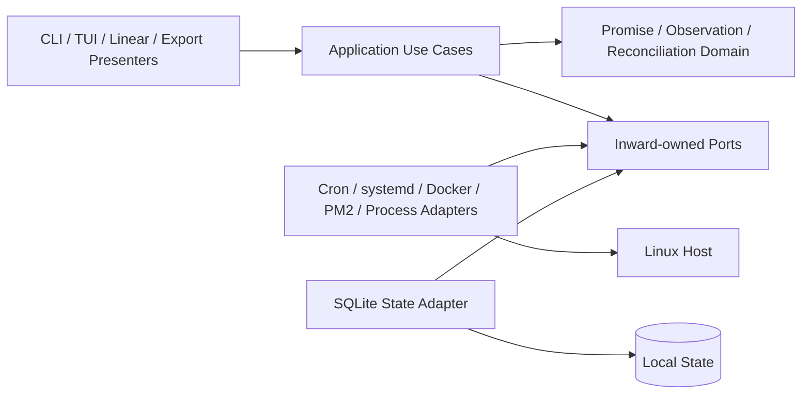
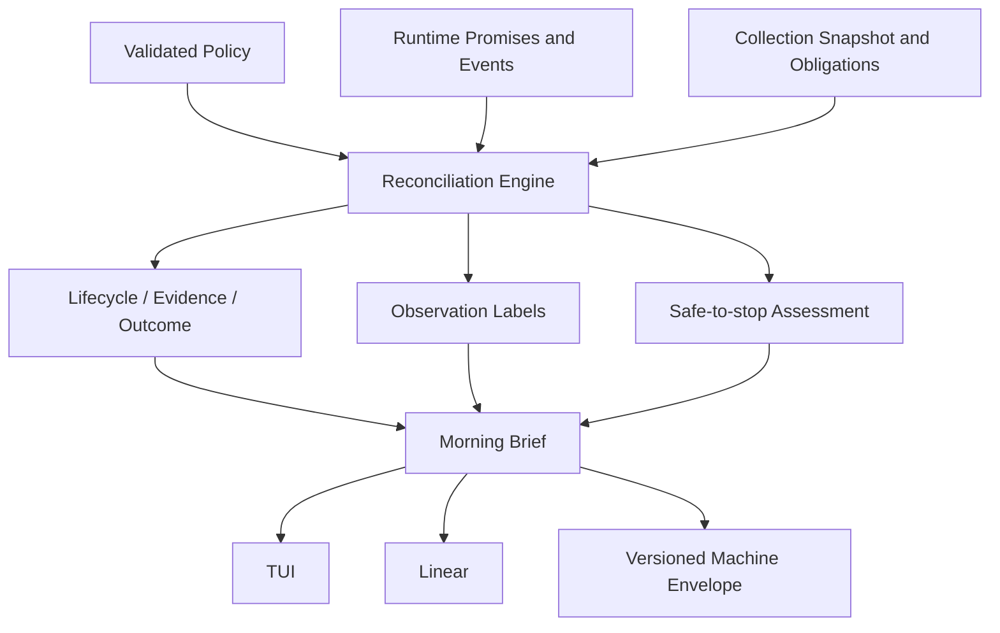

# Architecture Spine — srvls Runtime Promise Control Plane

## Design Paradigm

Hexagonal architecture keeps Host, storage, clock, and presentation details
outside a provider-neutral application core. The ratatui shell follows a
unidirectional `Model -> Event -> Update -> View` loop. Strategy owns grouping
and correlation policies, Adapter owns external integration, and Command owns
typed lifecycle mutation.

Canonical precedence is the final PRD, then its addendum, then the final UX
`DESIGN.md` and `EXPERIENCE.md`, then this spine. Live Python behavior and tests
govern only the explicitly inherited compatibility surfaces. A lower source may
constrain implementation but may not rename, blend, or defer a higher-source
contract.



## Invariants & Rules

### AD-1 — Dependency direction

- **Binds:** all modules
- **Prevents:** presentation, Provider, and persistence code becoming alternate
  owners of domain truth
- **Rule:** `domain` imports only the standard library. `application` imports
  `domain` and inward-owned port traits. `adapters`, `presentation`, and `cli`
  depend inward. Cross-adapter, presentation-to-adapter, domain-to-storage,
  domain-to-ratatui, and domain-to-wire-format imports are forbidden. Modules
  are private by default, each allowed edge is declared in one checked-in
  dependency manifest, and `cargo test --locked --test architecture_boundaries`
  rejects forbidden imports. That gate runs in bootstrap CI before any Provider
  implementation and in every later all-target test lane.

### AD-2 — Declared intent and observed truth stay separate

- **Binds:** runtime-promises, host-observations, reconciliation, exports,
  inspection, lifecycle-actions
- **Prevents:** a blended status, one incompatible model per Provider, and
  legacy output shape becoming the domain
- **Rule:** the core has distinct `RuntimePromise`, `Observation`,
  `ReconciliationFinding`, `Snapshot`, and `OperationRecord` aggregates.
  Provider-specific typed facets compose into `Observation`; providers never
  subtype it. Promise Lifecycle, Evidence Status, Promise Outcome, Observation
  labels, Safe-to-stop Assessment, Collection Obligation, Collector outcome,
  and Action Outcome remain orthogonal typed fields with exactly the canonical
  PRD values. Legacy six-field `EntryV1` exists only as an outward presenter
  projection.

### AD-3 — Ports own every side effect

- **Binds:** collection, durable-state, configuration, inspection,
  lifecycle-actions, time
- **Prevents:** subprocess, SQL, clock, boot identity, and privilege behavior
  diverging by caller
- **Rule:** adapters implement `Collector`, `Inspector`, `ActionExecutor`,
  `CommandRunner`, `PromiseRepository`, `SnapshotRepository`,
  `ActionPlanRepository`, `OperationRepository`, `PolicyRepository`,
  `StateMigrationCoordinator`, `Clock`, `BootIdentity`, and `HostIdentity`.
  Ports exchange versioned domain values and total typed results only. The
  application layer owns collection, Promise lifecycle, reconciliation,
  baseline, Brief, inspection, action, and release use cases; no caller
  constructs Host argv, SQL, backup operations, or time decisions.

### AD-4 — Evidence-based Stack inference

- **Binds:** stack-grouping, morning-brief, tui
- **Prevents:** renderers inventing groups or similarly named unrelated
  Runtimes being merged
- **Rule:** grouping runs after correlation and uses absolute tiers: exact
  matched Runtime Promise Project `400`, Provider-native `300`, source
  `200`, semantic `100`; evidence does not sum or merge transitively. Native
  evidence is Docker Compose working directory then project, or non-default PM2
  namespace; systemd, cron, and direct process have none. Project evidence uses
  the stable supplied Project ID only after independent identity correlation;
  ambiguous, conflicting, or name-only Promise matches contribute no grouping
  evidence. Source evidence is Docker working directory or PM2 cwd, normalized
  lexically as absolute, case-preserving, repeated and dot segments collapsed,
  parent traversal rejected, trailing slash removed, and never
  filesystem-canonicalized. Names use Unicode lowercase, non-alphanumeric and
  letter-number splits, only known Provider suffix and terminal replica
  removal, and retain environment words. Sort candidates by tier, unclaimed
  member count, specificity, then canonical key; greedily claim residual
  members. Native, Project, and source groups need two residual members;
  semantic groups need three sharing a non-generic project prefix.
  `StackGroupId` is evidence kind plus the AD-24 encoding of the full evidence
  key; label collisions receive Provider, Project, or source disambiguation.

### AD-5 — Snapshot owns scoped collection truth

- **Binds:** host-observations, collection, reconciliation, morning-brief,
  exports
- **Prevents:** unavailable or unauthorized collection looking like healthy
  empty Host truth
- **Rule:** each Collector returns generation, scope, effective
  `required | optional | not-applicable` obligation with reason, Observations,
  duration, diagnostics, and one `complete | partial | unavailable | denied |
  timed-out | invalid-output` outcome. The shared reducer and scope promotion
  implement PRD FR-14 exactly; only supported optional scopes can become
  required through configuration or an active Promise. Snapshot owns
  diagnostics; Observations reference diagnostic IDs. Strict mode fails every
  non-complete required scope and every partial, denied, timed-out, or
  invalid-output scope. Completion order never affects content. Failed
  generations never carry old Observations forward as current; the TUI may show
  last-good truth only as visibly stale with all mutations disabled. Every
  fully reduced generation has one terminal report for every frozen AD-21
  scope, synthesizing `timed-out` at its half-open deadline. The reducer may
  retain an immutable candidate even when required evidence is incomplete, but
  only the persisted latest-requested generation may atomically become current
  with its Findings under AD-16 and AD-21. Incomplete current truth disables
  absence claims and mutation as its evidence requires. Setup, reduction, or
  persistence failure before that transaction records a failed
  CollectionAttempt, leaves the prior current pointer unchanged, and exposes
  it only as stale. Eligible TUI initial load
  and `r`, plus canonical `brief --linear | --json`, collect and commit the
  exact candidate Snapshot they render. Canonical action verification may
  commit a fresh targeted Snapshot only while its generation remains latest.
  Timestamped resource samples live in immutable Snapshot history; hot
  classification reads the configured AD-20 window from that history and never
  infers missing samples.
  Promise commands persist lifecycle state without creating Snapshots;
  canonical inspect, action status, and config commands are read-only. Action
  planning is Host-read-only and may persist only the immutable AD-22 plan.
  Legacy table, flat top-level JSON, Prometheus, Markdown, inspection, and
  explicit legacy actions remain stateless. Only explicit TUI `b` acceptance
  or the deterministic `baseline` command may move the Accepted Baseline
  pointer; refresh and scheduled collection never do. A
  Snapshot with an incomplete required scope is ineligible unless a typed
  override transaction retains missing scopes, principal, wall time, and
  reason. AD-24 Host identity, schema, AD-21 scope-manifest fingerprint, and
  AD-24 governing policy fingerprint define baseline compatibility. First-run
  and incompatible-baseline states
  never invent a change set.

### AD-6 — Commands own exact-target mutation

- **Binds:** lifecycle-actions, runtime-promises, tui, cli
- **Prevents:** unsafe duplicated action logic, row or name targeting, false
  success, and shell injection
- **Rule:** groups are read-only. Action Menu `a` is the complete discovery path
  and can plan `start` from a Promise with a supported Launch Mechanism even
  without an Observation. Cron has no canonical mutation capability in v1 and
  is refused before argv construction. An individual action follows AD-22
  durable plan, capability and authorization preflight, UX-governed
  confirmation, identity revalidation,
  execute, OperationId-correlated targeted verification, and one terminal
  `verified | executed-unverified | refused | timed-out | failed` outcome under
  PRD FR-40 precedence. Pre-launch identity drift is `refused` with
  `stale-identity`; post-launch replacement is `executed-unverified`. Stop and
  disable or delete require TUI confirmation; unknown safety requires the exact
  resolved verb. Safe-to-stop is recalculated before mutation and remains
  advisory: `unsafe` makes the action unavailable, while `unknown` requires the
  canonical typed acknowledgement. Planning is Host-read-only but may persist
  the immutable AD-22 ActionPlan required by a separate execute process. A plan
  is valid only for its exact source generation, identity, effective policy
  snapshot, BootIdentity, and AD-20 lifetime;
  expiration or intervening identity evidence requires a new plan and
  confirmation. A durable partial unique constraint admits at most one
  nonterminal operation per exact target, while caller actor plus idempotency
  key returns the original plan or operation result on retry. A conflicting
  submission is `refused` with `duplicate-operation`; actions use the bounded
  AD-20 pool separate from collection. Saturation refuses before Provider
  launch rather than entering an unbounded queue. Operations never auto-replay
  after crash. `OperationCoordinator` alone applies FR-40 precedence and owns
  the terminal compare-and-swap; adapters and verifiers return evidence, and
  presentation only requests cancellation or renders committed truth. Direct
  non-TUI verbs preserve their explicit compatibility lane. Adapters use argv only,
  safe end-of-options or identifier rejection, and these verification
  predicates:

  A `verified` predicate must be proved by fresh evidence sampled after the
  Provider launch boundary and correlated to the OperationId; matching state
  observed before launch or at any uncorrelated point never verifies an action.

  - systemd start is active; stop is inactive; restart retains exact unit and
    has a newer invocation or start timestamp; disable is not enabled;
  - Docker start is running; stop or disable is not running; restart retains
    exact container ID and has a newer `StartedAt`;
  - PM2 start is online with the same birth identity; stop is stopped with the
    same birth identity; restart has a newer restart counter or uptime; delete
    removes that full identity;
  - direct-process stop removes the exact PID and birth identity; start or
    restart delegates to a declared supported Launch Mechanism rather than
    reconstructing a command.

### AD-7 — Presentation routing is explicit and terminal-aware

- **Binds:** cli, tui, linear-output, exports, configuration
- **Prevents:** automation breakage, inaccessible interaction, and side effects
  before invalid configuration is reported
- **Rule:** raw argv selects one profile before clap, configuration, collection,
  or any other side effect. First match wins: argv[1] in `config | promise |
  brief | baseline | action | release`, then `inspect --id`, owns its complete
  tail as a canonical namespace; argv[1] in `inspect | start | stop | restart |
  disable` selects the frozen legacy action profile before that profile performs
  its exact-three-argument arity check. Explicit
  `--tui` or deprecated `--fzf` selects ratatui; a recognized top-level
  `--json | --prom | --md | --table` selects the stateless legacy inventory
  profile; and empty argv selects bare routing. Namespace-local `--json` can
  never select legacy inventory. Within the legacy inventory profile, frozen
  output precedence and supported modifiers remain compatibility contracts,
  but previously ignored extra or unknown options now fail nonzero through a
  named ledger deviation. `--help` renders help without collection, and retired
  `--fzf-lines` fails with its ledgered replacement. Configuration validates
  after profile selection but before collection, state writes, terminal setup,
  or mutation. Bare `srvls` opens ratatui only when stdin and stdout are
  terminals and `TERM != dumb`; otherwise it emits the legacy table. Explicit
  TUI failure never falls back. The canonical release namespace owns `install |
  upgrade | validate | status | rollback` under AD-23. `brief --linear` is the
  complete no-cursor human
  path; canonical JSON is machine-facing. Legacy machine stdout remains free of
  progress, diagnostics, and terminal decoration.

### AD-8 — Terminal meaning never depends on decoration

- **Binds:** tui, linear-output, inspection
- **Prevents:** inaccessible state, unsupported glyphs, animation dependence,
  and hostile terminal content
- **Rule:** widgets obtain optional style only through `Theme` and `IconSet`.
  Text carries every identity, state, focus, progress, and outcome. `NO_COLOR`
  controls color only; `--ascii` controls glyphs and wins over capability
  detection; `TERM=dumb` selects undecorated legacy output unless an explicit
  format wins. V1 has no spinner or animation mode. Untrusted C0, C1, DEL,
  escape, invalid byte, and bidirectional control content is visibly escaped or
  replaced before display. UX `DESIGN.md` and `EXPERIENCE.md` own layout,
  component, responsive, focus, and accessibility behavior.

### AD-9 — Compatibility and new contracts have separate owners

- **Binds:** exports, inspection, cli, Agent interfaces, release-recovery
- **Prevents:** richer internal truth silently breaking scripts, timers, and
  metrics consumers
- **Rule:** legacy presenters map through exact Provider compatibility mappings
  to table, flat `EntryV1` JSON, Prometheus, Markdown, inspection, and explicit
  action contracts. Fixed merge order is cron, system systemd, user systemd,
  Docker, PM2; each adapter preserves encounter ordinal, while Markdown alone
  retains legacy type and name sorting. The layered oracle is the checked-in
  Python behavior inventory, a frozen deterministic
  `tests/compat/{capture-baseline.sh,fixtures,golden,compatibility-ledger.md}`
  corpus captured once with declared volatile substitutions, the opt-in live
  Host smoke suite, and named deployed-consumer checks. Tests never recapture
  live truth as an assertion source. The frozen corpus includes flag-combination
  precedence, help and unknown argv, bad action arity, successful-empty unknown
  inspection, stdout refusal placement, child stderr merging, missing Docker,
  absent PM2 and fzf, malformed and wrong-shaped structured data, hostile
  identifiers, and every action argv. New Promise, Brief, config, linear,
  baseline, reconciliation, and operation commands use separately versioned
  deterministic envelopes and do not change top-level legacy output without a
  ledger entry naming rationale, version impact, replacement assertion, and
  consumer disposition. Direct-process Observations therefore appear only in
  new Brief, reconciliation, TUI, linear, and versioned machine surfaces until
  a ledgered decision explicitly changes a legacy presenter.

### AD-10 — Synchronous concurrency is bounded and correlated

- **Binds:** collection, tui, lifecycle-actions, subprocesses
- **Prevents:** sequential refresh latency, stale overwrite, runaway children,
  and a second runtime architecture
- **Rule:** a fixed collection pool uses deterministic longest-processing-time
  scheduling over the frozen AD-21 ScopeManifest: sort scopes by descending
  configured deadline then ScopeIdV1, assign each to the earliest available
  worker, and break worker ties by worker ID. Scope time starts at worker
  dispatch; the generation cutoff
  includes queue time. Configuration simulates that exact schedule and rejects
  a cutoff below computed makespan plus the AD-20 scheduler margin. Global
  refresh has monotonic generation IDs persisted with
  `latest_requested_generation`. New requests coalesce latest-wins: cancel
  undispatched superseded scopes, request typed cancellation of running old
  scopes, retain attempt diagnostics, and admit only the newest queued
  generation. Only its pointer CAS may replace repository or displayed current
  truth. Action execution and verification use a separate bounded pool and
  OperationId lane,
  complete a durable outcome regardless of newer global refreshes, and may
  replace global truth only when their generation remains latest. All
  potentially blocking Provider file, `/proc`, and command work runs in a
  supervised invocation of the same binary, so the parent can cut a scope
  without stranding a worker thread.

  A coordinator-owned atomic result registry accepts a report only before both
  its scope deadline and generation cutoff; equality is `timed-out`, and reducer
  mailbox order is irrelevant. `CommandRunner` reserves stdout and stderr
  independently against generation, scope, then child capture ledgers under one
  coordinator before spawn, drains
  both streams after their retained cap, and frees raw bytes and reservations
  immediately after typed normalization. It owns spawn, deadlines,
  typed cancellation, process-group termination, and eventual reaping under the
  AD-15 executable, environment, and working-directory policy. Its
  total result is `SpawnFailed(kind) | Exited(code) | Signaled(signal) |
  TimedOut` plus bounded stdout, stderr, original byte counts, truncation flags,
  duration, and redacted argv identity. Nonzero and signals are values
  interpreted by adapters. At a deadline the Snapshot reducer stops waiting;
  an exited child is reaped synchronously, while a Linux uninterruptible child
  is registered with the bounded reaper and remains a visible diagnostic until
  eventual reap. No application can promise a wall bound across kernel
  uninterruptible I/O. Dropped delivery suppresses stale results but is never
  cancellation. Tokio requires a new AD.

### AD-11 — Verification is deterministic below Host boundaries

- **Binds:** all modules
- **Prevents:** environment-sensitive CI and silent domain, storage, output, or
  terminal regressions
- **Rule:** the frozen Python compatibility corpus and golden outputs cover
  every Provider success, malformed, unavailable, denied, timeout, ordering,
  escaping, output, inspection, and action-argv case. Deterministic tests also
  cover Promise lifecycle and idempotency, boot and clock discontinuity,
  migrations and crash recovery, configuration precedence and invalid values,
  every reconciliation axis and classification, Safe-to-stop rules, retention,
  all AD-20 limits, human-linear journeys, all canonical UX states and budgets,
  terminal lifecycle, and action races and signals. Application tests use fake
  ports; grouping and reconciliation use table or property cases; TUI uses
  ratatui `TestBackend`. Cross-unit contract fixtures freeze the AD-21 read cut,
  scope and diagnostic IDs, timeout equality, generation CAS, AD-22 plan and
  launch handoffs, policy fingerprint bytes, every AD-23 crash phase, upgrade
  quiescence, sidecar restore, and the storage-unavailable shutdown exception.
  The existing Python smoke suite and named timer checks
  remain live opt-in integration lanes and CI requires no Host service.

### AD-12 — One locked binary upgrades with its state

- **Binds:** build, release-recovery, durable-state, deployed consumers
- **Prevents:** dependency drift, late CI discovery, ABI breakage, binary-only
  rollback, and install-path ambiguity
- **Rule:** ship one Rust 2024 binary crate for
  `x86_64-unknown-linux-gnu` and glibc 2.42 with committed `Cargo.lock`, MSRV
  1.88, explicit Cargo resolver 3, and current-stable CI from the bootstrap
  story. Required gates are
  `cargo fmt --check`, locked clippy with warnings denied, locked all-target
  tests at MSRV and stable, compatibility goldens, migration tests, and release
  asset smoke. Build in a pinned glibc-2.42 image and verify symbol versions.
  The release tarball and SHA-256 contain one versioned binary. `srvls release`
  is the sole install, upgrade, validation, status, and rollback process owner;
  AD-23 owns its crash and state contract. Installer smoke uses an isolated
  state directory. Preflight inventories the resolved shell command plus every
  managed and foreign absolute consumer path, including unit `ExecStart`
  values. A foreign bypass needs an explicit disposition; `--force` never
  silently rewrites it. Managed links and unit definitions are staged with
  their matching database backup, atomically activated, daemon-reloaded, and
  validated read-only. Failure restores binary link, state, consumer definitions,
  and daemon state together, then reruns exact legacy exports, `srvls-metrics`,
  `srvls-snapshot`, timers, and every named consumer check. The prior target and
  recovery material remain until those checks pass. Split crates only after
  three independent consumers.

### AD-13 — Identity is typed, exact, and generation-bound

- **Binds:** runtime-promises, host-observations, grouping, tui, inspection,
  lifecycle-actions, durable-state
- **Prevents:** selection drift, identity reuse, and mutation of a recreated
  Runtime with the same display name
- **Rule:** `PromiseId`, `SnapshotId`, `PlanId`, `OperationId`, and lifecycle
  `EventId` are UUIDv7. `GenerationId` is a gap-free Host-local unsigned
  sequence allocated in state. `ScopeIdV1` is a tagged Provider locator with
  Provider-specific exact fields; its normalized canonical ordering forms
  ScopeManifestV1. `DiagnosticId` is `(GenerationId, ScopeIdV1,
  canonical_ordinal)`, where the coordinator assigns the ordinal before worker
  dispatch. `ObservationId` is a typed tuple of ScopeIdV1, native locator,
  occurrence, and required birth evidence with AD-24 canonical display encoding:
  full systemd unit; immutable Docker container ID; PM2 home, numeric ID,
  creation or uptime origin, and executable/name fingerprint; cron source,
  zero-based physical line, exact schedule/user/command hash, and duplicate
  occurrence; or Linux boot ID, PID, process start time, and executable or
  command fingerprint. Workers retain bounded process ownership hints; the
  AD-21 reducer alone deduplicates Provider-owned children and `srvls` itself
  after eligible reports close. Inspection and action carry the typed identity and source
  generation; executors re-resolve every component before mutation. Display
  names, row indexes, groups, and weak correlations are never identity.

### AD-14 — One terminal and shutdown owner

- **Binds:** tui, cli, lifecycle-actions
- **Prevents:** raw-mode corruption, detached operations, duplicate outcomes,
  and layers competing to restore the terminal
- **Rule:** one RAII `TerminalSession` at the TUI boundary owns raw mode,
  alternate screen, cursor, input, panic, and signal restoration under
  `panic=unwind`. `Update` alone owns the model and implements UX-IP-10 for
  pre-submit, executing, verifying, persisted-outcome, and exit phases.
  Submitted operations never detach; `q` is unavailable while active and Esc
  only navigates after submit. Ctrl-C, SIGINT, and SIGTERM request phase-specific
  typed cancellation. `OperationCoordinator`, not `Update` or an adapter, owns
  FR-40 and the one terminal revision CAS; `Update` renders only durable state.
  Terminal restoration and termination attempts obey AD-20 bounds. If SQLite or
  kernel I/O cannot complete, restoration still occurs, the last durable
  `launch-authorized | executing | verifying` phase remains for AD-16 recovery,
  and no false terminal outcome is invented. A repeated signal forces the
  bounded termination-attempt path without rewriting durable truth. SIGKILL,
  fatal synchronous signals, and Linux uninterruptible I/O are documented
  platform exceptions to process-exit and reap bounds.

### AD-15 — Privilege is narrow and never hidden in raw mode

- **Binds:** cron, systemd, Docker, PM2, direct-process, lifecycle-actions
- **Prevents:** password hangs, whole-process elevation, wrong user scope, and
  incompatible denial handling
- **Rule:** the binary never elevates itself. Root collection and TUI system
  mutation use `sudo -n`; explicit non-TUI system mutation preserves legacy
  interactive sudo and is golden-tested as a separate lane. User systemd,
  Docker, PM2, and direct-process access retain the invoking principal and
  narrow Provider capability. Canonical adapters resolve executables only from
  compiled or configured absolute allowlisted paths, start in `/`, and pass a
  minimal per-Provider allowlist of locale, identity, socket, and runtime
  variables; caller PATH, arbitrary working directory, hooks, and credentials
  are not inherited. The frozen legacy profile alone retains its ledgered PATH,
  cwd, environment, and interactive-sudo behavior. Missing executable,
  unsupported capability, daemon unavailable, permission denied, timeout,
  invalid output, and nonzero
  status map to distinct diagnostics and collection or action outcomes. Secrets,
  environments, unrestricted logs, and full cron command bodies are never
  logged.

### AD-16 — SQLite is the sole durable truth owner

- **Binds:** runtime-promises, lifecycle-events, snapshots, baselines,
  operations, retention, recovery
- **Prevents:** partial records, concurrent file rewrites, divergent schemas,
  and silent state reset
- **Rule:** one bundled SQLite database at
  `${XDG_STATE_HOME:-~/.local/state}/srvls/state.sqlite3` implements repository
  ports; directory mode is `0700` and database and sidecars are `0600`. The
  adapter sets and verifies `foreign_keys=ON` (`1`) before any transaction on
  every connection, `journal_mode=WAL`, `synchronous=FULL` (`2`), and AD-20 busy
  timeout.
  Writers use `BEGIN IMMEDIATE`, revision compare-and-swap, and deterministic ID
  order; schema migration takes an exclusive lock. Promise event sequence plus
  current projection, ActionPlan creation or consumption, every operation phase
  plus its evidence, baseline acceptance plus audit event, and complete
  PolicySnapshot insertion are single transactions. A Snapshot transaction
  contains its CollectionPlan reference, scope reports, diagnostics,
  Observations, retained resource samples, materialized Findings, Promise and
  policy revisions, decision-contract version, and current-pointer CAS; only
  `latest_requested_generation` can move that pointer.
  Before an external Provider may launch, an operation is durably moved from
  `planned` to `launch-authorized`; after launch it moves through `executing`
  and `verifying` to exactly one terminal outcome. Restart never auto-replays a
  nonterminal operation: an unconsumed plan remains bounded by TTL; a submitted
  but pre-launch operation can become `refused` as interrupted before
  launch, while `launch-authorized`, `executing`, or `verifying` receives fresh
  targeted evidence and resolves conservatively to `verified`, `failed`, or
  `executed-unverified`. Embedded forward migrations are versioned and tested;
  integrity, cross-record invariant, or migration failure opens read-only
  recovery and refuses mutation and baseline acceptance rather than creating
  fresh state.
  Retention runs transactionally after successful writes, excludes active truth
  and pinned current or Accepted Baseline records, and leaves a bounded audit
  summary for pruned closed intent. UTC `completed_at` or `terminal_at` is the
  age clock; records at or before the cutoff are eligible, and `(timestamp,
  typed ID)` is the oldest-first tie-break. Age and count limits are both
  enforced on unpinned records, including AD-20 global Promise, operation, and
  lifecycle-event ceilings. Pins may exceed those counts but are disclosed; a
  closed or expired Promise remains pinned while a current Observation or
  finding depends on its closure, Lease, or ownership evidence. Crossing the
  AD-20 state-byte ceiling is the no-symlink sum of POSIX `st_blocks * 512` for
  the database, WAL, SHM, retained state backups, and AD-23 upgrade manifests;
  a missing file contributes zero. It then prunes all eligible data. If pinned
  truth still exceeds it, state enters capacity-exhausted mode:
  in-place recovery and writes
  required to terminalize already-admitted lifecycle or action work continue,
  while new Promise declarations, candidate Snapshots, baseline changes, and
  Host mutations are refused. Stateless read-only compatibility output remains
  available. Replaced baselines become unpinned. One bounded watermark
  per record class lets a pruned `action status` return `gone` with cutoff
  evidence instead of false `not-found`. The schema has versioned families for
  `schema_migrations`, Promise projections and lifecycle events,
  PolicySnapshots, CollectionPlans and CollectionAttempts, immutable Snapshots
  and Collector
  reports, Observations and typed Provider details, materialized reconciliation
  findings and Briefs, baseline acceptances, ActionPlans, operations and
  operation events, compatibility runs, and retention tombstones. Rows retain
  typed IDs,
  boot and wall-time provenance, governing policy snapshot, and schema version;
  bounded Provider detail is versioned JSON, while raw process streams,
  unrestricted logs, secrets, and full environments are never persisted.
  AD-23's fsynced UpgradeTransaction manifest is the sole permission-restricted
  recovery artifact outside SQLite and never owns product-domain truth.

### AD-17 — Promise lifecycle uses explicit events and defensible time

- **Binds:** runtime-promises, Heartbeats, Leases, Agent interfaces,
  durable-state
- **Prevents:** retries duplicating intent, wall-clock rollback extending
  ownership, and restart silently preserving ephemeral ownership
- **Rule:** declare, revise, renew, release, complete, and revoke append typed
  events and update one current Promise projection transactionally. Required
  fields validate before write. Caller operation identity plus actor and kind is
  unique, so safe retry returns the original deterministic result. Every
  accepted event receives a gap-free per-Promise `event_sequence` and
  `prior_projection_revision`; the projection through sequence N is
  authoritative, and readers never refold events in another order. Same-boot
  Lease and cadence calculations use suspend-inclusive Linux `CLOCK_BOOTTIME`
  semantics while wall time remains display provenance. Host suspend therefore
  consumes Lease and Heartbeat time. Boot-ID change expires ephemeral ownership
  until valid renewal; wall-clock discontinuity never extends it. Omitted intent
  uses the finite AD-20 Lease; persistent intent requires Durable Ownership and
  an inspectable Launch Mechanism. `closed` retains exactly one `released |
  completed | revoked` reason and never stops a Runtime.

### AD-18 — Reconciliation is one pure deterministic decision engine

- **Binds:** runtime-promises, host-observations, findings, morning-brief,
  Safe-to-stop Assessment
- **Prevents:** UI-specific classification, false certainty, and weak evidence
  becoming action identity
- **Rule:** one pure use case consumes only an AD-21 frozen CollectionPlan and
  its eligible reports, then evaluates in canonical order: Promise Lifecycle,
  Evidence Status, identity correlation, Promise Outcome, every compatible
  Observation label, attention rank, and Safe-to-stop Assessment. For each
  Promise/Observation edge it records a lexicographic evidence vector in this
  order: exact Provider identity `2` or exact declared immutable locator `1`;
  exact Project; exact Launch Mechanism target; exact normalized source; exact
  bounded process ownership; bounded name similarity. Secondary fields are
  `match=1 | absent=0 | conflict=-1`; they never sum. Provider or anchor conflict
  rejects the edge. Unequal present Project IDs conflict; unequal exact targets
  in one Provider conflict; incompatible present sources or process ownership
  conflict. Name uses strsim 0.11.1 Jaro-Winkler over the AD-4 normalized name,
  at most 256 Unicode scalars, with `>= 0.94` as match and every lower or
  over-limit value as absent, never conflict. Without an anchor the edge is retained only as `candidate`
  and cannot establish healthy truth or mutation identity. An anchored edge is
  `conflicted` when any secondary conflicts, otherwise `corroborated` when any
  secondary matches, otherwise `confirmed`; conflicted evidence prohibits
  health and safety. Each Observation selects a Promise only when one eligible edge
  has a strict lexicographic maximum. Equal maxima remain `ambiguous`; a Promise
  may receive multiple Observations so intended count can classify exact excess
  instances without silently choosing a destructive target. Stable typed IDs
  break output order only, never an evidence tie. Ambiguity or incomplete
  required evidence yields `unresolved` or `unknown`, never absence, safety, or
  empty success. Output retains each vector plus contributing, contradictory,
  and missing evidence and applies PRD FR-18 through FR-27 without collapsing
  axes. Materialized Findings carry `decision_contract_version`; historical
  reads render them unchanged, while re-evaluation creates a new derived
  generation. The Brief answers all eight FR-28 questions, names completeness,
  baseline, current Snapshot, Evidence Window, and timezone, and keeps
  drill-down IDs back to every contributing aggregate.

### AD-19 — Typed configuration retains provenance

- **Binds:** configuration, policy, collection, reconciliation, retention,
  lifecycle-actions, presentation
- **Prevents:** hidden defaults, silent typos, inconsistent policy, and
  configuration side effects
- **Rule:** typed TOML values merge in fixed precedence: built-ins,
  `/etc/srvls/config.toml`, XDG user config, explicit config file,
  `SRVLS_` environment, then CLI value flags. Each effective field retains its
  winning source and overridden chain. Unknown keys, duplicate semantic keys,
  invalid types, and values outside AD-20 or UX ranges fail visibly rather than
  clamp. Every discovered source is parsed and schema-validated before merge;
  a malformed lower-precedence value still fails instead of being hidden by a
  later override. Dotted TOML names are canonical; environment spelling uppercases path
  components and joins them with `__`, for example
  `SRVLS_COLLECTION__MAX_CONCURRENCY`; repeatable CLI `--set key=value` uses the
  same dotted name, and duplicate assignments within one source are errors.
  `config validate --linear | --json` and `config explain --linear` expose
  schema-declaration field order, value or redaction, source, default, valid
  range, correction, and restart requirement. The versioned JSON validation
  envelope carries `schema_version`, `ok`, and ordered errors with stable code,
  path, redacted value, source, message, and valid range. Snapshots, findings,
  Accepted Baselines, plans, and operations reference one complete AD-24
  PolicySnapshotV1 rather than artifact-specific subsets. The provenance chain
  and separate ProvenanceDigest remain inspectable without changing behavioral
  compatibility. An unsupported policy schema is a typed read-only result;
  readers never fill absent historical fields from current defaults, so history
  is never reinterpreted under later configuration.
  Validation precedes all side effects and v1 does not hot-reload.

### AD-20 — Operational limits are stable, visible contracts

- **Binds:** collection, subprocesses, inspection, retention, Leases,
  Heartbeats, findings, lifecycle-actions, durable-state
- **Prevents:** downstream stories choosing incompatible time, memory, privacy,
  and safety boundaries
- **Rule:** the following built-in defaults and inclusive valid ranges are
  stable identifiers. Invalid values fail configuration. Effective values and
  provenance appear in config explanation and any finding, truncation, timeout,
  or outcome they affect.

| ID | Configuration | Built-in default | Valid range and invariant |
| --- | --- | --- | --- |
| ARCH-LIM-1 | `collection.max_concurrency` | 4 workers | 1–8 |
| ARCH-LIM-2 | `collection.deadline.*` | cron user/root/system 10 s each; system/user systemd 15 s each; Docker 30 s; PM2 20 s; process 10 s | 1–60 s each; one budget covers every sub-operation in its scope |
| ARCH-LIM-3 | `collection.generation_cutoff`, `collection.scheduler_margin` | 40 s and 5 s | cutoff 10–120 s; margin 0–30 s; cutoff must be at least exact LPT makespan plus margin |
| ARCH-LIM-4 | `process.child_stdout_bytes`, `process.child_stderr_bytes` | 4 MiB and 256 KiB | stdout 64 KiB–16 MiB; stderr 16 KiB–1 MiB; separate counts, truncation, and draining |
| ARCH-LIM-5 | `inspection.max_bytes`, `inspection.max_lines` | 256 KiB and 200 lines | 4 KiB–2 MiB and 10–2,000 lines; earlier bound wins and is disclosed |
| ARCH-LIM-6 | `retention.snapshot_days`, `retention.snapshot_count` | 14 days and 256 historical | 2–90 days and 16–4,096; both apply; current and Accepted Baseline are pinned |
| ARCH-LIM-7 | `retention.event_days`, `retention.events_per_promise` | 90 days and 50,000 | 30–365 days and 1,000–1,000,000; active truth and latest closure summary remain |
| ARCH-LIM-8 | `lease.default_duration`, `heartbeat.default_cadence`, `heartbeat.grace` | 12 h, 5 min, 5 min | 5 min–30 d, 10 s–1 h, 30 s–30 min; grace never extends the Lease |
| ARCH-LIM-9 | `stale.no_use_window` | 24 h | 5 min–30 d; no supported positive no-use evidence means no stale label |
| ARCH-LIM-10 | `hot.cpu_percent`, `hot.memory_percent`, `hot.sample_count`, `hot.window` | 80%, 25%, 3 samples, 2 min | thresholds 1–100%; samples 1–12; window 1 min–1 h; query timestamped samples from current and retained prior Snapshots; insufficient samples mean no hot label |
| ARCH-LIM-11 | `action.execution.*` | systemd 100 s; Docker 45 s; PM2 30 s; process 10 s; Launch Mechanism 120 s | systemd and Launch Mechanism 5–600 s; Docker and PM2 5–300 s; process 1–60 s |
| ARCH-LIM-12 | `action.verification_window`, `action.poll_interval` | 30 s and 500 ms | 5–120 s and 100–2,000 ms |
| ARCH-LIM-13 | `action.graceful_termination`, `action.forced_observation` | 2 s and 1 s | 100 ms–10 s and 100 ms–5 s; no timed reap guarantee for Linux D-state work |
| ARCH-LIM-14 | `state.busy_timeout` | 5 s | 100 ms–30 s; timeout is an explicit unavailable or refused result, never a lost write |
| ARCH-LIM-15 | `action.plan_ttl` | 5 min | 10 s–30 min; a newer source generation, identity, policy, or expiry requires replan and reconfirmation |
| ARCH-LIM-16 | `process.scope_stdout_bytes`, `process.scope_stderr_bytes` | 8 MiB and 512 KiB | stdout 64 KiB–64 MiB; stderr 16 KiB–4 MiB; each is at least its child cap |
| ARCH-LIM-17 | `process.generation_stdout_bytes`, `process.generation_stderr_bytes` | 32 MiB and 2 MiB | stdout 256 KiB–256 MiB; stderr 64 KiB–16 MiB; each is at least concurrency times its child cap |
| ARCH-LIM-18 | `retention.promise_count`, `retention.operation_count`, `retention.lifecycle_event_count` | 10,000; 10,000; 1,000,000 | Promises 100–100,000; operations 100–1,000,000; events 10,000–10,000,000; deterministic pins and watermarks apply |
| ARCH-LIM-19 | `state.byte_ceiling` | 512 MiB | 64 MiB–8 GiB; AD-16 `st_blocks * 512` accounting; prune eligible truth, then enter disclosed capacity-exhausted mode rather than delete pins |
| ARCH-LIM-20 | `action.max_concurrency` | 4 operations | 1–16; independent of collection; saturation refuses before launch |
| ARCH-LIM-21 | `action.revalidation_deadline` | 5 s | 1–15 s; expiry before launch is refused |
| ARCH-LIM-22 | `action.finalization_deadline` | 5 s | 1–30 s; bounded durable-write attempts before restoration; unavailable or uninterruptible storage leaves the last truthful nonterminal phase for recovery |
| ARCH-LIM-23 | derived `action.total_decision_bound` | systemd 143 s; Docker 88 s; PM2 73 s; process 53 s; Launch Mechanism 163 s | revalidation + selected execution + verification + graceful + forced observation + finalization attempt; read-only decision budget, never a universal process-exit, durable-write, or reap bound |

For ARCH-LIM-3, default jobs are
`[30, 20, 15, 15, 10, 10, 10, 10]`. AD-10 assigns them to four workers for an
exact 35-second makespan; the five-second margin yields the 40-second cutoff.
For ARCH-LIM-23, configuration validation computes the same formula exposed by
config explanation, action planning, confirmation, status, linear, and machine
surfaces. Both derived calculations are generated from the typed configuration
schema and tested as contracts, not duplicated constants.

### AD-21 — Collection and reconciliation share one frozen truth cut

- **Binds:** collection, runtime-promises, reconciliation, snapshots,
  baselines, resource evidence
- **Prevents:** mixed-time findings, obligation drift, worker/reducer shape
  mismatch, cutoff races, and two meanings of current
- **Rule:** one consistent repository read creates `CollectionPlanV1` with
  GenerationId, generation-start boot sample, BootIdentity, HostIdentityV1,
  Promise projection revisions and current event sequences, complete
  PolicySnapshotV1, and ordered ScopeManifestV1 with frozen obligations. V1
  ScopeId variants are cron user/root/system, systemd user/system, Docker
  resolved endpoint plus context, PM2 normalized `PM2_HOME`, and process
  HostIdentity. Their provider tag and canonical AD-24 bytes define equality and
  ordering everywhere. Workers receive and echo the exact ScopeId, obligation,
  deadline, and coordinator-assigned diagnostic range; reduction rejects a
  mismatch and never consults newer Promise or policy state. Reports register
  atomically before both half-open deadlines. The reducer alone performs
  cross-Provider attribution and deduplication after all eligible reports,
  materializes Findings under the frozen decision version, and requests the
  AD-16 transaction. Later Promise writes belong to the next generation. A
  superseded generation may retain CollectionAttempt and candidate evidence but
  cannot move either repository or displayed current truth.

### AD-22 — Action plans and operation effects have one durable handoff

- **Binds:** lifecycle-actions, cli, tui, durable-state, verification,
  recovery
- **Prevents:** incompatible Plan references, ambiguous launch boundaries,
  duplicate mutation, and competing terminal outcomes
- **Rule:** immutable `ActionPlanV1` is stored under PlanId with SnapshotId,
  GenerationId, exact target identity, verb, capability and safety evidence, confirmation
  contract, PolicyFingerprint, decision-contract version, actor, idempotency
  key, BootIdentity, created boot and wall samples, and expiry. Actor,
  idempotency key, and
  plan kind are unique and return the original plan. Submit revalidates every
  captured field, then one transaction consumes the plan by revision CAS,
  allocates OperationId, and creates the `planned` operation; expiry or drift
  refuses before launch. After durable
  `launch-authorized`, `LaunchReceiptV1` records OperationId, exact argv
  identity, spawn result or `may-have-launched`, and coordinator monotonic launch
  sequence. `VerificationRequestV1` registers its sample start strictly after
  that sequence and tags every result with OperationId and verification
  generation. `OperationCoordinator` is the sole FR-40 outcome authority and
  terminal CAS owner. Adapters emit execution or cancellation evidence,
  verifier emits fresh evidence, TUI emits navigation or CancellationRequest,
  and status renders repository truth. Storage failure follows AD-14 recovery;
  no layer invents a terminal result.

### AD-23 — Release is a quiesced, crash-recoverable transaction

- **Binds:** install, upgrade, validation, rollback, durable-state, deployed
  consumers
- **Prevents:** live writes lost by restore, split binary/schema pairs,
  unowned absolute consumers, and incompatible backup methods
- **Rule:** `application::release` owns `srvls release install | upgrade |
  validate | status | rollback`; `StateMigrationCoordinator` owns typed
  `create_backup | migrate | restore | verify` effects. Release preflight
  refuses before quiescence when staged files and the required backup cannot fit
  under ARCH-LIM-19. Every stateful process holds a shared install-generation
  admission lease. Release obtains the
  external exclusive lease before backup and retains it through commit or
  rollback; its candidate validator receives one inherited, read-only bypass
  token and cannot admit lifecycle, Snapshot, baseline, plan, or operation
  writes. A mode-0600, file-and-directory-fsynced `UpgradeTransactionV1`
  outside SQLite binds transaction ID, old/new targets and hashes, old/new
  schemas, backup path/hash, consumer manifest, and exactly one phase:
  `staged | backed-up | migrated | activated | validated | rollback-started |
  recovered | committed`. Every release entry resumes or reverses an existing
  transaction idempotently before new work. Recovery discards `staged`, restores
  the old pair from `backed-up | migrated`, validates `activated` and commits it
  only on success, commits `validated`, finishes rollback from
  `rollback-started`, and cleans terminal `recovered | committed` before a new
  transaction. `StateBackupManifestV1` requires
  SQLite backup API or an explicitly equivalent checkpointed method, no live
  restore connections, database/WAL/SHM disposition, content hashes, schema and
  integrity verification, and file plus parent-directory fsync. Activation and
  rollback treat executable link, database, managed unit definitions, and
  daemon-reload state as one recovery result; foreign absolute consumers require
  an explicit unchanged, migrated, or blocked disposition.

### AD-24 — Shared encodings and historical contracts are canonical

- **Binds:** identity, grouping, configuration, snapshots, baselines,
  findings, actions, persistence
- **Prevents:** equivalent IDs or policies hashing differently, reboot-invalid
  baselines, and historical truth changing after upgrade
- **Rule:** `HostIdentityV1` is SHA-256 over domain `srvls-host-v1`, a zero byte,
  and the validated lowercase Linux machine-id bytes; BootIdentity remains the
  kernel boot UUID and is never baseline identity. Public composite strings use
  UTF-8 NFC, leave only RFC 3986 unreserved bytes literal, use uppercase
  percent-hex, and reject malformed or noncanonical input. `PolicySnapshotV1`
  stores every effective typed field in schema-declaration order with durations
  as integer nanoseconds, sizes as integer bytes, percentages as integer basis
  points, stable ASCII enum tokens, and no artifact-specific omissions. Its
  canonical UTF-8 JSON uses that fixed key order, NFC strings, decimal integers,
  lowercase booleans, no insignificant whitespace, and one schema version.
  `PolicyFingerprint` is SHA-256 over domain `srvls-policy-v1`, a zero byte, and
  those bytes; provenance is excluded. `ProvenanceDigest` is SHA-256 over domain
  `srvls-provenance-v1`, a zero byte, and the schema-ordered canonical source and
  override chain. Scope-manifest fingerprints use the same construction with
  domain `srvls-scopes-v1`. Findings and Briefs persist their materialized
  result plus `decision_contract_version`; historical reads never recompute it,
  and explicit re-evaluation creates a new derived generation. Unsupported
  encoding, policy, or decision versions return a typed read-only result.

### Canonical UX acceptance Host

`ARCH-HOST-1` is a deterministic release-build test profile with four dedicated
x86_64 logical CPUs, 8 GiB memory, Linux, and glibc 2.42. The canonical UX
fixture from `EXPERIENCE.md` runs against ratatui `TestBackend` for 30 measured
iterations after warm-up with no live Collector or network dependency. The
benchmark records binary hash, CPU model, kernel, glibc, fixture hash, and
effective UX-BUD policy. The current reference machine is an AMD Ryzen 9 9950X
Host with 16 cores, 32 threads, 128 GiB memory, Linux 6.17, and glibc 2.42; its
runner is constrained to the `ARCH-HOST-1` profile. UX-BUD-1 through UX-BUD-7
retain the defaults and valid ranges in `EXPERIENCE.md` unchanged.

## Consistency Conventions

| Concern | Convention |
| --- | --- |
| Domain nouns | Canonical PRD capitalization in human text; singular PascalCase Rust types; Provider names remain adapter values. |
| Identity | UUIDv7 for durable generated IDs; exact typed Observation identity from AD-13; display and row position are never identity. |
| Time | Suspend-inclusive `CLOCK_BOOTTIME` for same-boot duration decisions; UTC wall time plus timezone provenance for persistence and display; boot ID retained. |
| Status | Canonical orthogonal enums only; diagnostics and reason codes never create status aliases. |
| Errors | `thiserror` enums at boundaries; total process results; typed diagnostics for partial truth; fatal setup and output errors return `Result`. |
| Persistence | Repositories and SQLite adapter own transactions and migrations; callers never coordinate files or issue SQL. |
| Configuration | Typed layered TOML under AD-19; built-ins are explicit sources; invalid values never clamp. |
| Logging | `tracing` only; no terminal stdout/stderr logging in raw mode; no secret, environment, or unrestricted command content. |
| Output | Machine stdout contains no ANSI, cursor control, progress, icons, logs, or human diagnostics; deterministic order and one trailing newline. |
| Group labels | Provider project or namespace, then exact source basename, then semantic prefix; stable key follows AD-4. |
| TUI behavior | `EXPERIENCE.md` owns keys, focus, states, action phases, responsive thresholds, and assistive lanes; `Update` is the sole model owner. |

## Stack

The versions below are the reviewed 2026-07-16 lock targets; compatible
requirements may be broader, but `Cargo.lock` and locked CI own the resolution.

| Name | Version |
| --- | --- |
| Rust MSRV / edition | 1.88.0 / 2024 |
| Rust current-stable lane | 1.97.0 at review |
| ratatui / default Crossterm line | 0.30.2 / 0.29 |
| clap | 4.6.2 |
| serde | 1.0.228 |
| serde_json | 1.0.150 |
| rusqlite with `bundled` / libsqlite3-sys / SQLite | 0.39.0 (`=0.39.0` manifest) / 0.37.0 / 3.51.3 |
| toml crate / TOML specification | 1.1.3 (`=1.1.3` manifest) / 1.1.0 |
| uuid with `v7` and `serde` | 1.24.0 |
| time | 0.3.53 |
| thiserror | 2.0.18 |
| tracing / tracing-subscriber | 0.1.44 / 0.3.23 |
| signal-hook | 0.4.4 |
| libc | 0.2.186 |
| strsim | 0.11.1 |
| insta (dev) | 1.48.0 |

## Structural Seed

```text
src/
  main.rs                    # composition root and pre-side-effect routing
  cli.rs                     # clap compatibility and new command contracts
  domain/
    promise.rs               # Promise, Lease, Heartbeat, lifecycle events
    observation.rs           # Observation aggregate and exact identity
    snapshot.rs              # collection truth, obligations, diagnostics
    reconciliation.rs        # axes, correlation, findings, safety
    grouping.rs              # Stack evidence and deterministic resolver
    action.rs                # plans, capabilities, commands, outcomes
    contracts.rs             # canonical IDs, encodings, policy snapshots
    policy.rs                # validated policy and ARCH-LIM values
  application/
    promises.rs              # declare, query, renew, close
    collect.rs               # bounded collection generations
    reconcile.rs             # pure reconciliation orchestration
    brief.rs                 # Evidence Window and Brief composition
    baseline.rs              # eligibility, acceptance, retention
    inspect.rs               # bounded typed inspection
    execute.rs               # exact-target lifecycle operation
    release.rs               # install transaction and recovery orchestration
  ports/
    collector.rs
    inspector.rs
    action_executor.rs
    command_runner.rs
    repositories.rs
    clock.rs
    state_migration.rs
  adapters/
    host/{cron,systemd,docker,pm2,process}.rs
    process.rs               # production CommandRunner
    state/sqlite.rs          # transactions, migrations, retention, recovery
    release.rs               # admission lock, manifest, activation, restore
    config.rs                # layered TOML and provenance
    linux_clock.rs           # monotonic time and boot identity
  presentation/
    tui/                     # TerminalSession and Model/Event/Update/View
    linear.rs                # complete no-cursor human path
    table.rs
    json.rs
    prometheus.rs
    markdown.rs
tests/
  architecture_boundaries.rs # dependency-manifest enforcement
  compat/                    # frozen Python fixture and golden oracle
  fixtures/                  # domain, state, config, Provider, and UX cases
  snapshots/                 # TUI, linear, and output snapshots
```



## Capability → Architecture Map

| Canonical capability | Lives in | Governed by |
| --- | --- | --- |
| FR-1–FR-7 Promise lifecycle and Agent contracts | `domain::promise`, `application::promises`, state adapter | AD-2, AD-3, AD-13, AD-16, AD-17, AD-19–AD-21, AD-24 |
| FR-8–FR-17 Host discovery and compatibility | Host adapters, `application::collect`, legacy presenters | AD-3, AD-5, AD-9–AD-11, AD-13, AD-15, AD-20–AD-21, AD-24 |
| FR-18–FR-27 reconciliation and Evidence Window | `domain::reconciliation`, `application::{reconcile,baseline}` | AD-2, AD-5, AD-13, AD-16–AD-21, AD-24 |
| FR-28–FR-35 Brief, Stack, TUI, action discovery, and inspection | `application::brief`, grouping, action planning, presentation | AD-4–AD-8, AD-11, AD-13–AD-16, AD-18–AD-22, AD-24 and canonical UX IDs |
| FR-36–FR-41 exact lifecycle control | `domain::action`, `application::execute`, action adapters | AD-6, AD-10, AD-13–AD-16, AD-20, AD-22, AD-24 |
| FR-42–FR-43 install, upgrade, and rollback | `application::release`, StateMigrationCoordinator, Cargo and CI | AD-3, AD-7, AD-9, AD-11–AD-12, AD-16, AD-23–AD-24 |

## Canonical Contract Traceability

| Stable identifiers | Architecture landing |
| --- | --- |
| UJ-1 | AD-5, AD-7, AD-18, AD-20–AD-21, AD-24; Brief and Evidence Window projections |
| UJ-2 | AD-13, AD-16–AD-17, AD-19–AD-21, AD-24; Promise application service |
| UJ-3 | AD-5–AD-6, AD-13, AD-18, AD-20–AD-22; inspection and Promise-origin Start |
| UJ-4 | AD-6, AD-13–AD-16, AD-18, AD-20–AD-22, AD-24; exact-target action pipeline |
| UJ-5 | AD-4, AD-18, AD-20; multi-label findings and Stack context |
| UJ-6 | AD-3, AD-7, AD-9, AD-11–AD-12, AD-16, AD-23–AD-24; staged activation and paired recovery |
| NFR-1–NFR-2 | AD-2, AD-5, AD-11, AD-18, AD-21, AD-24 |
| NFR-3–NFR-7 | AD-3, AD-6–AD-10, AD-14–AD-15, AD-20–AD-22 |
| NFR-8 | AD-7, AD-8, AD-11, AD-14, UX-A11Y-1–UX-A11Y-5, SR-A11Y-1 |
| NFR-9–NFR-12 | AD-10, AD-13–AD-24 |
| NFR-13–NFR-16 | AD-9, AD-11–AD-12, AD-19–AD-20, AD-23–AD-24 |
| SM-1–SM-2 | AD-5, AD-11, AD-18, AD-21, AD-24; canonical Brief and reconciliation fixtures |
| SM-3 | AD-6, AD-11, AD-13–AD-16, AD-20, AD-22; FR-40 precedence fixtures |
| SM-4 | AD-7, AD-9, AD-11–AD-12, AD-23; every layered-oracle lane and consumer assertion |
| SM-5 | AD-11, AD-13, AD-16, AD-17; idempotent Agent lifecycle fixtures |
| SM-6 | AD-7, AD-8, AD-11, AD-18, AD-21–AD-22; TUI and human-linear journey fixtures |
| SM-C1–SM-C3 | AD-5, AD-6, AD-11, AD-18, AD-21–AD-22; precision, partial-truth, and no-auto-cleanup assertions |
| UX-FND-1–UX-FND-6, UX-VT-1–UX-VT-4 | AD-2, AD-7, AD-8, AD-18; canonical nouns and copy projections |
| UX-IA-1–UX-IA-8, UX-IA-11, UX-CP-1–UX-CP-15 | AD-4–AD-8, AD-13–AD-22, AD-24; Brief, detail, action, baseline, and refinement projections |
| UX-IA-9, UX-CP-16, UX-IP-8 | AD-3, AD-7, AD-9, AD-11–AD-12, AD-16, AD-23–AD-24; release and recovery surface |
| UX-IA-10, UX-IA-12 | AD-7–AD-9, AD-16–AD-20, AD-24; Agent, machine, and configuration result surfaces |
| UX-ST-1–UX-ST-20 | AD-5–AD-8, AD-10, AD-13–AD-22, AD-24; canonical application, collection, focus, baseline, config, and action states |
| UX-IP-1–UX-IP-7, UX-IP-9–UX-IP-12 | AD-5–AD-7, AD-10, AD-13–AD-22, AD-24; routing, filter, refresh, action, Agent, linear, signal, and config primitives |
| UX-A11Y-1–UX-A11Y-5, SR-A11Y-1 | AD-7, AD-8, AD-11, AD-14; text-primary TUI and complete human-linear fixtures |
| UX-RP-1–UX-RP-6 | AD-7, AD-8, AD-11, AD-14; canonical geometry and focus-preserving resize behavior |
| UX-BUD-1–UX-BUD-7 | AD-8, AD-10, AD-11, AD-14, AD-19, AD-20, ARCH-HOST-1; inherited unchanged from `EXPERIENCE.md` |

## Deferred

- Persistent user grouping overrides: revisit after ambiguous canonical-Host
  cases show that automatic evidence cannot remain conservative.
- User theme files: revisit after a second theme beyond built-in terminal,
  color-off, and ASCII modes is required.
- Plugin or dynamic Collector loading: revisit only when an out-of-tree Provider
  must ship independently.
- Grouped legacy machine-output schema: keep top-level compatibility output flat
  until a consumer requires a versioned grouped contract.
- Broader Linux or glibc portability: revisit when a supported target Host exists;
  v1 is x86_64 glibc 2.42.
- Multi-resource actions and automatic remediation: groups remain read-only
  until target intersection, ordering, partial failure, and rollback have a
  separate approved design.
- Interactive privilege escalation in the TUI: v1 uses non-interactive
  authorization and requires a terminal-safe design before expansion.
- Multi-Host, daemon, network API, remote control, and multi-user tenancy: v1 is
  one local Host and deterministic local Agent commands.
- Fetching Plane, Git, or Telemetry content: references remain opaque until a
  separate product requirement defines trust, privacy, and failure behavior.
